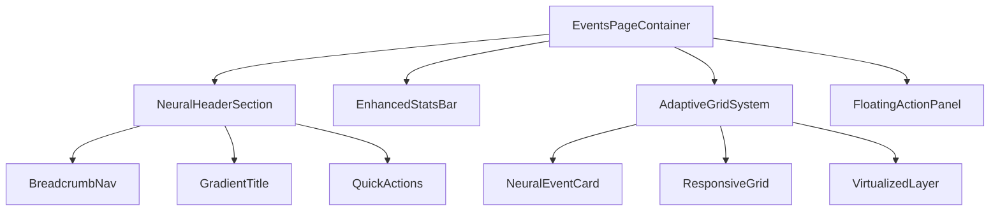

# Admin Events Interface Redesign - iOS 26 Liquid Glass

## Overview

This design document outlines the redesign of `/admin/events` using iOS 26 liquid glass aesthetic with enhanced space optimization for large displays. The current layout showing only 2 events on 27" monitors will be transformed into an efficient, visually stunning interface maximizing screen real estate.

## Architecture

### Design Philosophy - iOS 26 Neural Glass

- **Translucent layering** with advanced blur effects and depth perception
- **Dynamic refractive surfaces** that respond to user interaction
- **Spatial computing principles** for enhanced depth and dimensionality
- **Neural interface patterns** with subtle AI-enhanced visual cues
- **Contextual transparency** that adapts to content and background

### Component Architecture



### Responsive Grid Optimization

| Screen Size | Grid Columns | Card Width | Max Events Visible |
|-------------|--------------|------------|-------------------|
| Mobile (< 640px) | 1 | 100% | 3-4 |
| Tablet (640px - 1024px) | 2 | ~47% | 6-8 |
| Desktop (1024px - 1440px) | 3 | ~30% | 9-12 |
| Large (1440px - 1920px) | 4 | ~22% | 12-16 |
| XL (1920px - 2560px) | 5 | ~18% | 15-20 |
| XXL (> 2560px) | 6 | ~15% | 18-24 |

## Technology Stack & Dependencies

### Enhanced CSS Framework
```css
/* iOS 26 Neural Glass Foundation */
.neural-glass-surface {
  background: linear-gradient(135deg, rgba(255,255,255,0.09) 0%, rgba(255,255,255,0.02) 60%, rgba(255,255,255,0.06) 100%);
  backdrop-filter: blur(48px) saturate(200%) brightness(1.1) contrast(1.05);
  border: 1px solid rgba(255, 255, 255, 0.15);
  border-radius: 32px;
  box-shadow: 0 16px 64px rgba(31,38,135,0.4), inset 0 0 0 1px rgba(255,255,255,0.1), 0 0 120px rgba(99,119,237,0.12);
  transition: all 0.6s cubic-bezier(0.4, 0, 0.2, 1);
}

.neural-glass-surface::before {
  content: '';
  position: absolute;
  inset: 0;
  background: radial-gradient(ellipse at top left, rgba(255,255,255,0.2) 0%, transparent 60%);
  opacity: 0.6;
  pointer-events: none;
  mix-blend-mode: soft-light;
}

.neural-glass-surface:hover {
  transform: translateY(-8px) scale(1.02) rotateX(2deg);
  box-shadow: 0 32px 128px rgba(31,38,135,0.5), 0 0 160px rgba(99,119,237,0.2);
}
```

### Required Dependencies
```json
{
  "framer-motion": "^10.16.4",
  "react-window": "^1.8.8",
  "use-gesture": "^10.2.27"
}
```

## Component Architecture

### Enhanced Event Card Structure

```typescript
interface NeuralEventCardProps {
  event: EventData;
  viewMode: 'compact' | 'detailed' | 'minimal';
  onAction: (action: EventAction, event: EventData) => void;
  className?: string;
}

interface EventData {
  id: string;
  school: string;
  date: string;
  active: boolean;
  stats: {
    totalPhotos: number;
    totalSubjects: number;
    totalOrders: number;
    revenue: number;
    completionRate: number;
    engagement: number;
  };
  metadata: {
    colorScheme: string;
    priority: 'high' | 'medium' | 'low';
  };
}
```

### Adaptive Layout Manager

```typescript
interface LayoutManager {
  screenSize: 'mobile' | 'tablet' | 'desktop' | 'large' | 'xl' | 'xxl';
  gridColumns: number;
  cardSize: 'small' | 'medium' | 'large';
  density: 'comfortable' | 'compact' | 'dense';
  viewMode: 'grid' | 'list' | 'timeline';
}
```

## Data Models & Enhanced Metrics

### Event Entity Enhancement
```sql
-- Add neural glass metadata
ALTER TABLE events ADD COLUMN metadata JSONB DEFAULT '{}';
ALTER TABLE events ADD COLUMN color_scheme VARCHAR(50) DEFAULT 'neural';
ALTER TABLE events ADD COLUMN priority VARCHAR(20) DEFAULT 'medium';

-- Enhanced metrics view
CREATE OR REPLACE VIEW events_neural_stats AS
SELECT 
  e.*,
  COALESCE(photo_stats.total_photos, 0) as total_photos,
  COALESCE(subject_stats.total_subjects, 0) as total_subjects,
  COALESCE(order_stats.total_orders, 0) as total_orders,
  COALESCE(order_stats.revenue, 0) as revenue,
  CASE 
    WHEN photo_stats.total_photos > 0 
    THEN ((photo_stats.total_photos - COALESCE(photo_stats.untagged_photos, 0))::float / photo_stats.total_photos * 100)
    ELSE 0
  END as completion_rate
FROM events e
LEFT JOIN (SELECT event_id, COUNT(*) as total_photos, COUNT(*) FILTER (WHERE tags IS NULL) as untagged_photos FROM photos GROUP BY event_id) photo_stats ON e.id = photo_stats.event_id
LEFT JOIN (SELECT event_id, COUNT(*) as total_subjects FROM subjects GROUP BY event_id) subject_stats ON e.id = subject_stats.event_id
LEFT JOIN (SELECT event_id, COUNT(*) as total_orders, COALESCE(SUM(total_amount), 0) as revenue FROM orders GROUP BY event_id) order_stats ON e.id = order_stats.event_id;
```

## UI Design System

### Neural Typography System
```css
.neural-title {
  font-size: clamp(1.75rem, 4vw, 2.5rem);
  font-weight: 700;
  background: linear-gradient(135deg, #1e293b 0%, #334155 100%);
  -webkit-background-clip: text;
  -webkit-text-fill-color: transparent;
  animation: neural-pulse 6s ease-in-out infinite;
}

.neural-metric-display {
  padding: 16px 20px;
  background: linear-gradient(120deg, rgba(255,255,255,0.12) 0%, rgba(255,255,255,0.06) 50%, rgba(255,255,255,0.09) 100%);
  backdrop-filter: blur(24px) brightness(1.05);
  border: 1px solid rgba(255, 255, 255, 0.15);
  border-radius: 20px;
  transition: all 0.4s cubic-bezier(0.4, 0, 0.2, 1);
}

.neural-fab {
  position: fixed;
  bottom: 32px;
  right: 32px;
  width: 72px;
  height: 72px;
  border-radius: 24px;
  background: linear-gradient(135deg, rgba(99,119,237,0.9) 0%, rgba(59,130,246,0.9) 100%);
  backdrop-filter: blur(32px) saturate(180%);
  box-shadow: 0 16px 48px rgba(99,119,237,0.4);
  transition: all 0.4s cubic-bezier(0.4, 0, 0.2, 1);
}

@keyframes neural-pulse {
  0%, 100% { opacity: 0.8; transform: scale(1); }
  50% { opacity: 1; transform: scale(1.05); }
}
```

### Adaptive Grid System
```css
.adaptive-events-grid {
  display: grid;
  gap: var(--grid-gap, 24px);
  grid-template-columns: repeat(auto-fill, minmax(var(--card-min-width, 320px), 1fr));
  padding: var(--grid-padding, 24px);
  transition: all 0.4s cubic-bezier(0.4, 0, 0.2, 1);
}

@media (min-width: 1920px) {
  .adaptive-events-grid {
    --card-min-width: 340px;
    --grid-gap: 32px;
    --grid-padding: 40px;
  }
}

@media (min-width: 2560px) {
  .adaptive-events-grid {
    --card-min-width: 360px;
    --grid-gap: 36px;
    --grid-padding: 48px;
  }
}
```

## State Management

### Enhanced Zustand Store
```typescript
interface EventsState {
  events: EventData[];
  viewMode: 'grid' | 'list' | 'timeline';
  gridColumns: number;
  sortBy: 'date_desc' | 'name_asc' | 'revenue_desc';
  filterBy: 'all' | 'active' | 'draft';
  selectedEvents: string[];
  
  setViewMode: (mode: ViewMode) => void;
  refreshEvents: () => Promise<void>;
  updateGridColumns: (columns: number) => void;
}

const useEventsStore = create<EventsState>((set, get) => ({
  events: [],
  viewMode: 'grid',
  gridColumns: 4,
  sortBy: 'date_desc',
  filterBy: 'all',
  selectedEvents: [],

  setViewMode: (viewMode) => {
    set({ viewMode });
    const columns = viewMode === 'compact' ? 6 : viewMode === 'detailed' ? 3 : 4;
    set({ gridColumns: columns });
  },

  refreshEvents: async () => {
    const response = await fetch('/api/admin/events?include_stats=true');
    const events = await response.json();
    set({ events: Array.isArray(events) ? events : events.events || [] });
  }
}));
```

### Custom Hooks
```typescript
export function useAdaptiveGrid() {
  const [gridColumns, setGridColumns] = useState(4);
  
  useEffect(() => {
    const updateGrid = () => {
      const width = window.innerWidth;
      if (width >= 2560) setGridColumns(6);
      else if (width >= 1920) setGridColumns(5);
      else if (width >= 1440) setGridColumns(4);
      else if (width >= 1024) setGridColumns(3);
      else if (width >= 640) setGridColumns(2);
      else setGridColumns(1);
    };

    updateGrid();
    window.addEventListener('resize', updateGrid);
    return () => window.removeEventListener('resize', updateGrid);
  }, []);

  return { gridColumns };
}
```

## API Integration

### Enhanced Events Service
```typescript
export class NeuralEventsService {
  static async getEventsWithMetrics(): Promise<EventData[]> {
    const response = await fetch('/api/admin/events/neural', {
      headers: { 'Content-Type': 'application/json' }
    });
    return response.json();
  }

  static async bulkUpdateEvents(eventIds: string[], updates: Partial<EventData>): Promise<void> {
    await fetch('/api/admin/events/bulk', {
      method: 'PATCH',
      headers: { 'Content-Type': 'application/json' },
      body: JSON.stringify({ eventIds, updates })
    });
  }
}
```

## Testing Strategy

### Component Testing
```typescript
describe('NeuralEventCard', () => {
  it('renders with iOS 26 styling', () => {
    render(<NeuralEventCard event={mockEvent} viewMode="detailed" />);
    expect(screen.getByTestId('neural-card')).toHaveClass('neural-glass-surface');
  });

  it('adapts grid columns based on screen size', () => {
    const { result } = renderHook(() => useAdaptiveGrid());
    expect(result.current.gridColumns).toBeGreaterThanOrEqual(1);
  });
});
```

### Performance Testing
- Virtualization for 100+ events
- Smooth 60fps animations
- Reduced motion support
- Memory optimization for large datasets