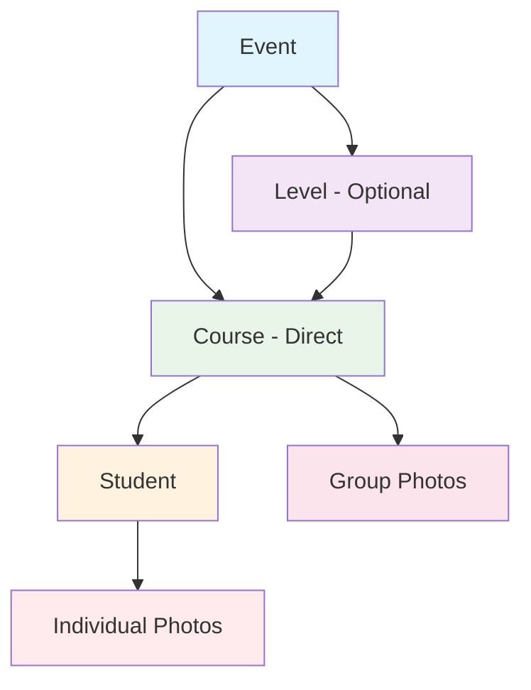
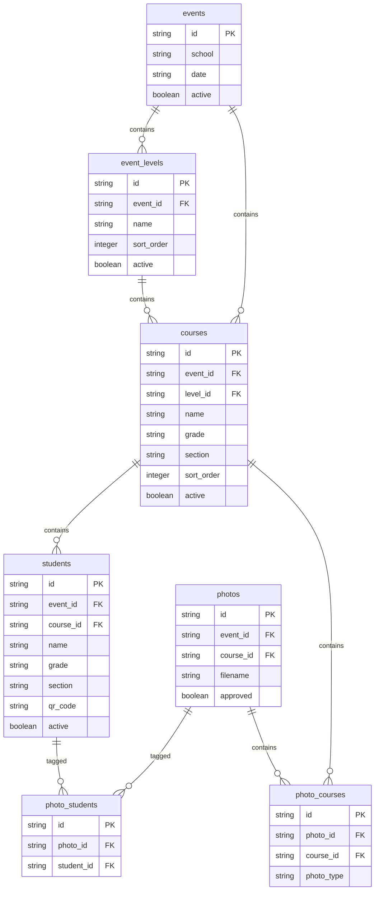

# Admin Events Structure: Comprehensive 360-Degree Analysis

## 1. Overview

The admin events structure in LookEscolar implements a hierarchical organization system that allows photographers to organize photo sessions for educational institutions. The system follows a flexible hierarchy that can accommodate different school structures:

**Event → Level (optional) → Course → Student → Photos**

This design allows for both flat and nested organizational structures, supporting schools with varying complexity levels.

For users managing multiple schools, modalities, and large numbers of people, the system provides scalable navigation, filtering, and batch operations to efficiently handle complex organizational structures.

## 2. Architectural Evaluation

### 2.1 System Architecture

The admin events structure follows a Hybrid Full-Stack Application architecture using Next.js App Router with API routes and Backend-as-a-Service (BaaS) via Supabase. This architecture provides:

1. **Frontend**: Next.js React components with React Query for state management communicating with API routes
2. **Backend**: Next.js API routes acting as a middleware layer between the frontend and Supabase
3. **Database**: PostgreSQL with Row Level Security (RLS) policies for data isolation

### 2.2 Design Patterns

The implementation utilizes several design patterns:

1. **Provider Pattern**: Context providers for state management in the hierarchical navigation
2. **Service Layer Pattern**: Business logic abstracted in API routes
3. **Middleware Pattern**: Next.js middleware for authentication and routing
4. **Virtualization Pattern**: React Window library for efficient rendering of large datasets

### 2.3 Component Architecture

The admin events structure consists of several key components:

1. **HierarchicalNavigation**: Main component for navigating the event hierarchy
2. **VirtualizedStudentGrid**: Efficient rendering of large student lists
3. **CourseManagement**: Interface for managing courses within events
4. **BatchStudentManagement**: Bulk operations for students and courses
5. **BulkOperations**: Generic bulk action handling component

## 3. Core Components

### 3.1 Hierarchical Structure

The system implements a multi-level hierarchy to organize photo sessions:



### 3.2 Entity Relationships



## 4. Core Components

### 4.1 Event Entity

The Event is the top-level container that represents a photo session at a school:

- **Attributes**: id, school, date, active status
- **Purpose**: Acts as the primary organizational unit for all related data
- **Relationships**: Contains levels, courses, students, and photos

### 4.2 Level Entity (Optional)

The Level represents organizational divisions within an event (e.g., "Primary", "Secondary"):

- **Attributes**: id, event_id, name, description, sort_order, active
- **Purpose**: Provides an optional organizational layer for complex institutions
- **Relationships**: Belongs to an event, contains courses

### 4.3 Course Entity

The Course represents a class or group of students:

- **Attributes**: id, event_id, level_id, name, grade, section, sort_order, active
- **Purpose**: Groups students for organizational and tagging purposes
- **Relationships**: Belongs to an event and optional level, contains students

### 4.4 Student Entity

The Student represents an individual participant in the photo session:

- **Attributes**: id, event_id, course_id, name, grade, section, qr_code, contact info
- **Purpose**: Individual subject for photo tagging and family access
- **Relationships**: Belongs to an event and course, associated with photos

### 4.5 Photo Entities

Photos can be associated with either individual students or entire courses:

- **Individual Photos**: Tagged with specific students via photo_students table
- **Group Photos**: Associated with courses via photo_courses table

## 5. Navigation and UI Structure

### 5.1 Hierarchical Navigation Component

The admin interface uses a tab-based navigation system:

1. **Overview Tab**: Dashboard with event statistics and quick actions
2. **Levels Tab**: Management of organizational levels (if used)
3. **Courses Tab**: Management of courses within levels or directly under events
4. **Students Tab**: Management of students within courses

### 5.2 URL Structure

The admin interface follows a consistent URL pattern:

```
/admin/events/[eventId]                    # Event overview
/admin/events/[eventId]?view=levels        # Levels view
/admin/events/[eventId]?view=courses       # Courses view
/admin/events/[eventId]?view=students      # Students view
/admin/events/[eventId]?level=[levelId]    # Filter by level
/admin/events/[eventId]?course=[courseId]  # Filter by course
```

## 6. API Endpoints

### 6.1 Event Management

```
GET    /api/admin/events/[id]              # Get event details
GET    /api/admin/events/[id]/stats        # Get event statistics
```

### 6.2 Level Management

```
GET    /api/admin/events/[id]/levels       # List event levels
POST   /api/admin/events/[id]/levels       # Create new level
PUT    /api/admin/events/[id]/levels/[levelId]  # Update level
DELETE /api/admin/events/[id]/levels/[levelId]  # Delete level
```

### 6.3 Course Management

```
GET    /api/admin/events/[id]/courses      # List courses
POST   /api/admin/events/[id]/courses      # Create new course
PUT    /api/admin/events/[id]/courses/[courseId]  # Update course
DELETE /api/admin/events/[id]/courses/[courseId]  # Delete course
```

### 5.4 Student Management

```
GET    /api/admin/events/[id]/students     # List students
POST   /api/admin/events/[id]/students     # Create new student
PUT    /api/admin/events/[id]/students/[studentId]  # Update student
DELETE /api/admin/events/[id]/students/[studentId]  # Delete student
```

## 7. Data Flow and Interconnections

### 7.1 Creation Flow

1. **Event Creation**: Admin creates a new event with school name and date
2. **Level Setup** (Optional): Admin can create organizational levels
3. **Course Creation**: Admin creates courses within levels or directly under events
4. **Student Enrollment**: Admin adds students to courses
5. **Photo Upload**: Photos are uploaded and associated with the event
6. **Photo Tagging**: Photos are tagged with students or courses
7. **Family Access**: Students are provided with QR codes or tokens for gallery access

### 7.2 Data Relationships

The hierarchical structure maintains referential integrity through foreign key relationships:

- Events can contain multiple levels (optional)
- Levels can contain multiple courses
- Events can also contain courses directly (bypassing levels)
- Courses contain multiple students
- Students can be tagged in multiple photos
- Courses can be associated with group photos

## 8. Implementation Examples

### 8.1 Example Hierarchy Structure

For a school with multiple levels:

```
Evento: "Fotos Escuela Normal"
├── Secundaria
│   ├── Salon 1
│   │   ├── Students (30)
│   │   └── Photos (150 individual, 5 group)
│   ├── Salon 2
│   │   ├── Students (28)
│   │   └── Photos (140 individual, 4 group)
│   └── Salon 3
│       ├── Students (32)
│       └── Photos (160 individual, 6 group)
└── Primaria
    ├── Salon 1
    │   ├── Students (25)
    │   └── Photos (125 individual, 3 group)
    ├── Salon 2
    │   ├── Students (27)
    │   └── Photos (135 individual, 4 group)
    └── Salon 3
        ├── Students (24)
        └── Photos (120 individual, 3 group)
```

### 8.2 Flat Structure Example

For a simpler school structure:

```
Evento: "Fotos Jardín de Infantes"
├── Sala Celeste
│   ├── Students (20)
│   └── Photos (100 individual, 5 group)
├── Sala Roja
│   ├── Students (18)
│   └── Photos (90 individual, 4 group)
└── Sala Amarilla
    ├── Students (22)
    └── Photos (110 individual, 6 group)
```

## 9. Security and Access Control

### 9.1 Row Level Security (RLS)

All entities implement Row Level Security policies:

- **Admin Access**: Authenticated admins can manage all entities within their events
- **Service Role**: Backend services have full access for operations
- **Family Access**: Limited read access to their own student data via tokens

### 9.2 Data Isolation

Each event is isolated from others through:
- Event-scoped queries in all API endpoints
- Foreign key constraints ensuring data integrity
- RLS policies preventing cross-event access

### 9.3 Security Assessment

The current implementation provides several security features:

1. **Authentication**: Admin users must be authenticated to access the admin interface
2. **Authorization**: RLS policies ensure users can only access data they are authorized to view
3. **Data Encryption**: Supabase handles encryption at rest and in transit
4. **Input Validation**: Zod schemas validate all incoming data
5. **Rate Limiting**: Upstash rate limiting prevents abuse of API endpoints
6. **Audit Logging**: Admin activities are logged for accountability

**Security Recommendations**:
1. Implement multi-factor authentication for admin users
2. Add session timeout mechanisms for inactive admins
3. Enhance audit logging with more detailed event tracking
4. Implement IP whitelisting for administrative access
5. Add data export controls to prevent unauthorized bulk data extraction

## 10. Performance Considerations

### 10.1 Database Indexing

Critical indexes for performance:
- Event-based filtering indexes on all child entities
- Sort order indexes for proper display ordering
- Active status indexes for filtering inactive records
- Student token indexes for family access validation

### 10.2 Pagination

Large datasets are paginated:
- Student lists use pagination with configurable limits
- Course lists are paginated for large institutions
- Photo galleries implement virtualized scrolling

### 10.3 Performance Review

The current implementation includes several performance optimizations:

1. **Virtualized Rendering**: React Window library efficiently renders large lists
2. **Database Indexing**: Properly indexed foreign keys and frequently queried fields
3. **Pagination**: Server-side pagination prevents loading excessive data
4. **Caching**: Supabase built-in caching mechanisms
5. **Asynchronous Loading**: Non-blocking data fetching

**Performance Recommendations**:
1. Implement intelligent caching strategies for frequently accessed hierarchical data
2. Optimize complex queries for large datasets
3. Add performance monitoring metrics
4. Implement request batching for related data fetching
5. Add lazy loading for non-critical components

## 11. Migration and Backward Compatibility

### 11.1 Schema Evolution

The hierarchical schema maintains backward compatibility through:
- Migration functions that convert legacy subjects to students
- Optional level implementation allowing flat structures
- Legacy API endpoints maintained during transition

### 11.2 Data Consistency

Migration processes ensure:
- All existing subjects are converted to students
- Subject tokens are migrated to student tokens
- Photo-subject associations are converted to photo-student associations

## 12. Testing Strategy Analysis

The admin events structure should implement a comprehensive testing strategy:

### 12.1 Unit Testing

1. **Component Testing**: Test individual components like HierarchicalNavigation, VirtualizedStudentGrid
2. **API Route Testing**: Test all API endpoints for events, levels, courses, students
3. **Business Logic Testing**: Test data validation, transformation, and business rules

### 12.2 Integration Testing

1. **Database Integration**: Test database operations with Supabase
2. **API Integration**: Test end-to-end flows through API routes
3. **Authentication Integration**: Test RLS policies and authentication flows

### 12.3 Performance Testing

1. **Load Testing**: Test performance with large numbers of students and photos
2. **Stress Testing**: Test system behavior under extreme conditions
3. **Pagination Testing**: Verify pagination works correctly with large datasets

### 12.4 Usability Testing

1. **Navigation Testing**: Test hierarchical navigation with different data structures
2. **Bulk Operation Testing**: Test batch operations with various data sizes
3. **Accessibility Testing**: Ensure compliance with WCAG standards

### 12.5 Security Testing

1. **Authorization Testing**: Verify RLS policies prevent unauthorized access
2. **Data Isolation Testing**: Ensure events are properly isolated
3. **Input Validation Testing**: Test validation of all user inputs

## 13. Current Implementation Assessment

Based on the codebase analysis, the current implementation provides a solid foundation for managing multiple schools, modalities, and large numbers of people:

### 10.1 Multiple Schools Management

The system effectively isolates data between different schools through the Event entity, which serves as the top-level container. Each school event maintains its own hierarchy of levels, courses, students, and photos.

Key features already implemented:
- Event-based data isolation with proper foreign key relationships
- School-specific filtering and navigation
- CSV import/export capabilities for bulk student/course management
- Email template generation for school distribution

### 10.2 Multiple Modalities Support

The flexible hierarchy supports different photography modalities:
- Optional Level entity allows for different organizational structures
- Course entity can represent different photography types
- Photo classification system (individual/group) through photo_type field
- Support for both flat and nested organizational structures

### 10.3 Large Numbers of People Handling

The system implements several optimizations for handling large datasets:
- Virtualized rendering using React Window for efficient student list display
- Pagination support in API endpoints
- Batch operations for students and courses
- Advanced filtering and search capabilities
- Progressive loading for smooth navigation

### 10.4 Performance Considerations

Current performance optimizations include:
- Proper database indexing on frequently queried fields
- Pagination for large datasets
- Virtualized rendering for UI performance
- Row Level Security for data isolation
- Caching through Supabase infrastructure

## 14. Optimization Recommendations

### 14.1 For Multiple Schools Management

Based on the current implementation analysis, the system already provides several features for managing multiple schools:

1. **Event-Based Isolation**: Each school event is isolated through the event entity, ensuring data separation
2. **Bulk Operations**: The system includes batch management components for students and courses with CSV import/export capabilities
3. **Cross-Event Filtering**: Events can be filtered and managed individually through the admin interface

**Recommended Enhancements**:
- **School Templates**: Implement reusable templates for common school structures to speed up event creation for recurring schools
- **Cross-Event Analytics**: Dashboard views that aggregate data across multiple schools for performance tracking
- **Bulk Event Management**: Allow operations across multiple events simultaneously (e.g., updating pricing, applying policies)

### 14.2 For Multiple Modalities

The current system supports different photography modalities through:

1. **Flexible Hierarchy**: The optional level entity allows for different organizational structures
2. **Course Grouping**: Courses can represent different modalities (e.g., individual portraits, group photos)
3. **Photo Classification**: Photos can be tagged as individual or group through the photo_type field

**Recommended Enhancements**:
- **Custom Fields**: Allow administrators to define custom fields for different photography modalities
- **Workflow Templates**: Predefined workflows for different photography types with modality-specific tagging approaches
- **Modality-Based Reporting**: Generate reports specific to different photography modalities

### 14.3 For Large Numbers of People

The system already implements several optimizations for handling large numbers of people:

1. **Virtualized Rendering**: VirtualizedStudentGrid component for efficient rendering of large student lists
2. **Pagination**: API endpoints support pagination for large datasets
3. **Batch Operations**: Bulk operations for students and courses with progress tracking
4. **Advanced Filtering**: Multi-dimensional filtering capabilities in various components
5. **Search Functionality**: Search capabilities across students, courses, and events

**Recommended Enhancements**:
- **Enhanced Search**: Implement fuzzy matching and autocomplete for more efficient student lookup
- **Smart Grouping**: Allow dynamic grouping of students based on multiple criteria
- **Progressive Loading**: Improve infinite scroll implementation for smoother navigation
- **Performance Monitoring**: Add metrics to track performance with large datasets

### 14.4 Performance Enhancements

The current implementation includes several performance optimizations:

1. **Database Indexing**: Proper indexes on foreign keys and frequently queried fields
2. **Pagination**: Server-side pagination for large datasets
3. **Virtualization**: React Window library for efficient rendering of large lists
4. **Caching**: Supabase built-in caching mechanisms

**Recommended Enhancements**:
- **Intelligent Caching**: Implement custom caching strategies for frequently accessed hierarchical data
- **Query Optimization**: Analyze and optimize complex queries for large datasets
- **Asynchronous Processing**: Background jobs for bulk operations to maintain UI responsiveness
- **Database Partitioning**: Consider partitioning strategies for very large events

### 14.5 User Experience Improvements

The system already provides a comprehensive admin interface with:

1. **Responsive Design**: Mobile-optimized navigation and controls
2. **Tab-Based Navigation**: Clear organization of different administrative functions
3. **Visual Feedback**: Progress indicators and status badges
4. **Bulk Actions**: Multi-select capabilities for batch operations

**Recommended Enhancements**:
- **Keyboard Navigation**: Enhanced keyboard shortcuts for power users
- **Customizable Views**: Allow administrators to save and switch between different organizational views
- **Activity History**: Track and display user actions for accountability
- **Role-Based Access**: Implement fine-grained permissions for team collaboration

## 15. Deployment Readiness Evaluation

The admin events structure is ready for deployment with the following considerations:

### 15.1 Infrastructure Requirements

1. **Supabase**: PostgreSQL database with RLS enabled
2. **Next.js**: Standalone server deployment
3. **Storage**: Supabase storage for photo assets
4. **Authentication**: Supabase Auth for admin user management

### 15.2 Scalability Considerations

1. **Database Scaling**: PostgreSQL can handle the hierarchical structure efficiently
2. **Application Scaling**: Next.js standalone deployment supports horizontal scaling
3. **Storage Scaling**: Supabase storage provides scalable asset storage

### 15.3 Monitoring and Observability

1. **Error Tracking**: Pino logging for error monitoring
2. **Performance Monitoring**: Bundle analysis and Web Vitals tracking
3. **Usage Analytics**: Event and student activity tracking

### 15.4 Backup and Recovery

1. **Database Backups**: Supabase provides automated backups
2. **Asset Backups**: Storage assets are replicated
3. **Disaster Recovery**: Migration scripts support data recovery

## 12. Conclusion and Final Recommendations

The current implementation of the admin events structure in LookEscolar provides a robust foundation for managing multiple schools, modalities, and large numbers of people. The hierarchical design effectively supports the complex organizational needs of educational photography workflows.

### Key Strengths:
1. **Flexible Hierarchy**: The Event → Level → Course → Student structure accommodates both simple and complex organizational structures
2. **Scalability**: Virtualized rendering and pagination support large datasets efficiently
3. **Bulk Operations**: Comprehensive batch management capabilities for students and courses
4. **Data Isolation**: Proper RLS policies ensure data separation between different schools
5. **Performance Optimization**: Database indexing and virtualization techniques optimize performance

## 16. Prioritized Improvement Recommendations

Based on the comprehensive analysis, here are the prioritized recommendations for enhancing the admin events structure:

### 13.1 Immediate Priority (Next Release - 2-4 weeks)

1. **Enhanced Search Functionality**:
   - Implement fuzzy matching for student names and attributes
   - Add autocomplete suggestions to improve search efficiency
   - Enable search across multiple fields simultaneously

2. **Customizable Dashboard Views**:
   - Allow administrators to create and save custom dashboard layouts
   - Implement cross-event analytics widgets
   - Add keyboard navigation shortcuts for power users

3. **Performance Monitoring**:
   - Add metrics to track API response times
   - Implement client-side performance tracking
   - Add loading indicators for long-running operations

### 13.2 Short-term Goals (1-3 months)

1. **School Templates System**:
   - Develop a template system for recurring school structures
   - Create import/export functionality for templates
   - Add template versioning and management

2. **Enhanced Role-Based Access Control**:
   - Implement fine-grained permissions for team collaboration
   - Add user activity history tracking
   - Create audit logs for administrative actions

3. **Advanced Bulk Operations**:
   - Extend batch operations to support cross-event actions
   - Add progress tracking for long-running batch jobs
   - Implement undo functionality for bulk operations

### 13.3 Long-term Vision (3-6 months)

1. **Workflow Templates**:
   - Create predefined workflows for different photography modalities
   - Implement modality-specific tagging approaches
   - Add workflow customization capabilities

2. **Advanced Data Management**:
   - Implement data partitioning strategies for very large events
   - Add advanced filtering and grouping capabilities
   - Create comprehensive reporting across multiple schools and modalities

3. **Multi-tenancy Enhancements**:
   - Implement organization-level isolation
   - Add billing and subscription management
   - Create white-labeling capabilities for large clients

### 13.4 Implementation Strategy

The recommended implementation approach follows an iterative development model:

1. **Phase 1**: Focus on immediate improvements to enhance user experience
2. **Phase 2**: Build foundational features for scalability and collaboration
3. **Phase 3**: Implement advanced functionality for complex use cases

Each phase should include:
- Comprehensive testing (unit, integration, and end-to-end)
- Performance benchmarking
- Security reviews
- User acceptance testing

The current architecture is well-positioned to support the growing needs of photographers managing multiple schools and large numbers of students, with the recommended enhancements providing additional value for power users and complex workflows.