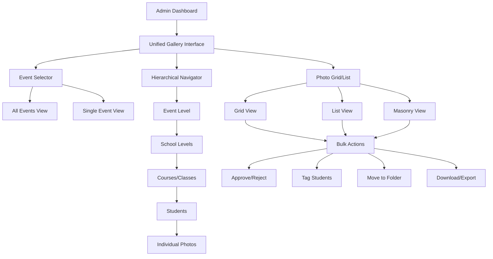
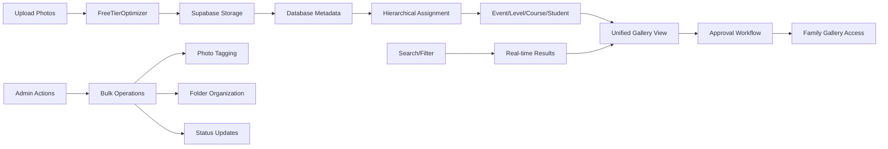
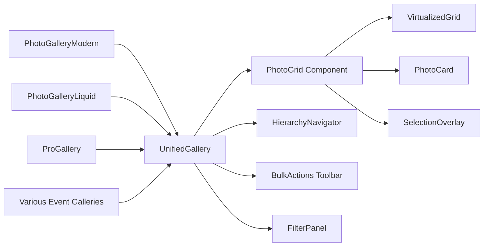
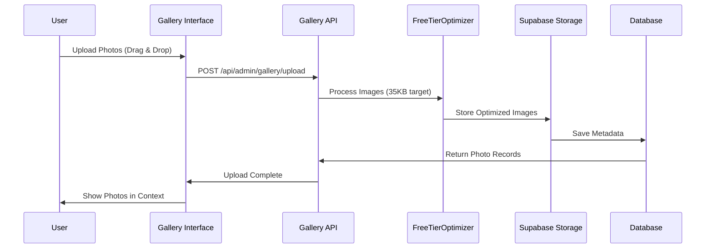
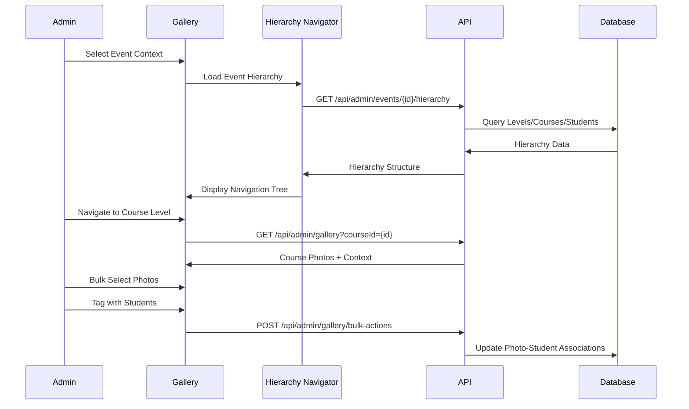
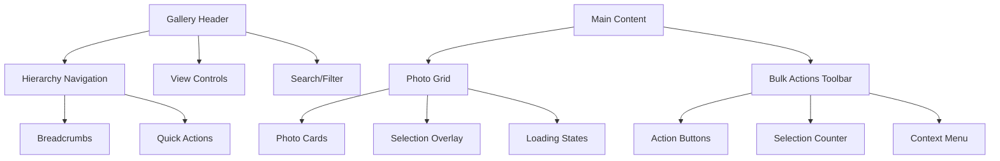

# Admin Gallery Redesign - Unified Photo Management System

## Overview

This design document outlines the redesign of LookEscolar's admin gallery system to create a unified, hierarchical photo management interface. The current system has fragmentation between `/admin/photos` (simple gallery) and `/admin/events` (event-specific libraries), creating confusion for photographers managing large volumes of school photos across multiple events and organizational levels.

## Current System Analysis

### Problem Statement

The current photo management system suffers from:

1. **Dual Interface Confusion**: Separate galleries at `/admin/photos` and `/admin/events/[id]/library` with different UIs
2. **Component Fragmentation**: Multiple photo gallery components (PhotoGalleryModern, PhotoGalleryLiquid, ProGallery) with overlapping functionality
3. **Inconsistent Hierarchy**: Unclear navigation between Event → Level → Course → Student → Photos
4. **Poor Scalability**: Managing hundreds of photos across multiple events, levels, and classrooms is cumbersome

### Current Architecture Issues

- **PhotoGalleryModern.tsx**: 74KB component with excessive memory usage
- **Three Photo Pages**: page.tsx, page-old.tsx, page-simple.tsx creating maintenance overhead
- **Disconnected Workflows**: Event management and photo organization feel like separate systems

## Technology Stack

### Frontend
- **Framework**: Next.js 15.4.5 with App Router
- **UI Library**: React 19.1.1 + TypeScript 5.9.2
- **Styling**: Tailwind CSS 3.4.17 + Shadcn/ui components
- **State Management**: Zustand 5.0.7 + React Query 5.84.1
- **Virtualization**: @tanstack/react-virtual for large photo sets

### Backend
- **Database**: Supabase PostgreSQL with Row Level Security
- **Storage**: Supabase Storage with FreeTierOptimizer
- **Authentication**: Supabase Auth with custom middleware
- **Image Processing**: Sharp 0.34.3 with custom compression

## Architecture

### Unified Gallery Architecture



### Data Flow Architecture



## Component Architecture

### Unified Gallery Component Hierarchy

```typescript
// Main Gallery Container
interface UnifiedGalleryProps {
  mode: 'all-events' | 'single-event';
  eventId?: string;
  initialView: 'overview' | 'hierarchy' | 'photos';
}

// Hierarchical Navigation
interface HierarchyNavigatorProps {
  eventId: string;
  currentPath: HierarchyPath;
  onNavigate: (path: HierarchyPath) => void;
}

// Photo Grid with Virtualization
interface VirtualizedPhotoGridProps {
  photos: Photo[];
  selectionMode: boolean;
  viewMode: 'grid' | 'list' | 'masonry';
  onSelectionChange: (photoIds: string[]) => void;
}

// Bulk Action Toolbar
interface BulkActionsProps {
  selectedPhotos: string[];
  currentContext: HierarchyContext;
  onAction: (action: BulkAction) => Promise<void>;
}
```

### Component Consolidation Strategy



## Data Models & ORM Mapping

### Hierarchical Data Structure

```sql
-- Event Structure (Root Level)
events
├── id: UUID (Primary Key)
├── name: VARCHAR (e.g., "Colegio San Martín 2024")
├── school: VARCHAR
├── event_date: DATE
├── status: ENUM ('active', 'completed', 'archived')
└── photo_count: INTEGER (computed)

-- Event Levels (Optional Organizational Layer)
event_levels
├── id: UUID
├── event_id: UUID (FK → events.id)
├── name: VARCHAR (e.g., "Primaria", "Secundaria")
├── description: TEXT
├── sort_order: INTEGER
└── active: BOOLEAN

-- Courses/Classes
courses
├── id: UUID
├── event_id: UUID (FK → events.id)
├── level_id: UUID (FK → event_levels.id, NULL if no levels)
├── name: VARCHAR (e.g., "1er Grado A")
├── grade: VARCHAR
├── section: VARCHAR
├── is_folder: BOOLEAN (for organizational folders)
├── parent_course_id: UUID (FK → courses.id, for nested folders)
└── sort_order: INTEGER

-- Students
students
├── id: UUID
├── course_id: UUID (FK → courses.id)
├── name: VARCHAR
├── qr_code: VARCHAR (unique identifier)
├── email: VARCHAR
├── active: BOOLEAN
└── photo_count: INTEGER (computed)

-- Photos with Hierarchical Associations
photos
├── id: UUID
├── event_id: UUID (FK → events.id)
├── filename: VARCHAR
├── storage_path: VARCHAR
├── preview_url: VARCHAR
├── file_size: INTEGER
├── approved: BOOLEAN
├── tagged: BOOLEAN
└── created_at: TIMESTAMP

-- Photo-Student Many-to-Many
photo_students
├── photo_id: UUID (FK → photos.id)
├── student_id: UUID (FK → students.id)
└── tagged_at: TIMESTAMP

-- Photo-Course Many-to-Many (for group photos)
photo_courses
├── photo_id: UUID (FK → photos.id)
├── course_id: UUID (FK → courses.id)
└── photo_type: ENUM ('individual', 'group', 'class')
```

### Hierarchy Path Resolution

```typescript
interface HierarchyPath {
  event?: {
    id: string;
    name: string;
  };
  level?: {
    id: string;
    name: string;
  };
  course?: {
    id: string;
    name: string;
    isFolder: boolean;
  };
  student?: {
    id: string;
    name: string;
  };
}

interface HierarchyContext {
  path: HierarchyPath;
  photoCount: number;
  canUpload: boolean;
  canBulkEdit: boolean;
  breadcrumbs: Breadcrumb[];
}
```

## API Endpoints Reference

### Unified Gallery Endpoints

| Endpoint | Method | Purpose | Request/Response |
|----------|--------|---------|------------------|
| `/api/admin/gallery` | GET | Unified gallery data | Query params for hierarchy filtering |
| `/api/admin/gallery/hierarchy` | GET | Get hierarchy tree | Event/level/course structure |
| `/api/admin/gallery/photos` | GET | Photos with hierarchy context | Paginated photos with metadata |
| `/api/admin/gallery/bulk-actions` | POST | Bulk photo operations | Array of photo IDs + action type |
| `/api/admin/gallery/search` | GET | Cross-hierarchy search | Search term + entity types |

### Enhanced Event Endpoints

| Endpoint | Method | Purpose | Enhancement |
|----------|--------|---------|-------------|
| `/api/admin/events/[id]/gallery` | GET | Event-specific gallery | Unified interface |
| `/api/admin/events/[id]/hierarchy` | GET | Event hierarchy tree | Complete organizational structure |
| `/api/admin/events/[id]/photos/bulk` | POST | Bulk photo operations within event | Context-aware actions |

### Request/Response Schemas

```typescript
// GET /api/admin/gallery
interface GalleryRequest {
  eventId?: string;
  levelId?: string;
  courseId?: string;
  studentId?: string;
  view: 'overview' | 'photos';
  page?: number;
  limit?: number;
  filters?: {
    approved?: boolean;
    tagged?: boolean;
    photoType?: 'individual' | 'group' | 'class';
  };
}

interface GalleryResponse {
  hierarchy: HierarchyContext;
  photos: Photo[];
  stats: {
    totalPhotos: number;
    approvedPhotos: number;
    taggedPhotos: number;
  };
  pagination: {
    page: number;
    limit: number;
    hasMore: boolean;
  };
}

// POST /api/admin/gallery/bulk-actions
interface BulkActionRequest {
  photoIds: string[];
  action: 'approve' | 'reject' | 'tag' | 'move' | 'delete';
  context: HierarchyContext;
  metadata?: {
    studentIds?: string[];
    targetCourseId?: string;
    approvalStatus?: boolean;
  };
}
```

## Business Logic Layer

### Photo Management Workflows

#### Upload and Processing Pipeline



#### Hierarchical Assignment Workflow



### Folder Organization System

#### Dynamic Folder Structure

```typescript
interface FolderStructure {
  event: {
    id: string;
    name: string;
    folders: Level[];
  };
}

interface Level {
  id: string;
  name: string; // "Primaria", "Secundaria"
  courses: Course[];
}

interface Course {
  id: string;
  name: string; // "1er Grado A"
  isFolder: boolean;
  subCourses?: Course[]; // Nested folders
  students: Student[];
  photoCount: number;
}

interface Student {
  id: string;
  name: string;
  qrCode: string;
  photoCount: number;
  individualPhotos: number;
  groupPhotos: number;
}
```

#### Folder Navigation Rules

1. **Event Level**: Shows all levels or courses if no levels exist
2. **Level Level**: Shows all courses within that level
3. **Course Level**: Shows students + course-specific folders
4. **Student Level**: Shows individual student photos
5. **Photo Level**: Individual photo management

### Bulk Operations Engine

```typescript
interface BulkOperation {
  type: 'approve' | 'reject' | 'tag' | 'move' | 'delete' | 'export';
  photoIds: string[];
  context: HierarchyContext;
  metadata: BulkOperationMetadata;
}

interface BulkOperationMetadata {
  // For tagging operations
  studentIds?: string[];
  tagMode?: 'add' | 'remove' | 'replace';
  
  // For move operations
  targetCourseId?: string;
  targetStudentId?: string;
  
  // For approval operations
  approvalStatus?: boolean;
  approvalReason?: string;
  
  // For export operations
  format?: 'zip' | 'folder';
  quality?: 'original' | 'compressed';
}

class BulkOperationsEngine {
  async executeBulkOperation(operation: BulkOperation): Promise<BulkOperationResult> {
    // Validate operation context
    // Execute operation with progress tracking
    // Update UI with real-time feedback
    // Handle rollback on errors
  }
}
```

## Routing & Navigation

### Unified URL Structure

```typescript
// New unified routing structure
const galleryRoutes = {
  // Global gallery view
  '/admin/gallery': 'All events overview',
  
  // Event-specific gallery
  '/admin/gallery/events/[eventId]': 'Event gallery root',
  '/admin/gallery/events/[eventId]/levels/[levelId]': 'Level view',
  '/admin/gallery/events/[eventId]/courses/[courseId]': 'Course view',
  '/admin/gallery/events/[eventId]/students/[studentId]': 'Student view',
  
  // Legacy support (redirects to new structure)
  '/admin/photos': '→ /admin/gallery',
  '/admin/events/[id]/library': '→ /admin/gallery/events/[id]',
};
```

### Navigation State Management

```typescript
interface NavigationState {
  currentPath: HierarchyPath;
  breadcrumbs: Breadcrumb[];
  backStack: HierarchyPath[];
  canNavigateBack: boolean;
  canNavigateUp: boolean;
}

interface Breadcrumb {
  label: string;
  path: HierarchyPath;
  icon?: IconType;
  isClickable: boolean;
}

class NavigationManager {
  updatePath(newPath: HierarchyPath): void;
  navigateBack(): void;
  navigateUp(): void;
  buildBreadcrumbs(path: HierarchyPath): Breadcrumb[];
}
```

### URL Parameter Management

```typescript
// Dynamic URL parameters for gallery state
interface GalleryURLParams {
  eventId?: string;
  levelId?: string;
  courseId?: string;
  studentId?: string;
  view?: 'overview' | 'photos';
  filter?: string;
  sort?: 'date' | 'name' | 'approval';
  page?: number;
}

// URL state synchronization
class URLStateManager {
  syncStateToURL(state: NavigationState): void;
  parseURLToState(searchParams: URLSearchParams): NavigationState;
  updateURLWithoutReload(params: Partial<GalleryURLParams>): void;
}
```

## Styling Strategy

### Design System Tokens

```typescript
// Gallery-specific design tokens
const galleryTokens = {
  colors: {
    hierarchy: {
      event: 'bg-blue-500',
      level: 'bg-green-500', 
      course: 'bg-purple-500',
      student: 'bg-orange-500',
      photo: 'bg-gray-500'
    },
    status: {
      approved: 'text-green-600',
      pending: 'text-yellow-600',
      rejected: 'text-red-600'
    }
  },
  spacing: {
    gridGap: '1rem',
    cardPadding: '1.5rem',
    hierarchyIndent: '2rem'
  },
  breakpoints: {
    mobile: '640px',
    tablet: '768px',
    desktop: '1024px',
    wide: '1280px'
  }
};
```

### Responsive Layout Strategy

```css
/* Gallery responsive grid system */
.gallery-grid {
  display: grid;
  gap: 1rem;
  
  /* Mobile: 2 columns */
  grid-template-columns: repeat(2, 1fr);
  
  /* Tablet: 3-4 columns */
  @media (min-width: 768px) {
    grid-template-columns: repeat(4, 1fr);
  }
  
  /* Desktop: 5-6 columns */
  @media (min-width: 1024px) {
    grid-template-columns: repeat(6, 1fr);
  }
  
  /* Wide screens: 8+ columns */
  @media (min-width: 1280px) {
    grid-template-columns: repeat(8, 1fr);
  }
}

/* Hierarchy navigation responsive */
.hierarchy-nav {
  @apply flex flex-col lg:flex-row gap-4;
}

.hierarchy-breadcrumbs {
  @apply flex flex-wrap gap-2 text-sm;
}
```

### Visual Hierarchy System



## State Management

### Gallery State Architecture

```typescript
// Main gallery store using Zustand
interface GalleryState {
  // Navigation state
  currentPath: HierarchyPath;
  navigationHistory: HierarchyPath[];
  
  // Data state
  events: Event[];
  hierarchy: HierarchyData;
  photos: Photo[];
  selectedPhotos: Set<string>;
  
  // UI state
  viewMode: 'grid' | 'list' | 'masonry';
  filters: PhotoFilters;
  sortBy: SortOption;
  isLoading: boolean;
  error: string | null;
  
  // Actions
  navigate: (path: HierarchyPath) => void;
  selectPhotos: (photoIds: string[]) => void;
  clearSelection: () => void;
  setViewMode: (mode: ViewMode) => void;
  applyFilters: (filters: PhotoFilters) => void;
  executeAction: (action: BulkAction) => Promise<void>;
}

// React Query for server state
const galleryQueries = {
  hierarchy: (eventId: string) => 
    useQuery(['gallery', 'hierarchy', eventId], () => 
      fetchHierarchy(eventId)
    ),
  
  photos: (context: HierarchyContext, filters: PhotoFilters) =>
    useQuery(['gallery', 'photos', context, filters], () =>
      fetchPhotos(context, filters)
    ),
    
  photoSearch: (query: string) =>
    useQuery(['gallery', 'search', query], () =>
      searchPhotos(query)
    )
};
```

### Performance Optimization State

```typescript
// Virtualization and caching
interface VirtualizationState {
  visibleRange: { start: number; end: number };
  itemHeight: number;
  containerHeight: number;
  scrollTop: number;
}

// Photo preloading
interface PreloadState {
  preloadedPhotos: Map<string, HTMLImageElement>;
  preloadQueue: string[];
  isPreloading: boolean;
}

// Selection optimization
interface SelectionState {
  selectedPhotos: Set<string>;
  lastSelectedIndex: number;
  shiftKeyPressed: boolean;
  
  // Optimized selection methods
  selectRange: (startIndex: number, endIndex: number) => void;
  toggleSelection: (photoId: string, index: number) => void;
  selectAll: () => void;
  clearSelection: () => void;
}
```

## API Integration Layer

### Unified Gallery API Client

```typescript
class GalleryAPIClient {
  // Hierarchy operations
  async getHierarchy(eventId: string): Promise<HierarchyData> {
    return this.get(`/api/admin/gallery/hierarchy?eventId=${eventId}`);
  }
  
  // Photo operations
  async getPhotos(context: HierarchyContext, options: PhotoQueryOptions): Promise<PhotosResponse> {
    const params = new URLSearchParams({
      ...this.serializeContext(context),
      ...this.serializeOptions(options)
    });
    return this.get(`/api/admin/gallery/photos?${params}`);
  }
  
  // Bulk operations
  async executeBulkAction(action: BulkAction): Promise<BulkActionResult> {
    return this.post('/api/admin/gallery/bulk-actions', action);
  }
  
  // Search operations
  async searchPhotos(query: string, filters: SearchFilters): Promise<SearchResult[]> {
    return this.get(`/api/admin/gallery/search?q=${encodeURIComponent(query)}`);
  }
  
  // Upload operations
  async uploadPhotos(files: File[], context: HierarchyContext): Promise<UploadResult> {
    const formData = new FormData();
    files.forEach(file => formData.append('photos', file));
    formData.append('context', JSON.stringify(context));
    
    return this.post('/api/admin/gallery/upload', formData);
  }
}
```

### Error Handling Strategy

```typescript
interface APIError {
  code: string;
  message: string;
  details?: any;
  retryable: boolean;
}

class ErrorHandler {
  handleAPIError(error: APIError): void {
    switch (error.code) {
      case 'HIERARCHY_NOT_FOUND':
        // Redirect to event selection
        break;
      case 'INSUFFICIENT_PERMISSIONS':
        // Show permission error
        break;
      case 'RATE_LIMIT_EXCEEDED':
        // Implement exponential backoff
        break;
      default:
        // Generic error handling
    }
  }
  
  async retryWithBackoff<T>(
    operation: () => Promise<T>,
    maxRetries: number = 3
  ): Promise<T> {
    // Exponential backoff implementation
  }
}
```

### Caching Strategy

```typescript
// React Query configuration for gallery
const galleryQueryConfig = {
  queries: {
    staleTime: 5 * 60 * 1000, // 5 minutes
    cacheTime: 30 * 60 * 1000, // 30 minutes
    refetchOnWindowFocus: false,
    retry: (failureCount, error) => {
      return error.retryable && failureCount < 3;
    }
  }
};

// Cache invalidation strategy
class CacheManager {
  invalidateHierarchy(eventId: string): void {
    queryClient.invalidateQueries(['gallery', 'hierarchy', eventId]);
  }
  
  invalidatePhotos(context: HierarchyContext): void {
    queryClient.invalidateQueries(['gallery', 'photos', context]);
  }
  
  invalidateSearch(): void {
    queryClient.invalidateQueries(['gallery', 'search']);
  }
}
```

## Testing Strategy

### Component Testing Strategy

```typescript
// Gallery component testing
describe('UnifiedGallery', () => {
  describe('Hierarchy Navigation', () => {
    test('should navigate between hierarchy levels', async () => {
      // Test navigation flow
    });
    
    test('should maintain breadcrumb state', () => {
      // Test breadcrumb updates
    });
    
    test('should handle back navigation', () => {
      // Test back button functionality
    });
  });
  
  describe('Photo Operations', () => {
    test('should handle bulk photo selection', () => {
      // Test selection logic
    });
    
    test('should execute bulk actions', async () => {
      // Test bulk operation execution
    });
    
    test('should handle photo upload', async () => {
      // Test upload workflow
    });
  });
  
  describe('Performance', () => {
    test('should virtualize large photo grids', () => {
      // Test virtualization
    });
    
    test('should preload images efficiently', () => {
      // Test image preloading
    });
  });
});
```

### Integration Testing

```typescript
// End-to-end gallery workflows
describe('Gallery Integration', () => {
  test('Photographer workflow: Upload → Organize → Approve', async () => {
    // 1. Login as photographer
    // 2. Navigate to event
    // 3. Upload photos
    // 4. Organize into hierarchy
    // 5. Bulk approve photos
    // 6. Verify family can access
  });
  
  test('Multi-event management workflow', async () => {
    // 1. Create multiple events
    // 2. Set up hierarchy for each
    // 3. Upload photos to different levels
    // 4. Test cross-event navigation
    // 5. Verify data isolation
  });
  
  test('Large dataset performance', async () => {
    // 1. Create event with 1000+ photos
    // 2. Test navigation performance
    // 3. Test search performance
    // 4. Test bulk operations
  });
});
```

### Performance Testing

```typescript
// Gallery performance benchmarks
const performanceTests = {
  photoGridRendering: {
    maxRenderTime: 100, // ms
    maxMemoryUsage: 50, // MB
    test: () => {
      // Render 500+ photos
      // Measure render time and memory
    }
  },
  
  hierarchyNavigation: {
    maxNavigationTime: 50, // ms
    test: () => {
      // Navigate through deep hierarchy
      // Measure response time
    }
  },
  
  bulkOperations: {
    maxProcessingTime: 200, // ms per 100 photos
    test: () => {
      // Execute bulk operations on large sets
      // Measure processing time
    }
  }
};
```

This unified gallery redesign consolidates the fragmented photo management system into a single, intuitive interface that scales efficiently for photographers managing large volumes of school photos across complex organizational hierarchies.