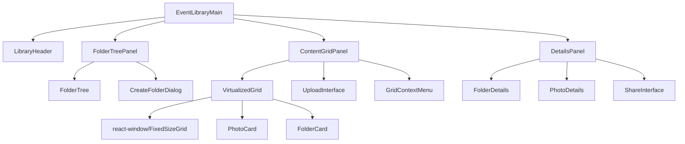
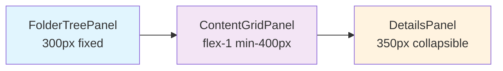

# Admin Photo Library - Design Document

## Overview

The Admin Photo Library is a comprehensive folder-based photo management system that provides administrators with an efficient interface for organizing, managing, and sharing event photos. The system introduces a hierarchical folder structure within events, enabling better organization and streamlined workflows for photo management.

### Core Value Proposition

- **Hierarchical Organization**: Folder-based structure for better photo organization within events
- **High Performance**: Virtualized rendering capable of handling thousands of photos with 60fps scrolling
- **Intuitive Interface**: Three-panel layout with drag-and-drop operations
- **Advanced Selection**: Multi-select with stable ID-based range selection
- **Seamless Sharing**: Generate secure tokens for watermarked family access

## Architecture

### Route Structure

```
/admin/events/:eventId/library?folderId=<uuid>
```

The library operates as a single-page application within the event context, using query parameters for folder navigation and deep linking.

### Data Model

#### Event Folders Table

```sql
CREATE TABLE event_folders (
  id UUID PRIMARY KEY DEFAULT gen_random_uuid(),
  event_id UUID NOT NULL REFERENCES events(id) ON DELETE CASCADE,
  parent_id UUID REFERENCES event_folders(id) ON DELETE CASCADE,
  name TEXT NOT NULL,
  path TEXT NOT NULL, -- Computed hierarchical path for breadcrumbs
  depth INTEGER NOT NULL DEFAULT 0,
  created_at TIMESTAMPTZ DEFAULT NOW(),
  updated_at TIMESTAMPTZ DEFAULT NOW(),
  CONSTRAINT valid_depth CHECK (depth >= 0 AND depth <= 10),
  CONSTRAINT valid_name CHECK (LENGTH(name) > 0 AND LENGTH(name) <= 100),
  CONSTRAINT no_self_reference CHECK (id != parent_id)
);

-- Indexes for performance
CREATE INDEX idx_event_folders_event_id ON event_folders(event_id);
CREATE INDEX idx_event_folders_parent_id ON event_folders(parent_id);
CREATE INDEX idx_event_folders_path ON event_folders(path);
```

#### Photos Table Enhancement

```sql
ALTER TABLE photos ADD COLUMN folder_id UUID REFERENCES event_folders(id) ON DELETE SET NULL;
CREATE INDEX idx_photos_folder_id ON photos(folder_id);
```

### Component Architecture



## API Endpoints

### Folder Management

#### GET /api/admin/events/{eventId}/folders

```typescript
interface FolderListResponse {
  success: boolean;
  folders: Array<{
    id: string;
    name: string;
    parent_id: string | null;
    path: string;
    depth: number;
    photo_count: number;
    subfolder_count: number;
    created_at: string;
    updated_at: string;
  }>;
}
```

**Query Parameters:**
- `parentId`: Filter folders by parent (null for root folders)
- `include_stats`: Include photo and subfolder counts

#### POST /api/admin/events/{eventId}/folders

```typescript
interface CreateFolderRequest {
  name: string;
  parentId?: string;
}

interface CreateFolderResponse {
  success: boolean;
  folder: {
    id: string;
    name: string;
    parent_id: string | null;
    path: string;
    depth: number;
  };
}
```

#### PATCH /api/admin/folders/{folderId}

```typescript
interface UpdateFolderRequest {
  name?: string;
  parentId?: string;
}
```

**Validation:**
- Prevent circular references in parent-child relationships
- Ensure maximum depth of 10 levels
- Check for duplicate names within the same parent

#### DELETE /api/admin/folders/{folderId}

**Query Parameters:**
- `force`: Boolean to delete non-empty folders (moves photos to parent or root)

### Photo Management

#### GET /api/admin/events/{eventId}/photos

```typescript
interface PhotoListResponse {
  success: boolean;
  photos: Array<{
    id: string;
    filename: string;
    storage_path: string;
    preview_url: string;
    folder_id: string | null;
    file_size: number;
    width: number;
    height: number;
    approved: boolean;
    created_at: string;
  }>;
  pagination: {
    page: number;
    limit: number;
    total: number;
    hasNextPage: boolean;
  };
}
```

**Query Parameters:**
- `folderId`: Filter by folder (null for unassigned)
- `page`: Page number (1-based)
- `limit`: Items per page (max 100)
- `orderBy`: Sort field (`created_at`, `filename`, `file_size`)
- `orderDirection`: Sort direction (`asc`, `desc`)

#### PATCH /api/admin/photos/batch-move

```typescript
interface BatchMoveRequest {
  photoIds: string[];
  folderId: string | null; // null moves to root/unassigned
}

interface BatchMoveResponse {
  success: boolean;
  moved: number;
  errors: Array<{
    photoId: string;
    error: string;
  }>;
}
```

### Upload System

#### POST /api/admin/events/{eventId}/upload-url

```typescript
interface UploadUrlRequest {
  filename: string;
  contentType: string;
  folderId?: string;
}

interface UploadUrlResponse {
  success: boolean;
  uploadUrl: string;
  photoId: string;
  expiresAt: string;
}
```

#### POST /api/admin/photos/finalize-upload

```typescript
interface FinalizeUploadRequest {
  photoId: string;
  folderId?: string;
  metadata?: {
    width: number;
    height: number;
    fileSize: number;
  };
}
```

### Batch Operations

#### POST /api/admin/photos/sign-urls

```typescript
interface SignUrlsRequest {
  photoIds: string[];
  purpose: 'preview' | 'thumbnail' | 'download';
}

interface SignUrlsResponse {
  success: boolean;
  urls: Record<string, string>; // photoId -> signedUrl
  expiresAt: string;
}
```

### Sharing System

#### POST /api/admin/share

```typescript
interface ShareRequest {
  eventId: string;
  folderId?: string; // Share specific folder
  photoIds?: string[]; // Share specific photos
  options?: {
    watermark: boolean;
    lowResolution: boolean;
    expiresInDays: number;
  };
}

interface ShareResponse {
  success: boolean;
  token: string;
  url: string;
  expiresAt: string;
}
```

## Performance Optimization

### Virtualized Grid Implementation

```typescript
interface VirtualizedGridProps {
  items: (FolderItem | PhotoItem)[];
  itemHeight: number; // Fixed height: 200px
  containerHeight: number;
  containerWidth: number;
  overscan: number; // Default: 3
  onScroll: (scrollTop: number) => void;
  onItemSelect: (itemId: string, isRange: boolean) => void;
}
```

**Key Features:**
- **Fixed Item Heights**: 200px for consistent virtualization
- **Overscan Buffer**: 3 items above/below viewport for smooth scrolling
- **Stable Selection**: ID-based selection that persists across sort/pagination
- **Efficient Rendering**: Only renders visible items + overscan

### Pagination Strategy

```typescript
interface PaginationConfig {
  itemsPerPage: 50; // Balanced for performance
  prefetchNextPage: boolean; // Preload next page when 80% scrolled
  cacheSize: 3; // Keep 3 pages in memory
}
```

### Image Loading Optimization

```typescript
interface ImageLoadingStrategy {
  batchSize: 50; // Request signed URLs in batches
  concurrencyLimit: 6; // Max 6 concurrent requests
  lazyLoading: boolean; // Use Intersection Observer
  placeholderHeight: 200; // Fixed skeleton height
  preloadNext: boolean; // Preload next image in lightbox
}
```

### Performance Monitoring

```typescript
interface PerformanceMetrics {
  scrollFPS: number; // Target: 60fps
  renderTime: number; // Target: <300ms for folder change
  TTI: number; // Target: <2s for 1k items
  memoryUsage: number;
  networkRequests: number;
}
```

## User Interface

### Three-Panel Layout



#### FolderTreePanel (Left Panel)

**Features:**
- Nested folder hierarchy with expand/collapse
- Drag-and-drop folder creation and moving
- Context menu for folder operations
- Search/filter folders
- Breadcrumb navigation

**Components:**
```typescript
interface FolderTreeNode {
  id: string;
  name: string;
  children: FolderTreeNode[];
  photoCount: number;
  isExpanded: boolean;
  isSelected: boolean;
}
```

#### ContentGridPanel (Center Panel)

**Features:**
- Virtualized grid with folders first, then photos
- Fixed 200px item height for consistent virtualization
- Multi-select with Shift+click range selection
- Drag-and-drop file upload overlay
- Sort controls (name, date, size)
- Filter controls (approved, pending)

**Grid Layout:**
```css
.content-grid {
  display: grid;
  grid-template-columns: repeat(auto-fill, minmax(180px, 1fr));
  gap: 16px;
  padding: 16px;
}

.grid-item {
  height: 200px; /* Fixed height for virtualization */
  border-radius: 8px;
  overflow: hidden;
}
```

#### DetailsPanel (Right Panel)

**Features:**
- Collapsible (can be hidden to save space)
- Folder details: name, photo count, creation date
- Photo details: metadata, approval status, tags
- Bulk operations panel when multiple items selected
- Share interface with token generation

### Interaction Patterns

#### Multi-Selection

```typescript
interface SelectionManager {
  selectedIds: Set<string>;
  lastSelectedIndex: number;
  
  handleItemClick(itemId: string, index: number, shiftKey: boolean): void;
  handleRangeSelect(startIndex: number, endIndex: number): void;
  clearSelection(): void;
  selectAll(visibleItems: string[]): void;
}
```

**Selection Behavior:**
- Click: Select single item
- Ctrl/Cmd+Click: Toggle item selection
- Shift+Click: Select range from last selected to clicked item
- Selection persists across sorting and pagination

#### Drag and Drop

```typescript
interface DragDropOperations {
  // File upload
  onFilesDrop(files: FileList, targetFolderId: string): void;
  
  // Folder moving
  onFolderDrop(folderId: string, targetParentId: string): void;
  
  // Photo moving
  onPhotosDrop(photoIds: string[], targetFolderId: string): void;
}
```

### Responsive Design

```css
/* Desktop: All three panels */
@media (min-width: 1024px) {
  .library-layout {
    grid-template-columns: 300px 1fr 350px;
  }
}

/* Tablet: Hide details panel by default */
@media (max-width: 1023px) {
  .library-layout {
    grid-template-columns: 250px 1fr;
  }
  
  .details-panel {
    position: absolute;
    right: 0;
    top: 0;
    bottom: 0;
    transform: translateX(100%);
    transition: transform 0.3s ease;
  }
  
  .details-panel.open {
    transform: translateX(0);
  }
}

/* Mobile: Stack panels vertically */
@media (max-width: 767px) {
  .library-layout {
    grid-template-columns: 1fr;
    grid-template-rows: auto 1fr;
  }
  
  .folder-tree {
    height: 200px;
    overflow-y: auto;
  }
}
```

## Migration Strategy

### Database Migration

```sql
-- Create event_folders table
CREATE TABLE event_folders (
  id UUID PRIMARY KEY DEFAULT gen_random_uuid(),
  event_id UUID NOT NULL REFERENCES events(id) ON DELETE CASCADE,
  parent_id UUID REFERENCES event_folders(id) ON DELETE CASCADE,
  name TEXT NOT NULL,
  path TEXT NOT NULL,
  depth INTEGER NOT NULL DEFAULT 0,
  created_at TIMESTAMPTZ DEFAULT NOW(),
  updated_at TIMESTAMPTZ DEFAULT NOW()
);

-- Add folder_id to photos table
ALTER TABLE photos ADD COLUMN folder_id UUID REFERENCES event_folders(id) ON DELETE SET NULL;

-- Create one root folder per event
INSERT INTO event_folders (event_id, name, path, depth)
SELECT id, 'Root', 'Root', 0 FROM events;

-- Assign orphan photos to root folders
UPDATE photos 
SET folder_id = (
  SELECT ef.id 
  FROM event_folders ef 
  WHERE ef.event_id = photos.event_id 
    AND ef.parent_id IS NULL 
  LIMIT 1
)
WHERE folder_id IS NULL;

-- Create indexes
CREATE INDEX idx_event_folders_event_id ON event_folders(event_id);
CREATE INDEX idx_event_folders_parent_id ON event_folders(parent_id);
CREATE INDEX idx_photos_folder_id ON photos(folder_id);
```

### Feature Flag Implementation

```typescript
// Enable progressive rollout
const FEATURE_FLAGS = {
  EVENT_PHOTO_LIBRARY_ENABLED: true,
  EVENT_PHOTO_LIBRARY_VIRTUALIZATION: true,
  EVENT_PHOTO_LIBRARY_DRAG_DROP: true,
};

// Fallback to legacy interface
if (!featureFlags.EVENT_PHOTO_LIBRARY_ENABLED) {
  return <LegacyPhotoManagement eventId={eventId} />;
}
```

## State Management

### Library State

```typescript
interface LibraryState {
  // Current context
  currentFolderId: string | null;
  selectedItems: Set<string>;
  
  // Data
  folders: FolderNode[];
  photos: Photo[];
  folderPath: Breadcrumb[];
  
  // UI state
  viewMode: 'grid' | 'list';
  sortBy: 'name' | 'date' | 'size';
  sortDirection: 'asc' | 'desc';
  detailsPanelOpen: boolean;
  
  // Loading states
  loading: {
    folders: boolean;
    photos: boolean;
    uploading: boolean;
  };
  
  // Pagination
  pagination: {
    page: number;
    limit: number;
    total: number;
    hasNextPage: boolean;
  };
}
```

### Actions

```typescript
interface LibraryActions {
  // Navigation
  navigateToFolder(folderId: string | null): void;
  navigateToParent(): void;
  
  // Folder operations
  createFolder(name: string, parentId?: string): Promise<void>;
  renameFolder(folderId: string, newName: string): Promise<void>;
  deleteFolder(folderId: string, force?: boolean): Promise<void>;
  moveFolder(folderId: string, newParentId: string): Promise<void>;
  
  // Photo operations
  movePhotos(photoIds: string[], folderId: string): Promise<void>;
  deletePhotos(photoIds: string[]): Promise<void>;
  
  // Selection
  selectItem(itemId: string, isRange?: boolean): void;
  clearSelection(): void;
  selectAll(): void;
  
  // Upload
  uploadFiles(files: FileList, folderId?: string): Promise<void>;
  
  // Sharing
  shareFolder(folderId: string, options?: ShareOptions): Promise<string>;
  sharePhotos(photoIds: string[], options?: ShareOptions): Promise<string>;
}
```

## Security Implementation

### Access Control

```typescript
interface SecurityMiddleware {
  // Verify admin has access to event
  verifyEventAccess(eventId: string, adminId: string): boolean;
  
  // Verify folder belongs to event
  verifyFolderAccess(folderId: string, eventId: string): boolean;
  
  // Verify photos belong to event/folder
  verifyPhotoAccess(photoIds: string[], eventId: string): boolean;
}
```

### Input Validation

```typescript
const FolderNameSchema = z.string()
  .min(1, 'Folder name is required')
  .max(100, 'Folder name too long')
  .regex(/^[^<>:"/\\|?*]+$/, 'Invalid characters in folder name');

const FolderDepthValidation = z.number()
  .min(0)
  .max(10, 'Maximum folder depth exceeded');
```

### Rate Limiting

```typescript
const RATE_LIMITS = {
  folderOperations: '100/minute',
  photoOperations: '500/minute',
  uploadOperations: '50/minute',
  shareOperations: '20/minute',
};
```

## Error Handling

### Error Types

```typescript
enum LibraryErrorType {
  FOLDER_NOT_FOUND = 'FOLDER_NOT_FOUND',
  CIRCULAR_REFERENCE = 'CIRCULAR_REFERENCE',
  MAX_DEPTH_EXCEEDED = 'MAX_DEPTH_EXCEEDED',
  DUPLICATE_FOLDER_NAME = 'DUPLICATE_FOLDER_NAME',
  UPLOAD_FAILED = 'UPLOAD_FAILED',
  PERMISSION_DENIED = 'PERMISSION_DENIED',
}

interface LibraryError {
  type: LibraryErrorType;
  message: string;
  details?: any;
}
```

### Error Recovery

```typescript
interface ErrorRecoveryStrategy {
  retryableOperations: Set<LibraryErrorType>;
  maxRetries: number;
  backoffStrategy: 'exponential' | 'linear';
  
  handleError(error: LibraryError): Promise<void>;
  retry(operation: () => Promise<any>): Promise<any>;
}
```

## Testing Strategy

### Performance Tests

```typescript
describe('Library Performance', () => {
  test('Grid renders 1000 items in <2s', async () => {
    const items = generateMockItems(1000);
    const startTime = performance.now();
    
    render(<VirtualizedGrid items={items} />);
    await waitForGridToRender();
    
    const renderTime = performance.now() - startTime;
    expect(renderTime).toBeLessThan(2000);
  });
  
  test('Scroll maintains 60fps with 5000 items', async () => {
    const items = generateMockItems(5000);
    const { container } = render(<VirtualizedGrid items={items} />);
    
    const fps = await measureScrollFPS(container);
    expect(fps).toBeGreaterThanOrEqual(60);
  });
});
```

### Integration Tests

```typescript
describe('Folder Operations', () => {
  test('Create folder and move photos', async () => {
    const { user, api } = await setupTest();
    
    // Create folder
    await user.click(screen.getByText('New Folder'));
    await user.type(screen.getByRole('textbox'), 'Test Folder');
    await user.click(screen.getByText('Create'));
    
    // Verify API call
    expect(api.post).toHaveBeenCalledWith('/api/admin/events/123/folders', {
      name: 'Test Folder',
    });
    
    // Move photos to folder
    await user.selectPhotos(['photo1', 'photo2']);
    await user.dragToFolder('Test Folder');
    
    expect(api.patch).toHaveBeenCalledWith('/api/admin/photos/batch-move', {
      photoIds: ['photo1', 'photo2'],
      folderId: 'folder123',
    });
  });
});
```

### Accessibility Tests

```typescript
describe('Accessibility', () => {
  test('Keyboard navigation works', async () => {
    const { user } = await setupTest();
    
    // Tab through interface
    await user.tab();
    expect(screen.getByRole('tree')).toHaveFocus();
    
    await user.keyboard('{ArrowDown}');
    expect(screen.getByRole('treeitem', { name: 'Folder 1' })).toHaveFocus();
    
    await user.keyboard('{Enter}');
    expect(screen.getByRole('grid')).toBeInTheDocument();
  });
  
  test('Screen reader compatibility', async () => {
    render(<Library />);
    
    expect(screen.getByRole('tree')).toHaveAttribute('aria-label', 'Folder tree');
    expect(screen.getByRole('grid')).toHaveAttribute('aria-label', 'Photo grid');
    expect(screen.getByRole('complementary')).toHaveAttribute('aria-label', 'Details panel');
  });
});
```

## Monitoring and Analytics

### Performance Metrics

```typescript
interface LibraryMetrics {
  // Performance
  scrollFPS: number;
  renderTime: number;
  timeToInteractive: number;
  memoryUsage: number;
  
  // Usage
  foldersCreated: number;
  photosUploaded: number;
  sharesGenerated: number;
  
  // Errors
  errorRate: number;
  retryCount: number;
}
```

### Logging Strategy

```typescript
const logger = {
  performance: (metric: string, value: number) => {
    console.log(`[PERF] ${metric}: ${value}ms`);
    // Send to monitoring service
  },
  
  userAction: (action: string, metadata?: any) => {
    console.log(`[ACTION] ${action}`, metadata);
    // Send to analytics
  },
  
  error: (error: Error, context?: any) => {
    console.error(`[ERROR]`, error, context);
    // Send to error tracking
  },
};
```