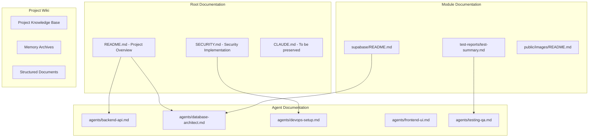
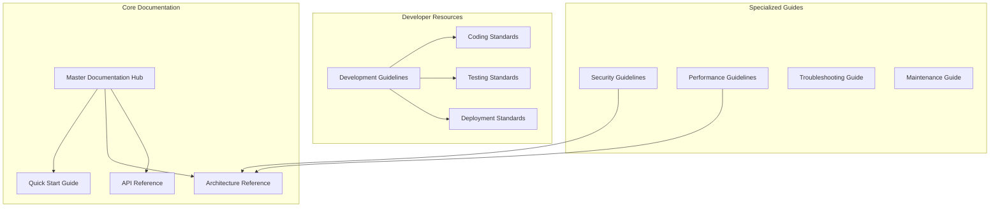
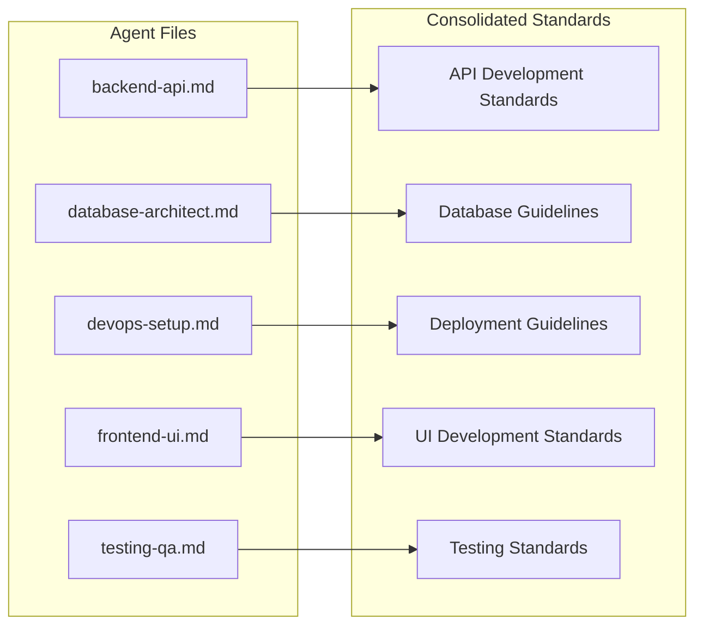
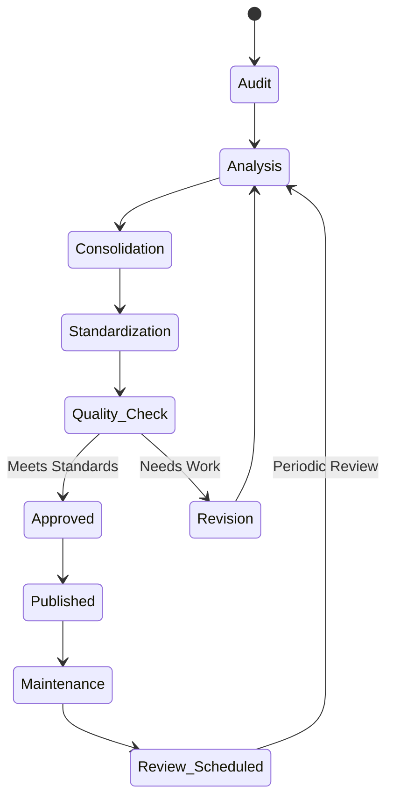
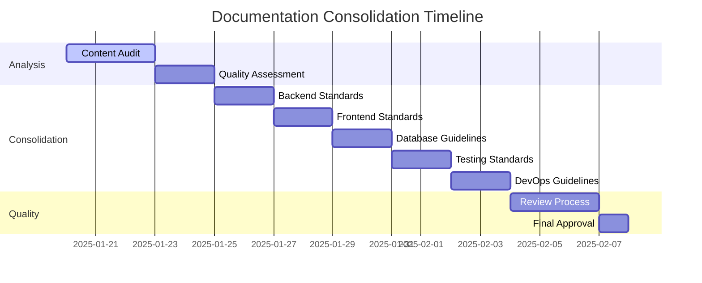

# Documentation Management Design - LookEscolar

## Overview

The LookEscolar project currently has extensive documentation scattered across multiple files and formats. This design outlines a comprehensive documentation management strategy to organize, clean up, and maintain high-quality technical documentation while preserving valuable information and establishing clear documentation standards.

## Architecture

### Current Documentation Landscape



### Target Documentation Structure



## Component Architecture

### Documentation Categories

#### 1. Essential Documentation (Keep & Enhance)
- **README.md**: Main project overview and setup instructions
- **SECURITY.md**: Comprehensive security implementation guide
- **API Documentation**: Derived from agent files and enhanced

#### 2. Developer Agent Documentation (Consolidate)
- **Backend API Agent**: Convert to API development standards
- **Database Architect Agent**: Transform to database guidelines
- **DevOps Setup Agent**: Merge into deployment documentation
- **Frontend UI Agent**: Convert to UI development standards  
- **Testing QA Agent**: Transform to testing standards

#### 3. Module-Specific Documentation (Reorganize)
- **Supabase README**: Integrate into database documentation
- **Test Reports**: Archive and establish reporting standards
- **Images README**: Standardize asset management documentation

### Documentation Transformation Strategy

#### Phase 1: Information Extraction

```typescript
interface DocumentationAudit {
  file: string;
  content_type: 'guide' | 'reference' | 'standards' | 'examples';
  quality_score: number;
  duplicate_content: string[];
  missing_elements: string[];
  consolidation_target: string;
}

// Example audit results
const auditResults: DocumentationAudit[] = [
  {
    file: 'agents/backend-api.md',
    content_type: 'standards',
    quality_score: 85,
    duplicate_content: ['API patterns', 'Error handling'],
    missing_elements: ['Version compatibility', 'Migration guides'],
    consolidation_target: 'developer-guidelines/api-standards.md'
  }
];
```

#### Phase 2: Content Consolidation



## Data Models

### Documentation Structure

```typescript
interface DocumentationStructure {
  core: {
    readme: ProjectOverview;
    architecture: SystemArchitecture;
    security: SecurityImplementation;
    api_reference: APIDocumentation;
  };
  
  development: {
    guidelines: DevelopmentGuidelines;
    standards: CodingStandards;
    testing: TestingStandards;
    deployment: DeploymentStandards;
  };
  
  operations: {
    troubleshooting: TroubleshootingGuide;
    maintenance: MaintenanceGuide;
    monitoring: MonitoringGuide;
  };
}

interface DevelopmentGuidelines {
  backend: {
    api_patterns: string[];
    security_practices: string[];
    database_patterns: string[];
    performance_guidelines: string[];
  };
  
  frontend: {
    component_patterns: string[];
    state_management: string[];
    ui_guidelines: string[];
    accessibility: string[];
  };
  
  testing: {
    unit_testing: string[];
    integration_testing: string[];
    e2e_testing: string[];
    security_testing: string[];
  };
}
```

### Content Quality Standards

```typescript
interface ContentQualityStandards {
  structure: {
    heading_hierarchy: boolean;
    table_of_contents: boolean;
    clear_sections: boolean;
  };
  
  content: {
    code_examples: boolean;
    practical_examples: boolean;
    troubleshooting_tips: boolean;
    links_valid: boolean;
  };
  
  maintenance: {
    last_updated: Date;
    version_compatibility: string;
    review_schedule: string;
  };
}
```

## Core Features

### 1. Documentation Consolidation Engine

#### Content Analysis and Extraction
- Parse existing agent documentation files
- Extract unique valuable content
- Identify redundant information
- Map content to new structure

#### Quality Assessment Matrix
```typescript
const qualityMetrics = {
  completeness: {
    weight: 0.3,
    criteria: ['All topics covered', 'Examples provided', 'Edge cases documented']
  },
  
  clarity: {
    weight: 0.25, 
    criteria: ['Clear headings', 'Logical flow', 'Concise language']
  },
  
  accuracy: {
    weight: 0.25,
    criteria: ['Technical accuracy', 'Updated information', 'Working examples']
  },
  
  usability: {
    weight: 0.2,
    criteria: ['Easy navigation', 'Search friendly', 'Quick reference']
  }
};
```

### 2. Standardized Documentation Templates

#### Developer Guidelines Template
```markdown
# [Feature] Development Guidelines

## Overview
Brief description of the feature and its purpose.

## Architecture Patterns
Core architectural decisions and patterns.

## Implementation Standards
Coding standards and best practices.

## Examples
Practical code examples and usage patterns.

## Testing Requirements
Testing standards and requirements.

## Troubleshooting
Common issues and solutions.

## References
Links to related documentation and resources.
```

### 3. Documentation Maintenance System

#### Automated Quality Checks
- Link validation
- Code example verification
- Structure validation
- Consistency checks

#### Update Tracking
```typescript
interface DocumentationTracking {
  file: string;
  last_updated: Date;
  version: string;
  contributors: string[];
  review_status: 'current' | 'needs_review' | 'outdated';
  next_review_date: Date;
}
```

## State Management

### Documentation State Flow



### Content Lifecycle Management

```typescript
enum DocumentationStatus {
  DRAFT = 'draft',
  REVIEW = 'review', 
  APPROVED = 'approved',
  PUBLISHED = 'published',
  OUTDATED = 'outdated',
  ARCHIVED = 'archived'
}

interface DocumentLifecycle {
  status: DocumentationStatus;
  created_date: Date;
  review_date?: Date;
  approval_date?: Date;
  publish_date?: Date;
  expiry_date?: Date;
}
```

## Implementation Strategy

### Phase 1: Assessment and Planning (Week 1)

#### Documentation Audit
- Inventory all existing documentation files
- Assess content quality and relevance
- Identify consolidation opportunities
- Map content to new structure

#### Stakeholder Alignment
- Define documentation requirements
- Establish quality standards
- Set maintenance procedures
- Create review processes

### Phase 2: Content Consolidation (Weeks 2-3)

#### Agent Documentation Transformation


#### Content Migration Process
1. **Extract** valuable content from agent files
2. **Transform** into standardized format
3. **Consolidate** related information
4. **Enhance** with missing elements
5. **Validate** for quality and completeness

### Phase 3: Standardization (Week 4)

#### Template Implementation
- Create standardized templates
- Apply consistent formatting
- Implement navigation structure
- Add cross-references and links

#### Quality Assurance
- Content review process
- Technical accuracy validation
- Link verification
- Example testing

### Phase 4: Maintenance Framework (Ongoing)

#### Automated Processes
- Regular link checking
- Content freshness monitoring
- Template compliance validation
- Update notifications

#### Review Cycles
- Monthly: Quick reviews for critical docs
- Quarterly: Comprehensive reviews
- Annually: Full documentation audit

## Testing Strategy

### Documentation Quality Testing

#### Automated Testing
```typescript
interface DocumentationTest {
  test_name: string;
  test_type: 'structure' | 'content' | 'links' | 'examples';
  validation_rules: string[];
  auto_fix: boolean;
}

const documentationTests: DocumentationTest[] = [
  {
    test_name: 'Link Validation',
    test_type: 'links',
    validation_rules: ['All internal links resolve', 'External links accessible'],
    auto_fix: false
  },
  {
    test_name: 'Code Example Validation', 
    test_type: 'examples',
    validation_rules: ['Code syntax valid', 'Examples executable'],
    auto_fix: false
  }
];
```

#### Manual Review Checklist
- [ ] Content accuracy and completeness
- [ ] Clear structure and navigation
- [ ] Practical examples provided
- [ ] Troubleshooting information included
- [ ] Cross-references properly linked
- [ ] Consistent formatting and style

### User Experience Testing

#### Documentation Usability Metrics
- Time to find information
- Task completion success rate
- User satisfaction scores
- Common search queries

## Maintenance Procedures

### Regular Maintenance Tasks

#### Weekly Tasks
- Monitor documentation usage analytics
- Check for broken links
- Review recent code changes for doc impacts
- Update version compatibility information

#### Monthly Tasks
- Comprehensive content review
- Update examples and screenshots  
- Validate all code examples
- Check external references

#### Quarterly Tasks
- Full documentation audit
- User feedback analysis
- Template updates
- Process improvements

### Content Update Procedures

#### Change Management Process
1. **Identify**: Changes needed based on code updates
2. **Plan**: Prioritize updates and assign ownership
3. **Execute**: Make changes following standards
4. **Review**: Quality check and approval process
5. **Deploy**: Publish updates and notify stakeholders

#### Version Control
- Track all documentation changes
- Maintain change logs
- Version alignment with code releases
- Rollback procedures for documentation

## Migration Plan

### Content Preservation Strategy

#### High-Value Content Identification
```typescript
interface ContentValue {
  file: string;
  content_sections: {
    section: string;
    value_score: number;
    migration_target: string;
  }[];
}

// Example: Backend API agent content preservation
const backendApiValue: ContentValue = {
  file: 'agents/backend-api.md',
  content_sections: [
    {
      section: 'API Routes Development',
      value_score: 95,
      migration_target: 'development/api-standards.md'
    },
    {
      section: 'Security in Endpoints',
      value_score: 90,
      migration_target: 'security/api-security.md'
    }
  ]
};
```

### File Reorganization Plan

#### Before (Current State)
```
docs/
├── README.md
├── SECURITY.md
├── agents/
│   ├── backend-api.md
│   ├── database-architect.md
│   ├── devops-setup.md
│   ├── frontend-ui.md
│   └── testing-qa.md
├── supabase/README.md
├── test-reports/test-summary.md
└── public/images/README.md
```

#### After (Target State)
```
docs/
├── README.md (Enhanced)
├── ARCHITECTURE.md (New)
├── development/
│   ├── api-standards.md (From backend-api.md)
│   ├── frontend-standards.md (From frontend-ui.md)
│   ├── database-guidelines.md (From database-architect.md)
│   ├── testing-standards.md (From testing-qa.md)
│   └── deployment-guidelines.md (From devops-setup.md)
├── operations/
│   ├── security-implementation.md (Enhanced SECURITY.md)
│   ├── troubleshooting.md (New)
│   └── maintenance.md (New)
└── resources/
    ├── api-reference.md (Generated)
    ├── asset-guidelines.md (From public/images/README.md)
    └── changelog.md (New)
```

### Transition Strategy

#### Gradual Migration Approach
1. **Week 1**: Create new structure and templates
2. **Week 2**: Migrate high-value content
3. **Week 3**: Enhance and standardize content
4. **Week 4**: Deprecate old files with redirects
5. **Week 5**: Final cleanup and validation

#### Stakeholder Communication
- Announce documentation restructuring plan
- Provide migration timeline and milestones
- Share new documentation locations
- Collect feedback and adjust as needed


