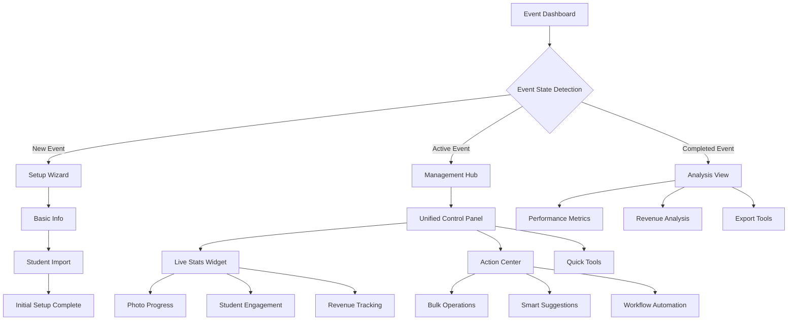
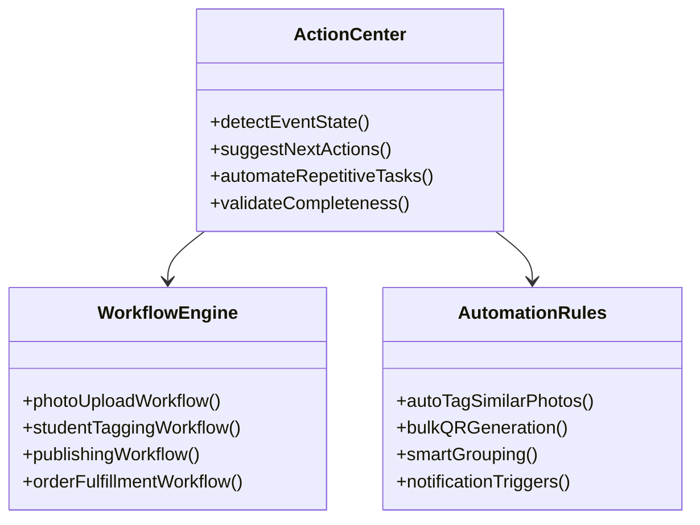

# Event Management Redesign - Holistic & Interconnected System

## Overview

This redesign transforms the current event management interface from a fragmented tabbed system into a holistic, interconnected workflow that optimizes utility and eliminates redundancy. The new design emphasizes seamless data flow between all event components and provides contextual automation to reduce manual effort.

## Current System Analysis

### Identified Issues
- **Fragmented Interface**: Four separate tabs (Overview, Students, Photos, Settings) create workflow silos
- **Redundant Navigation**: Users must constantly switch between tabs for related actions
- **Missing Context**: Actions don't leverage interconnected data effectively
- **Manual Processes**: Limited automation between related components
- **Utility Gaps**: Some features provide minimal value in current implementation

### Architecture Pattern
The current system follows a **Full-Stack Application** pattern with:
- Next.js 15 frontend with React 19
- Supabase backend (PostgreSQL + Auth + Storage)
- Component-based architecture with state management via Zustand

## Redesigned System Architecture

### Core Design Principles

1. **Contextual Workflows**: Actions automatically suggest next steps based on current state
2. **Unified Interface**: Single-page design with contextual panels instead of separate tabs
3. **Data Interconnectedness**: Real-time updates across all components when any data changes
4. **Intelligent Automation**: System proactively suggests optimizations and next actions
5. **Progressive Disclosure**: Show relevant information based on current workflow stage
6. **iOS 18 Liquid Glass Aesthetic**: Modern, translucent design language with depth and fluidity

### Visual Design Language - iOS 18 Liquid Glass

#### Material System
```css
/* Primary Glass Materials */
.glass-primary {
  background: rgba(255, 255, 255, 0.1);
  backdrop-filter: blur(20px) saturate(180%);
  border: 1px solid rgba(255, 255, 255, 0.2);
  box-shadow: 
    0 8px 32px rgba(0, 0, 0, 0.1),
    inset 0 1px 0 rgba(255, 255, 255, 0.2);
}

.glass-secondary {
  background: rgba(255, 255, 255, 0.05);
  backdrop-filter: blur(16px) saturate(150%);
  border: 1px solid rgba(255, 255, 255, 0.1);
}

.glass-elevated {
  background: rgba(255, 255, 255, 0.15);
  backdrop-filter: blur(24px) saturate(200%);
  box-shadow: 
    0 16px 64px rgba(0, 0, 0, 0.15),
    inset 0 1px 0 rgba(255, 255, 255, 0.3);
}
```

#### Color Palette
- **Primary Accent**: Dynamic island blue (#007AFF) with glass overlay
- **Secondary**: Soft purple (#5856D6) with translucency
- **Success**: Emerald green (#34C759) with glass effect
- **Warning**: Amber (#FF9F0A) with subtle glow
- **Background**: Ultra-thin material with contextual tinting

#### Typography Scale
- **Headings**: SF Pro Display with enhanced contrast on glass
- **Body**: SF Pro Text optimized for translucent backgrounds
- **Captions**: SF Pro with reduced opacity for subtle hierarchy

#### Interaction Patterns
- **Hover States**: Gentle luminosity increase with scale (1.02x)
- **Active States**: Soft inward shadow with slight scale reduction
- **Focus**: Smooth glow animation with accessibility-compliant contrast
- **Transitions**: Fluid 0.3s ease-out with spring physics

### Component Integration Flow



## Redesigned Interface Structure

### 1. Event State-Aware Dashboard

The interface adapts based on event lifecycle stage:

#### Setup Phase
- **Guided Setup Wizard**: Linear workflow for new events
- **Smart Defaults**: Pre-populate settings based on previous successful events
- **Validation Gates**: Prevent progression until minimum requirements are met

#### Active Management Phase
- **Unified Control Center**: All tools accessible from main view
- **Contextual Sidebars**: Information panels that update based on current focus
- **Real-time Sync**: All changes immediately reflected across interface

#### Completion Phase
- **Analytics Dashboard**: Performance metrics and insights
- **Export Hub**: Consolidated download center for all event outputs
- **Template Creation**: Save successful configurations for future events

### 2. Intelligent Action Center



### 3. Interconnected Data Flow

#### Real-time Updates
- **Photo Upload** → Automatically suggests tagging, updates progress indicators
- **Student Addition** → Generates tokens, updates capacity metrics, suggests QR creation
- **Order Placement** → Updates revenue tracking, triggers fulfillment workflows
- **Publishing Changes** → Notifies affected families, updates access logs

#### Cross-Component Intelligence
- **Smart Photo Classification**: Uses student roster to suggest likely matches
- **Revenue Optimization**: Suggests pricing adjustments based on engagement patterns
- **Quality Assurance**: Flags incomplete setups or potential issues

## Redesigned User Interface

### Main Dashboard Layout - iOS 18 Liquid Glass Design

```
┌─────────────────────────────────────────────────────────────┐
│ ╭─── Translucent Navigation Bar ─────────────────────────────╮ │
│ │ ◉ Event: [Event Name] • [Dynamic Status Pill] • [Live Time] │ │
│ ╰─────────────────────────────────────────────────────────────╯ │
│                                                             │
│ ╭─── Glass Health Cards ────╮  ╭─── Floating Action Hub ────╮ │
│ │ ◉ Photos: 245        85%  │  │ ⬆️ Upload Photos            │ │
│ │ ◉ Students: 45/45   100%  │  │ 👥 Add Students             │ │
│ │ ◉ Published: ✓            │  │ 📱 Generate QRs             │ │
│ │ ◉ Revenue: $450    ↗️12%  │  │ 🚀 Publish Gallery          │ │
│ ╰───────────────────────────╯  ╰─────────────────────────────╯ │
│                                                             │
│ ╭──── Intelligent Workflow Island ──────────────────────────╮ │
│ │ 🎯 Currently: Managing student photos                      │ │
│ │ ⏭️  Next: 23 photos need tagging                           │ │
│ │ 💡 AI Suggestion: Use bulk tagging for class photos        │ │
│ │ ┌─[✨ Start Bulk Tag]─┐ ┌─[📋 Review Queue]─┐ ┌─[⏭️ Skip]─┐ │ │
│ │ └─────────────────────┘ └──────────────────┘ └─────────────┘ │ │
│ ╰─────────────────────────────────────────────────────────────╯ │
│                                                             │
│ ╭─ Context Sidebar ──╮ ╭─ Immersive Work Canvas ───────────╮ │
│ │ 📊 Live Metrics     │ │ 🎨 Dynamic Content Area           │ │
│ │ • Photo velocity    │ │                                   │ │
│ │ • User engagement   │ │ ┌─ Fluid Tool Palette ──────────┐ │ │
│ │ • Revenue trends    │ │ │ [Contextual Tools & Controls]  │ │ │
│ │                     │ │ └────────────────────────────────┘ │ │
│ │ 🔄 Recent Activity  │ │                                   │ │
│ │ • Emma added 12     │ │ ┌─ Interactive Preview ─────────┐ │ │
│ │ • Auto-tagged 8     │ │ │ [Live Content Preview]         │ │ │
│ │ • Order #1847       │ │ └────────────────────────────────┘ │ │
│ ╰─────────────────────╯ ╰───────────────────────────────────╯ │
└─────────────────────────────────────────────────────────────┘
```

#### Glass Material Hierarchy
- **Navigation Bar**: Ultra-thin material with system blur
- **Primary Cards**: Medium glass with gentle shadows
- **Action Islands**: Elevated glass with enhanced luminosity
- **Context Panels**: Subtle glass with adaptive opacity
- **Work Canvas**: Minimal glass allowing content focus

### Workflow-Specific Panels

#### Photo Management Hub - Liquid Glass Interface
- **Floating Drop Zone**: Translucent, expandable area with gentle hover animations
- **AI-Powered Tagging**: Glass overlay cards with confidence indicators and smooth transitions
- **Batch Operations**: Floating action buttons with haptic-like feedback animations
- **Quality Control**: Subtle glass notifications with color-coded status indicators
- **Glass Gallery Grid**: Masonry layout with frosted glass preview cards
- **Contextual Tool Palette**: Sliding glass drawer with tool organization

#### Student Management Center - iOS 18 Design
- **Glass Student Cards**: Translucent cards with student photos and live engagement rings
- **Smart Import Flow**: Step-by-step glass wizard with real-time validation feedback
- **Token Dashboard**: Floating glass islands showing token status with subtle animations
- **Communication Hub**: Glass message composer with typing indicators and delivery status
- **Quick Actions Bar**: Persistent floating glass toolbar with most-used functions
- **Search Interface**: Expansive glass search with instant filtering and smart suggestions

#### Revenue & Orders Dashboard - Liquid Glass Analytics
- **Live Metrics Islands**: Floating glass cards with animated charts and real-time updates
- **Conversion Flow Visualization**: Glass pipeline with flowing data connections
- **Order Status Tracker**: Glass timeline with smooth progress animations
- **Smart Pricing Panel**: Translucent overlay with AI suggestions and impact predictions
- **Revenue Trends**: Glass chart containers with interactive data points
- **Quick Export Tools**: Floating glass action buttons with download progress

## Enhanced Automation Features - iOS 18 Experience

### 1. Smart Workflow Detection with Liquid Glass UI

```typescript
interface WorkflowDetector {
  detectPhase(): EventPhase;
  suggestNextActions(): Action[];
  identifyBottlenecks(): Issue[];
  recommendOptimizations(): Optimization[];
  renderGlassNotifications(): GlassNotification[];
}

enum EventPhase {
  SETUP = 'setup',
  CONTENT_UPLOAD = 'content_upload', 
  ORGANIZATION = 'organization',
  PUBLISHING = 'publishing',
  ACTIVE_SALES = 'active_sales',
  FULFILLMENT = 'fulfillment',
  COMPLETED = 'completed'
}

// Glass Notification System
interface GlassNotification {
  id: string;
  type: 'success' | 'warning' | 'info' | 'action';
  title: string;
  message: string;
  actions?: NotificationAction[];
  glassStyle: {
    blur: number;
    opacity: number;
    glow: boolean;
    animation: 'slide' | 'fade' | 'bounce' | 'spring';
  };
}
```

### 2. Intelligent Suggestions Engine with iOS 18 Aesthetics

#### AI-Powered Glass Cards
- **Photo Organization**: Floating suggestion cards with ML confidence indicators
- **Student Matching**: Face recognition results in translucent overlays with smooth reveal animations
- **Revenue Optimization**: Glass pricing panels with animated impact visualization
- **Quality Improvements**: Subtle glass alerts with color-coded severity and smooth dismissal

#### Micro-Interaction Design
```typescript
const glassInteractions = {
  hover: {
    scale: 1.02,
    y: -2,
    boxShadow: '0 12px 40px rgba(0, 0, 0, 0.15)',
    transition: { duration: 0.2, ease: 'easeOut' }
  },
  tap: {
    scale: 0.98,
    transition: { duration: 0.1 }
  },
  focus: {
    outline: '2px solid rgba(0, 122, 255, 0.6)',
    outlineOffset: '2px',
    transition: { duration: 0.15 }
  }
};

const suggestionCard = {
  initial: { opacity: 0, y: 20, scale: 0.95 },
  animate: { 
    opacity: 1, 
    y: 0, 
    scale: 1,
    transition: {
      type: 'spring',
      stiffness: 400,
      damping: 25
    }
  },
  exit: { 
    opacity: 0, 
    scale: 0.95, 
    y: -10,
    transition: { duration: 0.2 }
  }
};
```

### 3. Automated Quality Assurance with Liquid Glass Feedback

#### Visual Quality Indicators
- **Completeness Rings**: Circular progress indicators with iOS 18-style liquid animations
- **Image Quality Badges**: Floating glass status indicators with real-time updates
- **Data Integrity Panels**: Translucent validation overlays with smooth error highlighting
- **Privacy Compliance Dashboard**: Glass security panel with animated compliance checks

#### Real-time Validation System
```typescript
interface QualityAssurance {
  checkCompleteness(): Promise<CompletionStatus>;
  validateImages(): Promise<ImageQualityReport>;
  verifyDataIntegrity(): Promise<IntegrityReport>;
  auditPrivacyCompliance(): Promise<PrivacyReport>;
}

interface GlassStatusIndicator {
  status: 'pending' | 'success' | 'warning' | 'error';
  progress: number;
  animation: {
    type: 'pulse' | 'rotate' | 'bounce' | 'liquid';
    duration: number;
    easing: string;
  };
  glassEffect: {
    blur: number;
    tint: string;
    glow: boolean;
  };
}
```

## Interconnected Component Design

### 1. Unified State Management

```typescript
interface EventState {
  basicInfo: EventInfo;
  students: StudentData[];
  photos: PhotoData[];
  orders: OrderData[];
  settings: EventSettings;
  workflow: WorkflowState;
  metrics: RealTimeMetrics;
}

interface WorkflowState {
  currentPhase: EventPhase;
  completedSteps: string[];
  nextActions: Action[];
  blockers: Issue[];
  automationRules: AutomationRule[];
}
```

### 2. Real-time Synchronization

- **Event-driven Updates**: All components listen to state changes
- **Optimistic Updates**: Immediate UI feedback with rollback capability
- **Conflict Resolution**: Handle concurrent modifications gracefully
- **Offline Support**: Queue operations when connectivity is poor

### 3. Cross-Component Intelligence

#### Photo → Student Linking
- Automatic suggestions based on upload metadata
- Facial recognition integration for known students
- Batch tagging workflows for group photos

#### Student → Revenue Tracking
- Individual engagement metrics per student/family
- Conversion rate tracking by student segment
- Targeted marketing suggestions for low-engagement families

#### Orders → Fulfillment Automation
- Automatic grouping by delivery preferences
- Batch processing suggestions for efficiency
- Quality control checkpoints before shipping

## Performance & Scalability Improvements

### 1. Optimized Data Loading
- **Progressive Loading**: Load critical data first, enhance with additional context
- **Intelligent Prefetching**: Predict next actions and preload relevant data
- **Virtualized Rendering**: Handle large photo sets without performance impact

### 2. Efficient State Management
- **Granular Updates**: Only re-render components affected by changes
- **Debounced Operations**: Batch rapid user actions to reduce server load
- **Cached Computations**: Store expensive calculations for reuse

### 3. Scalable Architecture
- **Modular Components**: Independent, reusable interface elements
- **API Optimization**: Batch requests and minimize round trips
- **Resource Management**: Lazy load non-critical features

## Implementation Roadmap - iOS 18 Liquid Glass Development

### Phase 1: Core Infrastructure & Glass Foundation (2-3 weeks)
1. **Liquid Glass Design System**
   - Implement CSS-in-JS glass material components
   - Create responsive glass behavior for all screen sizes
   - Build accessibility-compliant glass contrast system
   - Develop dark mode adaptive glass materials

2. **State Management Redesign**
   - Implement unified event state system with glass UI updates
   - Create workflow detection engine with visual indicators
   - Build real-time synchronization layer with smooth animations

3. **Component Architecture**
   - Develop modular, interconnected glass components
   - Implement contextual panel system with fluid transitions
   - Create responsive layout framework with iOS 18 spacing

### Phase 2: Intelligent Features & Advanced Glass Interactions (3-4 weeks)
1. **Automation Engine with Glass UI**
   - Build suggestion system with floating glass cards
   - Implement quality assurance checks with status indicators
   - Create bulk operation tools with progress animations

2. **Enhanced Workflows**
   - Design guided setup wizard with glass step progression
   - Implement smart photo tagging with ML confidence overlays
   - Create advanced order management with glass dashboards

3. **iOS 18 Animation System**
   - Implement spring physics for all interactions
   - Create liquid glass morphing effects for state changes
   - Build haptic-like feedback through visual micro-interactions

### Phase 3: Advanced Integration & AI Features (2-3 weeks)
1. **AI-Powered Glass Features**
   - Integrate facial recognition with confidence glass overlays
   - Implement revenue optimization with animated impact visualization
   - Create predictive analytics dashboard with liquid glass charts

2. **Performance Optimization**
   - Implement virtualized rendering with smooth glass scrolling
   - Optimize API patterns for glass UI responsiveness
   - Add offline capability with glass status indicators

3. **Advanced Glass Interactions**
   - Implement gesture-based navigation for mobile
   - Create contextual glass menus with iOS 18-style reveal
   - Build adaptive glass opacity based on content and time of day

### Phase 4: Polish, Testing & Glass Refinement (1-2 weeks)
1. **User Experience Refinement**
   - Conduct usability testing with glass interface prototypes
   - Refine glass materials based on accessibility feedback
   - Optimize mobile glass responsiveness and touch targets

2. **Quality Assurance**
   - Comprehensive testing across glass animation workflows
   - Performance benchmarking for glass rendering efficiency
   - Security audit with glass-specific privacy considerations

3. **iOS 18 Design Validation**
   - Cross-platform glass consistency testing
   - High contrast and reduced motion accessibility validation
   - Color accuracy testing for glass tinting effects

## Success Metrics

### User Experience Improvements
- **Task Completion Time**: 40% reduction in common workflows
- **Error Rate**: 60% reduction in user-induced errors
- **Learning Curve**: 50% faster onboarding for new users
- **User Satisfaction**: Target 90%+ satisfaction score

### System Performance
- **Page Load Time**: <2 seconds for main dashboard
- **Action Response Time**: <500ms for common operations
- **Data Synchronization**: <100ms latency for real-time updates
- **Error Recovery**: <5 seconds to recover from failures

### Business Impact
- **Revenue per Event**: 25% increase through optimization suggestions
- **Processing Efficiency**: 50% reduction in manual work
- **Customer Satisfaction**: Improved family experience metrics
- **System Reliability**: 99.9% uptime during active events

## Technical Requirements

### Frontend Technologies
- Next.js 15 with React 19 (existing)
- Enhanced Zustand store with middleware
- React Query for optimized data fetching
- Framer Motion for iOS 18-style fluid animations
- Virtual rendering for large datasets
- CSS-in-JS with liquid glass material system
- React Spring for physics-based micro-interactions
- Lottie for subtle iconographic animations

### iOS 18 Design Implementation

#### Component Library Enhancement
```typescript
// Glass Material Components
interface GlassProps {
  variant: 'primary' | 'secondary' | 'elevated' | 'subtle';
  blur?: number;
  opacity?: number;
  glow?: boolean;
  animated?: boolean;
}

const GlassCard: React.FC<GlassProps> = ({ 
  variant = 'primary',
  blur = 20,
  opacity = 0.1,
  glow = false,
  animated = true,
  children 
}) => {
  const glassStyles = {
    backdropFilter: `blur(${blur}px) saturate(180%)`,
    background: `rgba(255, 255, 255, ${opacity})`,
    border: '1px solid rgba(255, 255, 255, 0.2)',
    borderRadius: '16px',
    boxShadow: glow 
      ? '0 8px 32px rgba(0, 0, 0, 0.1), 0 0 0 1px rgba(255, 255, 255, 0.1)'
      : '0 8px 32px rgba(0, 0, 0, 0.1)',
    transition: animated ? 'all 0.3s cubic-bezier(0.4, 0, 0.2, 1)' : 'none'
  };
  
  return (
    <motion.div 
      style={glassStyles}
      whileHover={{ scale: 1.02, y: -2 }}
      whileTap={{ scale: 0.98 }}
    >
      {children}
    </motion.div>
  );
};
```

#### Animation System
```typescript
// iOS 18 Spring Animations
const springConfig = {
  type: 'spring',
  stiffness: 400,
  damping: 30,
  mass: 1
};

const glassTransitions = {
  enter: {
    opacity: 1,
    scale: 1,
    y: 0,
    transition: springConfig
  },
  exit: {
    opacity: 0,
    scale: 0.95,
    y: 10,
    transition: { duration: 0.2 }
  }
};
```

#### Responsive Glass System
```css
/* Adaptive Glass Materials */
@media (prefers-color-scheme: dark) {
  .glass-primary {
    background: rgba(0, 0, 0, 0.3);
    border: 1px solid rgba(255, 255, 255, 0.1);
  }
}

@media (max-width: 768px) {
  .glass-card {
    backdrop-filter: blur(16px);
    border-radius: 12px;
  }
}

/* High contrast accessibility */
@media (prefers-contrast: high) {
  .glass-primary {
    background: rgba(255, 255, 255, 0.9);
    border: 2px solid rgba(0, 0, 0, 0.1);
  }
}
```

### Backend Enhancements
- Supabase real-time subscriptions with glass UI sync
- Enhanced API endpoints for batch operations with progress tracking
- Improved error handling with glass notification system
- Background job processing with visual glass progress indicators

### New Integrations
- AI/ML services for image recognition with glass confidence displays
- Advanced analytics platform with liquid glass data visualization
- Enhanced notification system with iOS 18-style glass alerts
- Automated backup and recovery with glass status monitoring

### iOS 18 Performance Specifications
- **Glass Rendering**: 60fps minimum for all glass animations
- **Blur Performance**: Hardware-accelerated backdrop-filter support
- **Transition Smoothness**: Sub-16ms frame times for micro-interactions
- **Memory Efficiency**: Optimized glass layer compositing
- **Battery Impact**: Minimal GPU usage through optimized glass effects

### Accessibility in Glass Design
- **High Contrast Mode**: Automatic glass opacity adjustment
- **Reduced Motion**: Graceful fallback to static glass materials
- **Screen Readers**: Proper semantic markup behind glass overlays
- **Color Blindness**: Glass tinting that maintains contrast ratios
- **Touch Targets**: Minimum 44px for all interactive glass elements

This redesign transforms the event management system from a collection of separate tools into a unified, intelligent platform that anticipates user needs and automates routine tasks. The result is a more efficient, user-friendly system that scales better and provides greater value to both administrators and families.