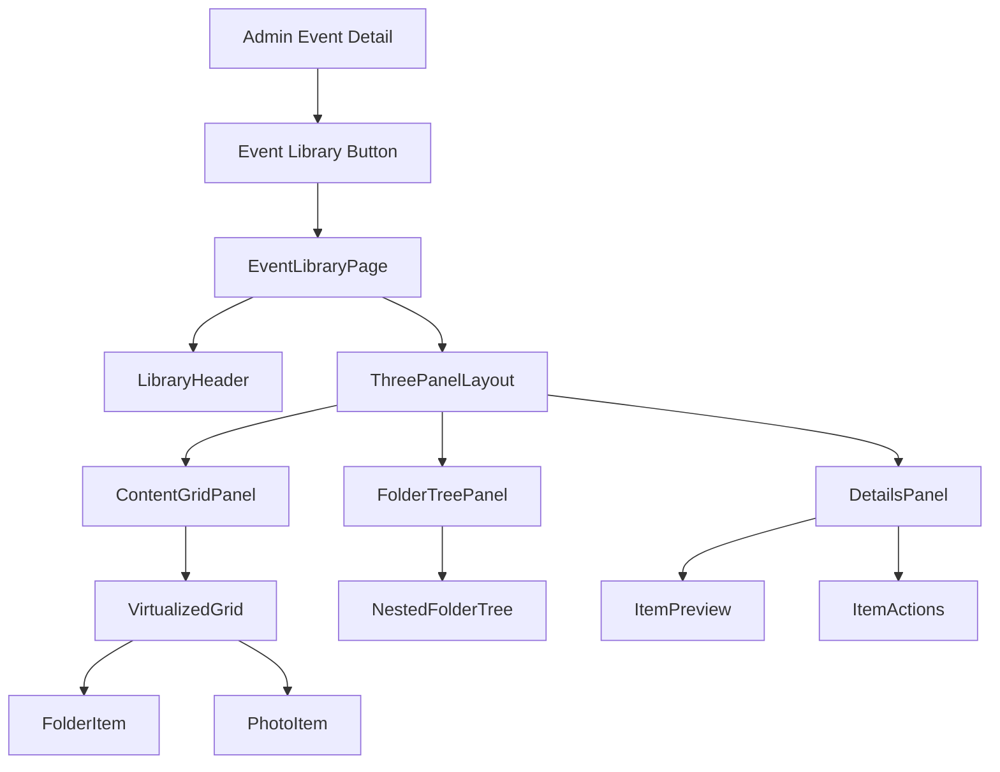
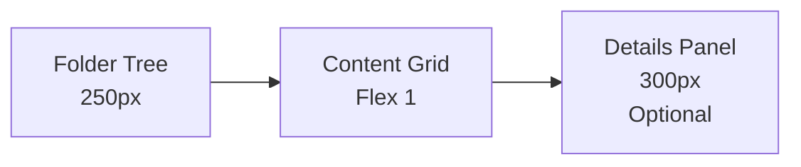
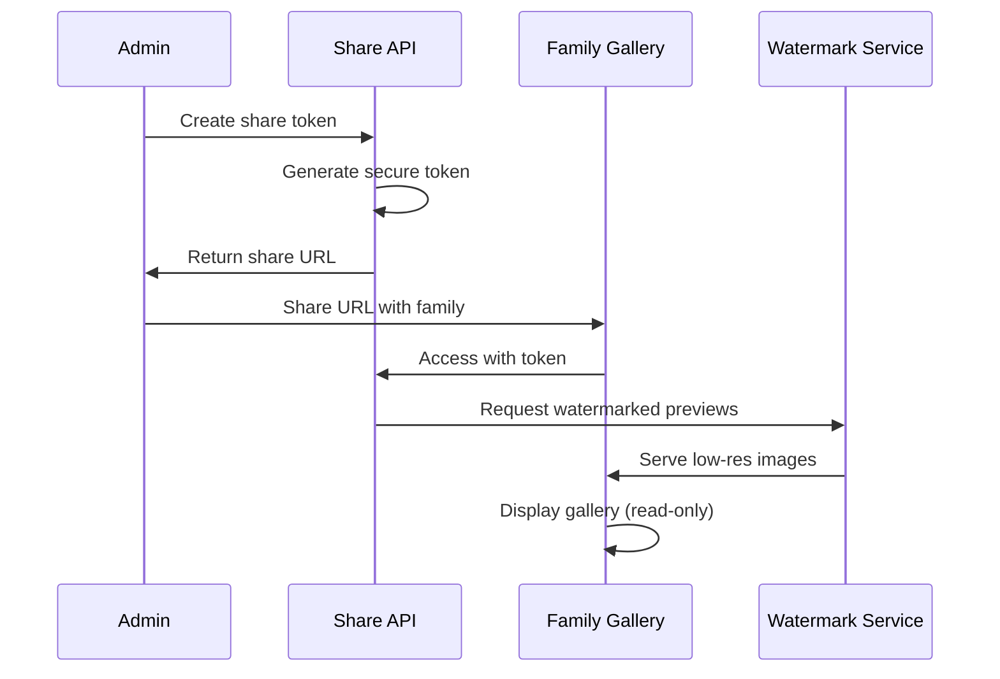

# Event Photo Library - Design Document

## Overview

The Event Photo Library unifies "Events" and "Photos" into a single file explorer-style interface per event. This eliminates navigation jumps between separate screens and provides a hierarchical folder system with high-performance virtualized rendering.

### Current Problem (Context)
- Today "Events" and "Photos" live in separate screens requiring route jumps
- Single-column layout with disorder becomes slow and impractical with many photos
- Photographers need a file manager-like experience: navigate, create folders, move items, upload to current folder
- All operations should happen in one view without breaking Family Gallery

### Objective
- Create a unified Library/Explorer within each event with nested folders (unlimited depth)
- High-performance virtualized grid handling thousands of items with smooth scroll
- Direct upload to current folder with drag & drop
- Comprehensive operations: move/rename/delete folders and photos
- Robust multi-selection (click, Ctrl/Cmd, Shift-range)
- Lightbox integration (reuse existing PhotoModal)
- Quick sharing with low-quality watermarked previews for families
- Maintain Family Gallery token system unchanged

## Architecture

### Technology Stack Integration
- **Frontend**: Next.js 15 App Router with React 19
- **UI Framework**: Tailwind CSS with Radix UI components
- **Virtualization**: react-window for high-performance rendering
- **State Management**: Zustand for local state, React Query for server state
- **Backend**: Next.js API routes with Supabase integration
- **Storage**: Supabase Storage with signed URLs

### Component Hierarchy



### Data Model Extensions

#### Minimal Data Model (MVP)

```sql
-- Event Folders Table (new)
CREATE TABLE event_folders (
    id UUID PRIMARY KEY DEFAULT gen_random_uuid(),
    event_id UUID NOT NULL REFERENCES events(id) ON DELETE CASCADE,
    parent_id UUID REFERENCES event_folders(id) ON DELETE CASCADE,
    name TEXT NOT NULL,
    path TEXT NOT NULL, -- computed full path for breadcrumbs
    depth INTEGER NOT NULL DEFAULT 0,
    created_at TIMESTAMPTZ DEFAULT NOW(),
    
    CONSTRAINT folder_name_length CHECK (length(name) >= 1 AND length(name) <= 255),
    CONSTRAINT folder_unique_name_per_parent UNIQUE(parent_id, name, event_id)
);

-- Indexes
CREATE INDEX idx_event_folders_event_id ON event_folders(event_id);
CREATE INDEX idx_event_folders_parent_id ON event_folders(parent_id);

-- Share Tokens Table (for public sharing)
CREATE TABLE share_tokens (
    id UUID PRIMARY KEY DEFAULT gen_random_uuid(),
    event_id UUID NOT NULL REFERENCES events(id) ON DELETE CASCADE,
    folder_id UUID REFERENCES event_folders(id) ON DELETE CASCADE,
    photo_ids UUID[] DEFAULT '{}', -- specific photos if not folder-based
    token TEXT UNIQUE NOT NULL,
    expires_at TIMESTAMPTZ NOT NULL DEFAULT (NOW() + INTERVAL '7 days'),
    access_count INTEGER DEFAULT 0,
    created_at TIMESTAMPTZ DEFAULT NOW(),
    
    CONSTRAINT share_token_length CHECK (length(token) >= 32)
);

CREATE INDEX idx_share_tokens_token ON share_tokens(token);
CREATE INDEX idx_share_tokens_expires ON share_tokens(expires_at);
```

#### Modified Photos Table

```sql
-- Add folder_id to existing photos table
ALTER TABLE photos ADD COLUMN folder_id UUID REFERENCES event_folders(id) ON DELETE SET NULL;
CREATE INDEX idx_photos_folder_id ON photos(folder_id);
```

## UI Design System

### Three-Panel Layout



#### Panel Specifications

**Folder Tree Panel (Left)**
- Width: 250px fixed
- Virtualized tree for large folder structures
- Expand/collapse with keyboard navigation
- Context menu for folder operations
- Drag & drop targets

**Content Grid Panel (Center)**
- Responsive grid layout (2-8 columns based on viewport)
- Virtualized rendering with react-window
- Mixed content: folders first, then photos
- Selection states with checkboxes
- Drag & drop source and target
- Upload drop zone overlay

**Details Panel (Right)**
- Width: 300px, collapsible
- Photo preview with metadata
- Batch operation controls
- Share generation interface
- Folder statistics

### Virtualization Strategy

#### Grid Configuration
```typescript
interface VirtualGridConfig {
  itemHeight: number; // 200px for photos, 60px for folders
  columnCount: number; // Responsive: 2-8 based on viewport
  overscanRowCount: number; // 5 rows for smooth scrolling
  scrollingDelay: number; // 150ms for scroll end detection
  threshold: number; // 0.5 for intersection observer
}
```

#### Performance Optimizations
- Item recycling with consistent heights
- Placeholder skeletons during loading
- Signed URL batching (max 50 per request)
- Concurrent download limiting (6 connections)
- Progressive image loading with WebP support

## API Architecture

### Core Endpoints

### Minimal Endpoints (MVP)

#### Folder Operations
```typescript
// GET /admin/events/{eventId}/folders?parentId
interface FoldersResponse {
  folders: EventFolder[];
}

// POST /admin/events/{eventId}/folders
interface CreateFolderRequest {
  name: string;
  parentId?: string;
}

// PATCH /admin/folders/{folderId} (rename/move)
interface UpdateFolderRequest {
  name?: string;
  parentId?: string;
}

// DELETE /admin/folders/{folderId} (safe cascade)
```

#### Photo Operations
```typescript
// GET /admin/events/{eventId}/photos?folderId&page&limit
interface PhotosQuery {
  folderId?: string;
  page: number;
  limit: number;
}

// PATCH /admin/photos/batch-move
interface BatchMoveRequest {
  photoIds: string[];
  folderId: string;
}

// POST /admin/photos/sign-urls (batch ~50/req)
interface SignUrlsRequest {
  photoIds: string[];
}
```

#### Upload System
```typescript
// POST /admin/events/{eventId}/upload-url
interface UploadUrlRequest {
  filename: string;
  contentType: string;
  fileSize: number;
  folderId: string;
}

// POST /admin/photos/finalize-upload
interface FinalizeUploadRequest {
  uploadId: string;
  fileKey: string;
  metadata: { width: number; height: number; size: number; };
}
```

#### Share System
```typescript
// POST /admin/share
interface CreateShareRequest {
  eventId: string;
  folderId?: string;
  photoIds?: string[];
}

interface ShareResponse {
  token: string;
  url: string;
}
```

## Core Features

### Folder Operations

#### Creation and Navigation
- **New Folder**: Modal dialog with name validation
- **Breadcrumb Navigation**: Click to navigate to parent folders
- **Deep Linking**: URL structure `/admin/events/{eventId}/library?folderId={id}`
- **Keyboard Shortcuts**: 
  - `N` - New folder
  - `F2` - Rename selected
  - `Delete` - Delete selected
  - `Enter` - Open/navigate

#### Drag & Drop System
```typescript
interface DragOperation {
  sourceType: 'photo' | 'folder';
  sourceIds: string[];
  targetType: 'folder';
  targetId: string;
  operation: 'move' | 'copy';
}
```

**Drag & Drop Rules:**
- Photos → Folders: Move operation
- Folders → Folders: Move operation (with cycle detection)
- Multi-selection support with visual feedback
- Optimistic updates with rollback on failure

### Photo Management

#### Upload Workflow
1. **Drag & Drop Detection**: Overlay appears on drag enter
2. **File Validation**: Type, size, and format checks
3. **Upload Queue**: Progress bars with pause/resume
4. **Metadata Extraction**: Automatic EXIF reading
5. **Optimistic UI**: Photos appear immediately with loading state

#### Batch Operations
- **Selection Methods**:
  - Individual click with checkbox
  - Ctrl/Cmd + click for multi-select
  - Shift + click for range selection
  - Ctrl/Cmd + A for select all
- **Operations**: Move, Delete, Share, Download
- **Progress Tracking**: Real-time operation status

### Lightbox Integration

#### Enhanced Photo Modal
```typescript
interface LightboxFeatures {
  navigation: {
    keyboard: boolean; // Arrow keys, Esc
    gestures: boolean; // Swipe, pinch
    thumbnail: boolean; // Grid navigation
  };
  preloading: {
    adjacent: boolean; // Preload next/prev
    strategy: 'lazy' | 'eager';
  };
  metadata: {
    exif: boolean;
    location: boolean;
    camera: boolean;
  };
}
```

### Share System

#### Token-Based Sharing
- **Folder Sharing**: Entire folder with read-only access
- **Photo Selection**: Specific photos only
- **Watermark Integration**: Low-resolution previews with watermarks
- **Access Logging**: Track views and downloads
- **Expiration**: Configurable TTL with automatic cleanup

#### Family Gallery Integration


## Performance Requirements

### Performance Criteria (Measurable)

#### Rendering Performance
- **Grid Scrolling**: 60 FPS with thousands of items
- **Time to Interactive (TTI)**: < 2 seconds with 1k items
- **Folder Navigation**: < 300ms (excluding network)
- **Upload Integration**: Photos appear without page reload

#### Network Optimization
- **Signed URL Batching**: ~50 URLs per request
- **Concurrent Downloads**: 6 connection limit
- **Skeletons**: Fixed height placeholders (no layout shift)
- **Photo Loading**: Lightbox with preload of next image

#### Virtualization Requirements
- **react-window/react-virtuoso**: Handle thousands of items smoothly
- **Overscan**: Adjusted for smooth scrolling
- **Real Pagination**: Photos per folder
- **Short TTL Cache**: Signed URLs with batch generation

### Caching Strategy

```typescript
interface CacheStrategy {
  signedUrls: {
    ttl: 3600; // 1 hour
    maxSize: 1000; // URLs
  };
  folderTree: {
    ttl: 300; // 5 minutes
    invalidateOn: ['create', 'move', 'delete'];
  };
  photoMetadata: {
    ttl: 86400; // 24 hours
    storage: 'indexedDB';
  };
}
```

## Security Implementation

### Access Control
- **Admin Authentication**: Required for all library operations
- **Token Validation**: Share tokens with expiration and revocation
- **Input Sanitization**: File names, folder names, metadata
- **Rate Limiting**: Upload and API request throttling

### Privacy Protection
```typescript
interface PrivacyControls {
  watermarking: {
    enabled: boolean;
    opacity: 0.7;
    position: 'center' | 'corner';
    text: string; // School name or custom
  };
  sharing: {
    maxExpiration: 30; // days
    requireApproval: boolean;
    logAccess: boolean;
  };
  antiHotlinking: {
    referrerCheck: boolean;
    signedUrlsOnly: boolean;
  };
}
```

## Migration Strategy

### Implementation Phases (MVP)

#### Phase 1: DB Migration + Endpoints
1. **Database Migration**: Create `event_folders` table and add `folder_id` to photos
2. **Root Folder Creation**: Auto-create root folder per event
3. **Photo Assignment**: Assign existing photos without folder to root
4. **Core Endpoints**: Folders CRUD + photos by folder + batch operations

#### Phase 2: UI /library + Virtualization + Selection
1. **New Route**: `/admin/events/:eventId/library?folderId=<uuid>`
2. **Three-Panel Layout**: Tree (left), Grid (center), Details (right, optional)
3. **Virtualized Grid**: Folders first, then photos with react-window/virtuoso
4. **Multi-Selection**: Click, Ctrl/Cmd, Shift-range by IDs (not indices)
5. **Breadcrumb Navigation**: Clickable path segments

#### Phase 3: Drag & Drop + Upload
1. **Drag & Drop**: Photo↔folder, folder↔folder with cycle detection
2. **Upload Integration**: Button + drag to current folder
3. **Progress UI**: Upload appears in grid without reload
4. **Lightbox**: Reuse existing PhotoModal with keyboard/gesture support

#### Phase 4: Share + Watermark
1. **Share Generation**: POST /admin/share → public token
2. **Public View**: Family Gallery integration with watermarked low-res previews
3. **Access Control**: No original access through shared links
4. **Token Management**: Opaque tokens with expiration and revocation

#### Phase 5: Performance Tuning + QA + Pilot
1. **Performance Optimization**: Meet all measurable criteria
2. **Feature Flag**: Behind `event_photo_library` flag
3. **Pilot Testing**: Enable for specific events
4. **QA Validation**: All DoD criteria met
5. **Production Rollout**: Gradual migration from legacy /admin/photos

### Data Migration Script (MVP)
```sql
-- Create root folders for existing events
INSERT INTO event_folders (event_id, name, path, depth)
SELECT id, 'Fotos', 'Fotos', 0 
FROM events 
WHERE NOT EXISTS (
  SELECT 1 FROM event_folders 
  WHERE event_folders.event_id = events.id 
  AND parent_id IS NULL
);

-- Assign existing photos to root folders
UPDATE photos 
SET folder_id = (
  SELECT ef.id 
  FROM event_folders ef 
  WHERE ef.event_id = photos.event_id 
  AND ef.parent_id IS NULL
)
WHERE folder_id IS NULL;
```

## Definition of Done (DoD) - Acceptance Criteria

### Core Functionality Validation
- **Navigation**: Navigate 3 folder levels without performance issues
- **Upload**: Upload 10 photos with drag & drop to current folder
- **Batch Operations**: Move 50 photos with drag & drop without jank
- **Lightbox**: Open/close modal smoothly (reuse existing PhotoModal)
- **Selection Stability**: Range selection works across pagination and reordering

### Performance Requirements
- **Grid Performance**: Scroll grid at 60 FPS with thousands of items
- **TTI**: Time to Interactive < 2 seconds with 1k items
- **Folder Navigation**: < 300ms response time (excluding network)
- **No Layout Shift**: Fixed-height skeletons prevent content jumps

### Sharing & Security
- **Public Links**: Share link opens public view with watermarked previews
- **Access Control**: No access to original high-resolution images through shared links
- **Token Security**: Opaque tokens with proper expiration and revocation

### Navigation & UX
- **Deep Linking**: `?folderId=` parameter opens correct folder
- **Breadcrumbs**: Accurate clickable path matches current location
- **Context Preservation**: No unnecessary page redirects during operations
- **Keyboard Shortcuts**: N (new folder), F2 (rename), Delete, Enter, Esc

### Integration Requirements
- **Family Gallery**: Existing token system remains unchanged
- **Feature Flag**: Protected behind `event_photo_library` feature flag
- **Migration**: Existing photos properly assigned to root folders
- **Rollback**: Complete rollback plan available if needed

## Guardrails & Constraints

### Technical Guardrails
- **Feature Flag**: `event_photo_library` controls access to new interface
- **Family Logic**: Do not modify existing Family Gallery token logic
- **Performance**: Meet all specified performance criteria before production
- **Security**: All public sharing uses watermarked low-resolution images only

### Data Integrity
- **Migration Safety**: Existing photos and events remain accessible
- **Folder Constraints**: Prevent infinite nesting and circular references
- **Token Management**: Secure, opaque tokens with proper expiration
- **Concurrent Access**: Handle multiple admin users safely

### User Experience
- **Progressive Enhancement**: Works without JavaScript for basic operations
- **Accessibility**: Keyboard navigation and screen reader support
- **Mobile Responsiveness**: Three-panel layout adapts to smaller screens
- **Error Handling**: Graceful degradation and user-friendly error messages

## Rollback Plan

### Immediate Rollback
```typescript
// Feature flag override
const EMERGENCY_DISABLE = {
  event_photo_library: false,
  force_legacy_photos: true
};

// Redirect logic in middleware
if (!featureFlags.event_photo_library || EMERGENCY_DISABLE.force_legacy_photos) {
  return redirect('/admin/photos');
}
```

### Data Rollback
- **Folder Data**: Preserve in separate tables, can be archived
- **Photo Assignments**: Maintain `subject_id` alongside `folder_id`
- **Legacy URLs**: Keep working through redirect layer
- **Share Tokens**: Continue working with existing family gallery

### Recovery Procedures
1. **Disable Feature Flag**: Immediate stop of new functionality
2. **Database Rollback**: Remove folder assignments, preserve photos
3. **URL Redirects**: Route library URLs to legacy photo management
4. **User Communication**: Admin notification of temporary limitation
