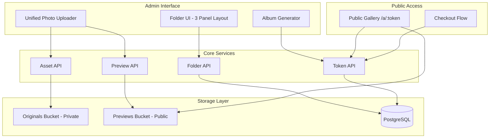
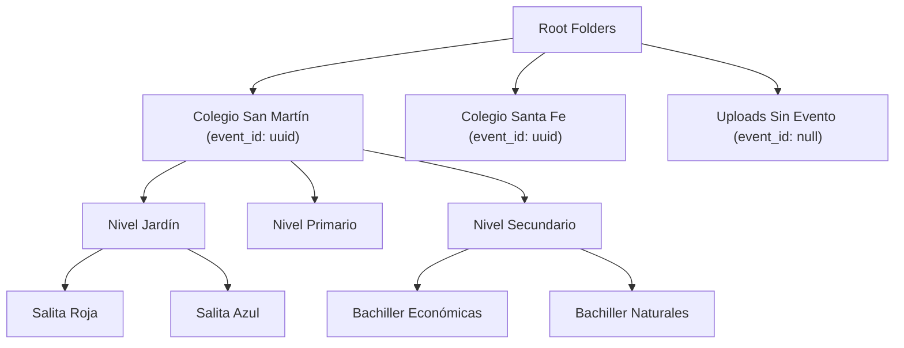
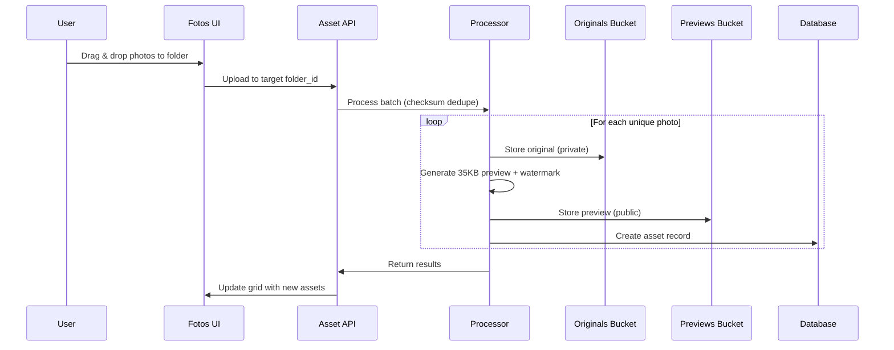
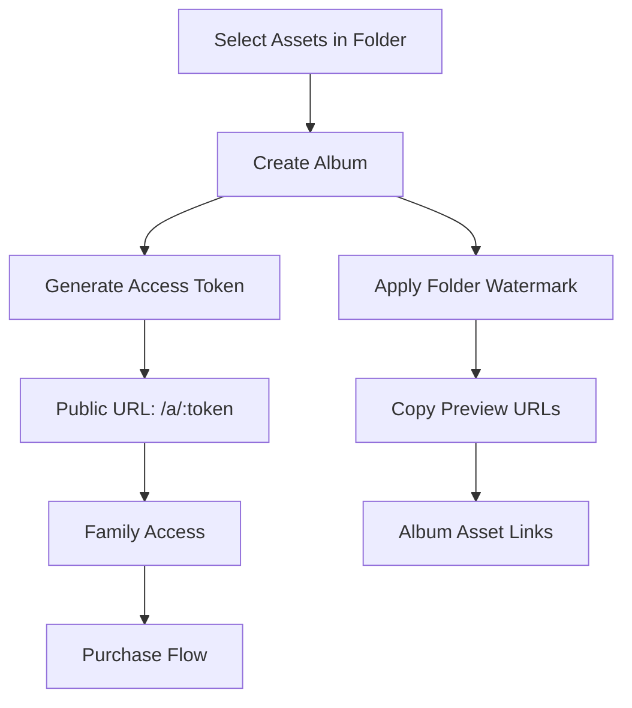

# Photo Gallery System Design

## Overview

The Photo Gallery System is a redesigned photo management workflow for LookEscolar that provides a unified, folder-based photo management interface. The system simplifies photo organization by using a flexible folder hierarchy with optional event metadata, enabling photographers to efficiently manage thousands of photos while maintaining clear organization for family access through token-based albums.

## Architecture

### System Goals
- **Unified Photo Entry Point**: Single "Fotos" section for all photo uploads and management
- **Flexible Folder System**: File explorer-like experience with optional event metadata
- **Bulk Operations**: Handle 5,000+ photos per month with efficient batch processing
- **Mouse-First Interface**: Desktop-optimized with Shift/Ctrl selection and context menus
- **Streamlined Previews**: Either on-the-fly CDN transforms or pre-generated watermarked previews
- **Token-Based Access**: Public albums accessible via /a/:token URLs

### MVP Architecture



## MVP Data Model

### Simplified Folder Structure



### Core Tables Structure

| Table | Purpose | Key Fields |
|-------|---------|------------|
| **folders** | Hierarchical organization | id, name, parent_id, event_id (optional) |
| **assets** | Photo metadata | id, folder_id, original_path, preview_path, checksum |
| **albums** | Public gallery collections | id, name, folder_id, watermark_text |
| **album_assets** | Asset-album relationships | album_id, asset_id |
| **access_tokens** | Public access control | token, album_id, expires_at |
| **events** | Event metadata (optional) | id, name, school_name, date |

## Three-Panel Layout Interface

### Panel Structure

#### 1. Folder Tree Panel (Left)
```typescript
interface FolderNode {
  id: string;
  name: string;
  parentId: string | null;
  photoCount: number;
  isExpanded: boolean;
  children: FolderNode[];
  eventId?: string; // Optional event metadata
  metadata: {
    icon: string;
    isEvent: boolean;
  };
}
```

#### 2. Photo Grid Panel (Center)
- **Virtualized Grid**: Render only visible photos for performance
- **Mouse-First Selection**: Shift+Click ranges, Ctrl+Click individual
- **Context Menu**: Right-click for move, delete, tag operations
- **Drag & Drop**: Move photos between folders
- **Status Overlays**: Processing, uploaded, error states

#### 3. Inspector Panel (Right)
```typescript
interface AssetInspector {
  selectedAssets: Asset[];
  metadata: {
    dimensions: string;
    fileSize: string;
    uploadDate: string;
    checksum: string;
  };
  tags: string[];
  bulkOperations: BulkAction[];
}
```

## Streamlined Upload Workflow

### Single Entry Point: "Fotos" Section



### Processing Strategy (MVP Decision)
**Choice: Pre-generated Previews**
- **Input**: JPEG, PNG, WebP → stored as originals
- **Preview Generation**: 35KB WebP with watermark overlay
- **Deduplication**: SHA-256 checksum to prevent duplicates
- **Error Handling**: 429 retry logic with exponential backoff
- **Watermark Source**: folder.event.school_name + folder.event.name or default

## Mouse-First File Explorer

### Navigation Patterns

#### Breadcrumb Navigation
```
Fotos > Colegio San Martín > Nivel Secundario > Bachiller Económicas
```

#### Folder Tree (Left Panel)
- Collapsible folder hierarchy
- Asset count indicators
- Event badge for folders with event_id
- Drag targets for moving assets

#### Context Menu Actions
- **Folder**: Create subfolder, upload, generate album, bulk operations
- **Single Asset**: Preview, move, delete, add tags
- **Multi-select**: Bulk move, delete, create album

### Mouse-Optimized Interactions

#### Selection Model
- **Click**: Select single asset, clear others
- **Ctrl+Click**: Toggle individual selection
- **Shift+Click**: Range selection from last selected
- **Click empty space**: Clear selection
- **Drag select**: Rectangle selection (like file explorer)

#### Drag & Drop Operations
- **Asset → Folder**: Move to target folder
- **Multiple Assets → Folder**: Bulk move operation
- **Files → Grid**: Upload to current folder
- **Visual Feedback**: Drop zones and drag previews

#### Keyboard Shortcuts
- **Ctrl+A**: Select all visible assets
- **Delete**: Move selected to trash
- **Ctrl+C / Ctrl+V**: Copy/move between folders
- **F2**: Rename selected folder
- **Enter**: Generate album from selection

## Bulk Operations & Templates

### Efficient Bulk Processing

```typescript
interface BulkOperation {
  type: 'move' | 'delete' | 'album' | 'tag';
  assetIds: string[];
  targetFolderId?: string;
  albumName?: string;
  tags?: string[];
}
```

#### Performance Features
- **Batch Processing**: 100 assets per API call
- **Progress Indicators**: Real-time completion status
- **Checksum Deduplication**: Prevent duplicate uploads
- **429 Retry Logic**: Exponential backoff for rate limits
- **Partial Success**: Continue processing on individual failures

### School Folder Templates

#### Template Generation
```typescript
interface SchoolTemplate {
  name: string;
  folders: {
    name: string;
    parentPath?: string;
  }[];
}

const templates = {
  colegio_completo: {
    name: "Colegio Completo",
    folders: [
      { name: "Nivel Jardín" },
      { name: "Salita Roja", parentPath: "Nivel Jardín" },
      { name: "Salita Azul", parentPath: "Nivel Jardín" },
      { name: "Nivel Primario" },
      { name: "1er Grado", parentPath: "Nivel Primario" },
      { name: "2do Grado", parentPath: "Nivel Primario" },
      { name: "Nivel Secundario" },
      { name: "Bachiller Económicas", parentPath: "Nivel Secundario" },
      { name: "Bachiller Naturales", parentPath: "Nivel Secundario" }
    ]
  }
};
```

#### Template Application
1. **Select Root Folder**: Choose or create event folder
2. **Apply Template**: Generate nested folder structure
3. **Set Event Metadata**: Link folders to event record
4. **Ready for Upload**: Folder hierarchy ready for photo uploads

## Public Album Generation

### Album Creation Workflow



### Token-Based Access
1. **Album Creation**: Admin selects folder/assets → creates album
2. **Token Generation**: Secure UUID with expiration
3. **Public Gallery**: Families access via /a/:token
4. **Asset Security**: RLS ensures only album assets are visible
5. **Purchase Integration**: Existing checkout flow integration

### Simplified Event Flow
1. **Create Event Folder**: Use template or manual creation
2. **Upload Photos**: Drag & drop to appropriate subfolders
3. **Generate Albums**: Select folder → create public album
4. **Share Access**: Send token URLs to families
5. **Process Orders**: Existing Mercado Pago integration

## Performance & Scale

### MVP Performance Targets
- **Monthly Volume**: 5,000+ photos efficiently processed
- **Upload Batches**: 100 photos per batch with progress tracking
- **Grid Rendering**: Virtualized scrolling for 1000+ photos
- **Folder Navigation**: <200ms switching with cached structures
- **Deduplication**: Instant checksum-based duplicate detection

### Scaling Strategies
- **Virtualized Grid**: Only render visible photos (react-window)
- **Paginated Loading**: Load 50-100 assets per page
- **Checksum Index**: Fast duplicate detection via database index
- **Preview CDN**: Serve public previews via CDN
- **Rate Limit Handling**: Exponential backoff with 429 retries

## Mobile Responsiveness

### Adaptive Interface
- **Desktop (>1024px)**: Full file explorer with sidebar
- **Tablet (768-1024px)**: Collapsible sidebar with touch gestures
- **Mobile (<768px)**: Stack navigation with bottom toolbar

### Touch Optimizations
- **Minimum Touch Targets**: 44px minimum
- **Swipe Gestures**: Navigate between folders
- **Pinch to Zoom**: Photo preview scaling
- **Pull to Refresh**: Update photo grid

## MVP API Endpoints

### Core Asset Management
```
GET    /api/admin/assets                 # List assets with folder filter
POST   /api/admin/assets/upload          # Upload to folder_id
PATCH  /api/admin/assets/bulk            # Bulk move/delete/tag
DELETE /api/admin/assets/{id}            # Delete single asset
```

### Folder Management
```
GET    /api/admin/folders                # Get folder tree
POST   /api/admin/folders                # Create folder
PUT    /api/admin/folders/{id}           # Update folder
DELETE /api/admin/folders/{id}           # Delete folder + assets
```

### Album & Token System
```
POST   /api/admin/albums                 # Create album from folder/assets
GET    /api/admin/albums/{id}/token      # Generate access token
GET    /a/{token}                        # Public album access
GET    /api/public/albums/{token}        # Album data for families
```

### Template System
```
GET    /api/admin/templates              # List school templates
POST   /api/admin/folders/from-template  # Apply template to create structure
```

## MVP Implementation Priority

### Phase 1: Core Infrastructure
- [ ] Database schema: folders, assets, albums, access_tokens
- [ ] RLS policies: private originals, public previews
- [ ] Basic folder CRUD API
- [ ] Asset upload with checksum deduplication

### Phase 2: UI Foundation
- [ ] Three-panel layout with virtualized grid
- [ ] Folder tree navigation
- [ ] Mouse-first selection model
- [ ] Drag & drop upload to folders

### Phase 3: Preview System
- [ ] 35KB WebP preview generation
- [ ] Watermark overlay (school + event name)
- [ ] Public preview bucket with CDN
- [ ] Preview URL generation

### Phase 4: Album Generation
- [ ] Album creation from folder/selection
- [ ] Access token generation with expiration
- [ ] Public gallery at /a/:token
- [ ] Integration with existing checkout

### Phase 5: Template System
- [ ] School folder templates
- [ ] Template application API
- [ ] Bulk folder creation
- [ ] Event metadata linking