# Photo Gallery System Design

## Overview

The Photo Gallery System is a redesigned photo management workflow for LookEscolar that provides a unified, folder-based photo management interface. The system simplifies photo organization by using a flexible folder hierarchy with optional event metadata, enabling photographers to efficiently manage thousands of photos while maintaining clear organization for family access through token-based albums.

## Architecture

### System Goals
- **Unified Photo Entry Point**: Single "Fotos" section for all photo uploads and management
- **Flexible Folder System**: File explorer-like experience with optional event metadata
- **Bulk Operations**: Handle 5,000+ photos per month with efficient batch processing
- **Mouse-First Interface**: Desktop-optimized with Shift/Ctrl selection and context menus
- **Streamlined Previews**: Either on-the-fly CDN transforms or pre-generated watermarked previews
- **Token-Based Access**: Public albums accessible via /a/:token URLs

### MVP Architecture


## MVP Data Model

### Simplified Folder Structure

```mermaid
graph TD
    R[Root Folders]
    R --> E1["Colegio San Martín (event_id: uuid)"]
    R --> E2["Colegio Santa Fe (event_id: uuid)"]
    R --> U["Uploads Sin Evento (event_id: null)"]
    
    E1 --> NJ["Nivel Jardín"]
    E1 --> NP["Nivel Primario"]
    E1 --> NS["Nivel Secundario"]
    
    NJ --> SR["Salita Roja"]
    NJ --> SA["Salita Azul"]
    
    NS --> SBE["Bachiller Económicas"]
    NS --> SBN["Bachiller Naturales"]
```



### Core Tables Structure

| Table | Purpose | Key Fields |
|-------|---------|------------|
| **folders** | Hierarchical organization | id, name, parent_id, event_id (optional) |
| **assets** | Photo metadata | id, folder_id, original_path, preview_path, checksum |
| **albums** | Public gallery collections | id, name, folder_id, watermark_text |
| **album_assets** | Asset-album relationships | album_id, asset_id |
| **access_tokens** | Public access control | token, album_id, expires_at |
| **events** | Event metadata (optional) | id, name, school_name, date |

## Three-Panel Layout Interface

### Panel Structure

#### 1. Folder Tree Panel (Left)
```typescript
interface FolderNode {
  id: string;
  name: string;
  parentId: string | null;
  photoCount: number;
  isExpanded: boolean;
  children: FolderNode[];
  eventId?: string; // Optional event metadata
  metadata: {
    icon: string;
    isEvent: boolean;
  };
}
```

#### 2. Photo Grid Panel (Center)
- **Virtualized Grid**: Render only visible photos for performance
- **Mouse-First Selection**: Shift+Click ranges, Ctrl+Click individual
- **Context Menu**: Right-click for move, delete, tag operations
- **Drag & Drop**: Move photos between folders
- **Status Overlays**: Processing, uploaded, error states

#### 3. Inspector Panel (Right)
```typescript
interface AssetInspector {
  selectedAssets: Asset[];
  metadata: {
    dimensions: string;
    fileSize: string;
    uploadDate: string;
    checksum: string;
  };
  tags: string[];
  bulkOperations: BulkAction[];
}
```

## Streamlined Upload Workflow

### Single Entry Point: "Fotos" Section


### Processing Strategy (MVP Decision)
**Choice: Pre-generated Previews**
- **Input**: JPEG, PNG, WebP → stored as originals
- **Preview Generation**: 35KB WebP with watermark overlay
- **Deduplication**: SHA-256 checksum to prevent duplicates
- **Error Handling**: 429 retry logic with exponential backoff
- **Watermark Source**: folder.event.school_name + folder.event.name or default

## Mouse-First File Explorer

### Navigation Patterns

#### Breadcrumb Navigation
```
Fotos > Colegio San Martín > Nivel Secundario > Bachiller Económicas
```

#### Folder Tree (Left Panel)
- Collapsible folder hierarchy
- Asset count indicators
- Event badge for folders with event_id
- Drag targets for moving assets

#### Context Menu Actions
- **Folder**: Create subfolder, upload, generate album, bulk operations
- **Single Asset**: Preview, move, delete, add tags
- **Multi-select**: Bulk move, delete, create album

### Mouse-Optimized Interactions

#### Selection Model
- **Click**: Select single asset, clear others
- **Ctrl+Click**: Toggle individual selection
- **Shift+Click**: Range selection from last selected
- **Click empty space**: Clear selection
- **Drag select**: Rectangle selection (like file explorer)

#### Drag & Drop Operations
- **Asset → Folder**: Move to target folder
- **Multiple Assets → Folder**: Bulk move operation
- **Files → Grid**: Upload to current folder
- **Visual Feedback**: Drop zones and drag previews

#### Keyboard Shortcuts
- **Ctrl+A**: Select all visible assets
- **Delete**: Move selected to trash
- **Ctrl+C / Ctrl+V**: Copy/move between folders
- **F2**: Rename selected folder
- **Enter**: Generate album from selection

## Bulk Operations & Templates

### Efficient Bulk Processing

```typescript
interface BulkOperation {
  type: 'move' | 'delete' | 'album' | 'tag';
  assetIds: string[];
  targetFolderId?: string;
  albumName?: string;
  tags?: string[];
}
```

#### Performance Features
- **Batch Processing**: 100 assets per API call
- **Progress Indicators**: Real-time completion status
- **Checksum Deduplication**: Prevent duplicate uploads
- **429 Retry Logic**: Exponential backoff for rate limits
- **Partial Success**: Continue processing on individual failures

### School Folder Templates

#### Template Generation
```typescript
interface SchoolTemplate {
  name: string;
  folders: {
    name: string;
    parentPath?: string;
  }[];
}

const templates = {
  colegio_completo: {
    name: "Colegio Completo",
    folders: [
      { name: "Nivel Jardín" },
      { name: "Salita Roja", parentPath: "Nivel Jardín" },
      { name: "Salita Azul", parentPath: "Nivel Jardín" },
      { name: "Nivel Primario" },
      { name: "1er Grado", parentPath: "Nivel Primario" },
      { name: "2do Grado", parentPath: "Nivel Primario" },
      { name: "Nivel Secundario" },
      { name: "Bachiller Económicas", parentPath: "Nivel Secundario" },
      { name: "Bachiller Naturales", parentPath: "Nivel Secundario" }
    ]
  }
};
```

#### Template Application
1. **Select Root Folder**: Choose or create event folder
2. **Apply Template**: Generate nested folder structure
3. **Set Event Metadata**: Link folders to event record
4. **Ready for Upload**: Folder hierarchy ready for photo uploads

## Public Album Generation

### Album Creation Workflow


### Token-Based Access
1. **Album Creation**: Admin selects folder/assets → creates album
2. **Token Generation**: Secure UUID with expiration
3. **Public Gallery**: Families access via /a/:token
4. **Asset Security**: RLS ensures only album assets are visible
5. **Purchase Integration**: Existing checkout flow integration

### Simplified Event Flow
1. **Create Event Folder**: Use template or manual creation
2. **Upload Photos**: Drag & drop to appropriate subfolders
3. **Generate Albums**: Select folder → create public album
4. **Share Access**: Send token URLs to families
5. **Process Orders**: Existing Mercado Pago integration

## Performance & Scale

### Performance Targets
- **Monthly Volume**: 5,000+ photos efficiently processed
- **Upload Batches**: 100 photos per batch with progress tracking
- **Grid Rendering**: Virtualized scrolling for 1000+ photos
- **Folder Navigation**: <200ms switching with cached structures
- **Preview Generation**: <30 seconds per photo background processing
- **API Response**: <200ms for folder/asset queries
- **Deduplication**: Instant checksum-based duplicate detection

### Scaling Architecture
- **Virtualized Grid**: Only render visible photos (react-window)
- **Lazy Loading**: Load folder contents on demand
- **Background Processing**: Preview generation in worker queues
- **Checksum Indexing**: Fast duplicate detection via database index
- **CDN Distribution**: Serve public previews via edge locations
- **Rate Limit Handling**: Exponential backoff with 429 retries
- **Database Optimization**: Proper indexing for hierarchical queries

## Mobile Responsiveness

### Adaptive Interface
- **Desktop (>1024px)**: Full file explorer with sidebar
- **Tablet (768-1024px)**: Collapsible sidebar with touch gestures
- **Mobile (<768px)**: Stack navigation with bottom toolbar

### Touch Optimizations
- **Minimum Touch Targets**: 44px minimum
- **Swipe Gestures**: Navigate between folders
- **Pinch to Zoom**: Photo preview scaling
- **Pull to Refresh**: Update photo grid

## MVP API Endpoints

### Core Asset Management
```
GET    /api/admin/assets                 # List assets with folder filter
POST   /api/admin/assets/upload          # Upload to folder_id
PATCH  /api/admin/assets/bulk            # Bulk move/delete/tag
DELETE /api/admin/assets/{id}            # Delete single asset
```

### Folder Management
```
GET    /api/admin/folders                # Get folder tree
POST   /api/admin/folders                # Create folder
PUT    /api/admin/folders/{id}           # Update folder
DELETE /api/admin/folders/{id}           # Delete folder + assets
```

### Album & Token System
```
POST   /api/admin/albums                 # Create album from folder/assets
GET    /api/admin/albums/{id}/token      # Generate access token
GET    /a/{token}                        # Public album access
GET    /api/public/albums/{token}        # Album data for families
```

### Template System
```
GET    /api/admin/templates              # List school templates
POST   /api/admin/folders/from-template  # Apply template to create structure
```

## 🚀 Implementation Status

### ✅ Phase 1: Core Infrastructure (Completed)
The LookEscolar system already has the foundation we need:
- **Database Schema**: folders (event_folders), photos, events, gallery_shares tables exist
- **RLS Policies**: Row-level security for multi-tenant access
- **Storage Buckets**: Configured for originals (private) and previews (public)
- **Upload Pipeline**: Existing photo upload with optimization and watermarking
- **Base Components**: UnifiedPhotoSystem, folder navigation, bulk operations

### 🔄 Phase 2: MVP Enhancements (In Progress)
**New Implementation Approach**: Enhance existing system for MVP folder-first design

#### Folder-First API Enhancement
```typescript
// NEW: /api/admin/folders (enhanced)
GET    /api/admin/folders                 # Hierarchical folder tree  
POST   /api/admin/folders                 # Create folder with templates
PUT    /api/admin/folders/{id}            # Update folder metadata
DELETE /api/admin/folders/{id}            # Delete folder + assets

// ENHANCED: Upload to folder
POST   /api/admin/photos/upload-to-folder # Direct folder upload
POST   /api/admin/photos/bulk-move        # Move assets between folders
```

#### Three-Panel Layout Component
```typescript
// NEW: Enhanced PhotoAdmin component
interface FolderFirstInterface {
  leftPanel: FolderTree;    // Hierarchical navigation
  centerPanel: PhotoGrid;   // Virtualized with drag&drop
  rightPanel: Inspector;    // Asset metadata + bulk ops
}
```

#### Album Generation System
```typescript
// NEW: Token-based album access
POST   /api/admin/albums/from-folder     # Create album from folder
GET    /a/{token}                        # Public album access (SSR)
GET    /api/public/albums/{token}        # Album API for families
```

### Phase 1: Core Infrastructure (Week 1)
**Database & Storage Setup**
- [ ] Create Supabase buckets: `originals` (private), `previews` (public)
- [ ] Run migration: `20240315000000_photo_gallery_mvp.sql`
- [ ] Apply RLS policies with proper admin/public access
- [ ] Create storage key structure: `{bucket}/{env}/folder-{id}/{yyyy}/{mm}/`
- [ ] Test bucket permissions and signed URL generation

**API Foundation**
- [ ] Implement `/api/upload-init` - presigned URL generation
- [ ] Implement `/api/upload-complete` - asset persistence with deduplication
- [ ] Implement `/api/process-preview` - background preview generation
- [ ] Implement `/api/admin/folders` - CRUD operations
- [ ] Add 429 retry logic with exponential backoff

### Phase 2: UI Foundation (Week 2)
**Component Architecture**
- [ ] Build `PhotoAdmin` - 3-panel responsive layout
- [ ] Build `FolderTree` - hierarchical navigation with lazy loading
- [ ] Build `PhotoGrid` - virtualized grid with react-window
- [ ] Build `UploadDropzone` - drag & drop with progress tracking
- [ ] Implement mouse-first selection (Shift/Ctrl + click)

**State Management**
- [ ] Create `useApiCache` hook with 429 handling
- [ ] Implement checksum calculation with Web Workers
- [ ] Add keyboard shortcuts (Ctrl+A, Escape, Delete)
- [ ] Context menus for folders and assets

### Phase 3: Preview Processing (Week 3)
**Image Processing Pipeline**
- [ ] Sharp processor: resize to 1600px max, WebP compression
- [ ] Watermark overlay: SVG-based with school + event name
- [ ] Target 35KB output with quality adaptation
- [ ] Background processing queue with status updates
- [ ] Error handling and retry mechanisms

**Storage Integration**
- [ ] Preview bucket uploads with proper content-type
- [ ] CDN configuration for public preview access
- [ ] Signed URL generation for preview display
- [ ] Asset status tracking (queued → processing → ready → error)

### Phase 4: Album System (Week 4)
**Public Gallery Creation**
- [ ] Album creation from folder or asset selection
- [ ] Token generation with 30-day expiration
- [ ] Public route `/a/:token` with SSR/ISR
- [ ] Asset filtering by album membership via RLS
- [ ] Pagination for large albums (50 assets per page)

**Family Interface**
- [ ] Public album viewer with responsive grid
- [ ] Asset preview modal with navigation
- [ ] Integration with existing checkout system
- [ ] Token validation and expiry handling

### Phase 5: School Templates (Week 5)
**Template System**
- [ ] Predefined school structures (Jardín, Primario, Secundario)
- [ ] Template application API with batch folder creation
- [ ] Event metadata linking for watermark context
- [ ] Bulk operations: move, delete, tag assets

**Admin Features**
- [ ] Inspector panel with asset metadata
- [ ] Bulk selection and operations
- [ ] Folder management: create, rename, delete
- [ ] Album management dashboard

## Technical Implementation Details

### Database Schema Implementation
```sql
-- Core tables with proper indexing
CREATE INDEX idx_assets_folder_checksum ON assets(folder_id, checksum);
CREATE INDEX idx_assets_status ON assets(status) WHERE status != 'ready';
CREATE INDEX idx_access_tokens_active ON access_tokens(expires_at) WHERE expires_at > NOW();
```

### API Rate Limiting Strategy
```typescript
// Implement in fetchWithRetry utility
const retryDelays = {
  429: (headers) => parseInt(headers.get('Retry-After')) * 1000 || 1000,
  default: (attempt) => Math.min(1000 * Math.pow(2, attempt), 10000)
};
```

### Performance Optimization
- **Virtualized Scrolling**: react-window for 1000+ photos
- **Checksum Deduplication**: SHA-256 at folder level
- **Background Processing**: Preview generation in worker threads
- **CDN Caching**: 1-hour cache for public previews
- **Database Indexing**: Optimized queries for folder traversal

### Security Implementation
- **RLS Policies**: Row-level security for multi-tenant isolation
- **Signed URLs**: Time-limited access to storage buckets
- **Token Expiration**: 30-day album access with renewal
- **Input Validation**: Zod schemas for all API endpoints
- **CORS Configuration**: Restricted origins for API access

## Testing Strategy

### Unit Tests (Vitest)
```bash
# Test utilities and core functions
npm run test:unit -- --coverage

# Key test areas:
# - Checksum calculation accuracy
# - Storage key generation
# - API response handling
# - Rate limit retry logic
```

### Integration Tests
```bash
# Test API endpoints end-to-end
npm run test:integration

# Scenarios:
# - Upload workflow (init → upload → complete)
# - Preview processing pipeline
# - Album creation and token access
# - Folder CRUD operations
```

### E2E Tests (Playwright)
```bash
# Full user workflows
npm run test:e2e

# Critical paths:
# - Upload 50 photos → verify previews
# - Create album → generate token → public access
# - Folder navigation and selection
# - Mobile responsiveness
```

## Deployment Plan

### Environment Setup
```bash
# Production environment variables
NEXT_PUBLIC_SUPABASE_URL=https://xxx.supabase.co
NEXT_PUBLIC_SUPABASE_ANON_KEY=eyJ...
SUPABASE_SERVICE_ROLE_KEY=eyJ...
STORAGE_BUCKET_ORIGINALS=photo-originals
STORAGE_BUCKET_PREVIEW=photo-previews
NODE_ENV=production
```

### Database Migration
```bash
# Apply schema and policies
supabase db push --linked
supabase db seed
```

### Storage Configuration
```bash
# Create buckets with proper permissions
supabase storage bucket create originals --public false
supabase storage bucket create previews --public true
```

### Build and Deploy
```bash
# Build optimized bundle
npm run build

# Deploy to production
npm run deploy

# Verify deployment
npm run health:check
```

## Monitoring and Maintenance

### Key Metrics
- **Upload Success Rate**: Target >95%
- **Preview Processing Time**: Target <30s per photo
- **API Response Time**: Target <200ms
- **Storage Usage**: Monitor against Supabase limits
- **Error Rates**: Alert on >1% failure rate

### Operational Tasks
- **Weekly**: Review storage usage and cleanup
- **Monthly**: Archive expired tokens and albums
- **Quarterly**: Performance optimization review
- **On-demand**: Scale preview processing workers

## Success Criteria

### Functional Requirements
- ✅ Upload 100 photos in single batch
- ✅ Generate 35KB watermarked previews
- ✅ Create public albums with token access
- ✅ Navigate folder hierarchy smoothly
- ✅ Deduplicate files by checksum

### Performance Requirements
- ✅ Grid loads 1000+ photos without lag
- ✅ Upload completes in <5 minutes
- ✅ Preview generation <1 minute per photo
- ✅ Folder switching <200ms
- ✅ Mobile responsive on 3G networks

### Scalability Requirements
- ✅ Handle 5,000+ photos per month
- ✅ Support 10 concurrent admin users
- ✅ Graceful degradation under load
- ✅ Horizontal scaling capability