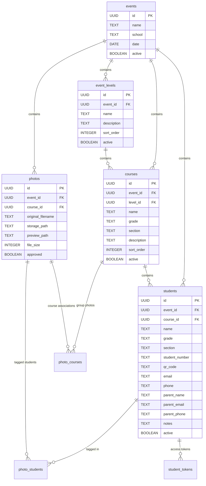

# Photo Hierarchy System Design

## 1. Overview

The Photo Hierarchy System implements a flexible organizational structure for managing educational photography sessions. It supports both flat and nested hierarchies to accommodate schools of varying complexity:

```
Event → Level (optional) → Course → Student → Photos
```

This design allows educational institutions to organize their photo sessions according to their specific structure, whether they have a simple flat organization or a complex multi-level hierarchy. For example, an event like "Fotos Colegio San Martin" can contain levels such as "Primaria", "Secundaria", "Terciaria" or "Jardín", each with their own courses (classrooms) and student photos.

The system provides photographers with intuitive tools to organize by school, by level, and by classrooms, making it easy to manage large photography sessions with thousands of students. Each level includes dedicated gallery functionality for easy photo management and downloading.

## 2. Architecture

### 2.1 Hierarchical Structure

The system implements a five-level hierarchy that enables seamless navigation and organization:

1. **Event**: Represents a photography session at a school (e.g., "Fotos Colegio San Martin")
2. **Level**: Optional organizational layer (e.g., "Primaria", "Secundaria", "Terciaria", "Jardín") 
3. **Course**: Classroom or group organization (e.g., "1st Grade A", "Kindergarten B")
4. **Student**: Individual student records with contact information
5. **Photos**: Individual photos associated with students or courses

Each level contains a gallery view that displays photos for downloading, making it easy for photographers to organize and manage sessions by school, level, and classroom.

### 2.2 Database Schema

The system uses a normalized relational database schema with the following key tables:



### 2.3 Gallery System

Each level of the hierarchy includes a dedicated gallery system with download capabilities:

1. **Event Gallery**: Shows all photos across all levels and courses within an event
2. **Level Gallery**: Displays photos specific to a level (e.g., all "Primaria" photos)
3. **Course Gallery**: Shows photos for a specific classroom or course
4. **Student Gallery**: Displays individual student photos
5. **Group Photos**: Special gallery for course-level group photos

Each gallery provides:
- Thumbnail grid view with lazy loading
- Photo selection and bulk operations
- Download functionality for selected photos
- Filtering by photo status (approved, pending, etc.)
- Search capabilities within the gallery

## 3. API Endpoints Reference

### 3.1 Event Levels
- `GET /api/admin/events/[id]/levels` - Retrieve all levels for an event
- `POST /api/admin/events/[id]/levels` - Create a new level
- `PUT /api/admin/events/[id]/levels/[levelId]` - Update a level
- `DELETE /api/admin/events/[id]/levels/[levelId]` - Delete a level

### 3.2 Courses
- `GET /api/admin/events/[id]/courses` - Retrieve courses with filtering and pagination
- `POST /api/admin/events/[id]/courses` - Create a new course
- `PUT /api/admin/events/[id]/courses/[courseId]` - Update a course
- `DELETE /api/admin/events/[id]/courses/[courseId]` - Delete a course

### 3.3 Students
- `GET /api/admin/events/[id]/students` - Retrieve students with filtering and pagination
- `POST /api/admin/events/[id]/students` - Create a new student or bulk import students
- `PUT /api/admin/events/[id]/students/[studentId]` - Update a student
- `DELETE /api/admin/events/[id]/students/[studentId]` - Delete a student

### 3.4 Photos
- `GET /api/admin/events/[id]/photos` - Retrieve photos with filtering and pagination
- `GET /api/admin/events/[id]/levels/[levelId]/photos` - Retrieve photos for a specific level
- `GET /api/admin/events/[id]/courses/[courseId]/photos` - Retrieve photos for a specific course
- `GET /api/admin/events/[id]/students/[studentId]/photos` - Retrieve photos for a specific student
- `POST /api/admin/events/[id]/photos/bulk-assign` - Bulk assign photos to students/courses
- Photos can be associated with individual students or courses

### 3.5 Galleries
- `GET /api/admin/events/[id]/gallery` - Retrieve event-level gallery
- `GET /api/admin/events/[id]/levels/[levelId]/gallery` - Retrieve level-specific gallery
- `GET /api/admin/events/[id]/courses/[courseId]/gallery` - Retrieve course-specific gallery
- `GET /api/admin/events/[id]/students/[studentId]/gallery` - Retrieve student-specific gallery
- `POST /api/admin/events/[id]/gallery/[galleryId]/download` - Download photos from a gallery
- `POST /api/admin/events/[id]/gallery/[galleryId]/bulk-actions` - Perform bulk actions on gallery photos

## 4. Data Models & ORM Mapping

### 4.1 Event Level Model
```typescript
interface EventLevel {
  id: string;
  event_id: string;
  name: string;
  description?: string;
  sort_order: number;
  active: boolean;
  created_at: string;
  updated_at: string;
  course_count?: number;
  student_count?: number;
  photo_count?: number;
}
```

### 4.2 Course Model
```typescript
interface Course {
  id: string;
  event_id: string;
  level_id?: string;
  name: string;
  grade?: string;
  section?: string;
  description?: string;
  sort_order: number;
  active: boolean;
  created_at: string;
  updated_at: string;
  student_count?: number;
  photo_count?: number;
  group_photo_count?: number;
}
```

### 4.3 Student Model
```typescript
interface Student {
  id: string;
  event_id: string;
  course_id?: string;
  name: string;
  grade?: string;
  section?: string;
  student_number?: string;
  qr_code?: string;
  email?: string;
  phone?: string;
  parent_name?: string;
  parent_email?: string;
  parent_phone?: string;
  notes?: string;
  active: boolean;
  created_at: string;
  updated_at: string;
  photo_count?: number;
  last_photo_tagged?: string;
  has_active_token: boolean;
  token_expires_at?: string;
}

### 4.4 Gallery Model
```typescript
interface Gallery {
  id: string;
  event_id: string;
  level_id?: string;
  course_id?: string;
  student_id?: string;
  name: string;
  description?: string;
  photo_count: number;
  cover_photo_id?: string;
  created_at: string;
  updated_at: string;
  photos: Photo[];
}

### 4.5 Photo Assignment Model
```typescript
interface PhotoAssignment {
  id: string;
  photo_id: string;
  student_id?: string;
  course_id?: string;
  level_id?: string;
  assigned_by: string; // user ID
  assigned_at: string;
  confidence_score?: number; // for AI tagging
}```

## 5. Business Logic Layer

### 5.1 Hierarchical Navigation
The system implements a virtualized hierarchical navigation component that efficiently handles large datasets through:
- Lazy loading of hierarchical levels
- Pagination for large collections
- Search and filtering capabilities
- Performance optimization through memoization
- Breadcrumb navigation showing current position
- Quick navigation between sibling levels/courses
- Collapsible navigation tree for better organization

### 5.2 Data Relationships
- Students can be associated with courses
- Photos can be tagged with multiple students
- Photos can be associated with courses for group photos
- Access tokens are generated for secure family access
- Photos can be viewed at any hierarchy level (event, level, course, student)
- Photos can be assigned to multiple entities (students, courses, levels)

### 5.3 Bulk Operations
- Bulk student import functionality
- Efficient photo tagging operations
- Batch token generation
- Bulk photo assignment to courses/levels
- Mass photo approval/rejection
- Bulk photo download from galleries
- Batch renaming of photos

### 5.4 Gallery Management
- Automatic gallery generation at each hierarchy level
- Gallery customization options (sorting, filtering)
- Download all photos in a gallery
- Gallery sharing capabilities
- Gallery cover photo selection
- Gallery metadata management

### 5.5 Photo Organization
- Drag-and-drop photo organization
- AI-assisted photo tagging
- Manual photo assignment to students/courses
- Photo grouping by capture time
- Duplicate photo detection

## 6. Frontend Component Architecture

### 6.1 Hierarchical Navigation Component
Located at `/components/admin/hierarchical-navigation.tsx`, this component provides:
- Tab-based navigation between hierarchy levels
- Search and filtering capabilities
- Virtualized rendering for large datasets
- Responsive design for mobile and desktop
- Breadcrumb navigation showing current position in hierarchy
- Collapsible tree view for better organization
- Quick actions for each hierarchy level

### 6.2 Virtualized Student Grid
Located at `/components/admin/virtualized-student-grid.tsx`, this component:
- Efficiently renders large numbers of students
- Provides photo tagging interface
- Supports drag-and-drop operations
- Implements lazy loading for performance
- Shows student photos in a gallery view
- Allows bulk photo assignment
- Supports student-level gallery management

### 6.3 Course Management
Located at `/components/admin/course-management.tsx`, this component:
- Allows creation and editing of courses
- Provides bulk student assignment
- Supports course-level photo management
- Includes a course gallery view for group photos
- Allows drag-and-drop photo organization
- Supports bulk photo operations

### 6.4 Level Management
A new component to manage organizational levels (Primaria, Secundaria, etc.):
- Create, edit, and organize levels within an event
- Drag-and-drop reordering of levels
- Level-specific gallery view
- Quick navigation between levels
- Bulk operations for all courses within a level

### 6.5 Gallery Components
Dedicated gallery components for each hierarchy level:
- Event Gallery: `/components/admin/event-gallery.tsx`
- Level Gallery: `/components/admin/level-gallery.tsx`
- Course Gallery: `/components/admin/course-gallery.tsx`
- Student Gallery: `/components/admin/student-gallery.tsx`

Each gallery component provides:
- Thumbnail grid view with lazy loading
- Photo selection and bulk operations
- Download functionality
- Filtering by photo status (approved, pending, etc.)
- Search within gallery
- Sorting options
- Gallery metadata editing

### 6.6 Photo Organization Component
A new component for advanced photo organization:
- `/components/admin/photo-organization.tsx`
- Drag-and-drop photo assignment
- AI-assisted tagging interface
- Duplicate detection
- Batch processing tools

## 7. Performance Optimizations

### 7.1 Database Indexing
- Composite indexes on frequently queried fields
- Partial indexes for active records
- Proper foreign key constraints for data integrity
- Indexes on gallery-related queries
- Indexes for photo assignment operations
- Indexes for bulk operations

### 7.2 API Performance
- Pagination for large datasets (max 500 items per page)
- Efficient JOIN queries with calculated fields
- Response caching for non-critical data
- Gallery data preloading
- Hierarchical data caching
- Bulk operation optimization
- Parallel processing for photo assignments

### 7.3 Frontend Optimizations
- Virtualized rendering for large lists
- Memoization of expensive calculations
- Code splitting for component loading
- Progressive loading with skeleton screens
- Gallery image lazy loading
- Thumbnail generation for faster gallery rendering
- Prefetching of hierarchy navigation data
- Client-side caching of gallery metadata
- Optimized photo grid rendering
- Efficient drag-and-drop operations

## 8. Security Considerations

### 8.1 Authentication
- Role-based access control (admin vs family access)
- JWT-based authentication for API endpoints
- Session management with secure tokens
- Gallery access control
- Bulk operation permissions

### 8.2 Data Protection
- Row Level Security (RLS) policies in database
- Encrypted storage of sensitive information
- Secure token generation for family access
- Gallery sharing security
- Photo download restrictions
- Bulk operation audit logging

### 8.3 Input Validation
- Zod schema validation for all API inputs
- Sanitization of user-provided data
- Protection against injection attacks
- Gallery name and description validation
- Photo metadata validation
- Bulk operation parameter validation

## 9. Testing Strategy

### 9.1 Unit Tests
- API endpoint validation
- Data model validation
- Business logic testing
- Gallery rendering tests
- Navigation component tests
- Bulk operation tests
- Photo assignment tests

### 9.2 Integration Tests
- Database query testing
- API integration testing
- Authentication flow testing
- Hierarchy navigation testing
- Gallery functionality testing
- Bulk operation integration tests
- Photo organization workflow tests

### 9.3 Performance Tests
- Load testing for large datasets
- Response time monitoring
- Memory usage optimization
- Gallery loading performance
- Hierarchy traversal performance
- Bulk operation performance
- Photo assignment performance

### 9.4 Usability Tests
- Navigation ease testing
- Gallery usability testing
- Mobile responsiveness testing
- Photographer workflow optimization
- Bulk operation usability
- Photo organization efficiency

## 10. Mobile-First Design Considerations

### 10.1 Responsive Interface
- Adaptive layouts for different screen sizes
- Touch-friendly controls with appropriate sizing
- Optimized navigation for mobile devices
- Collapsible hierarchy navigation for small screens
- Gallery swipe gestures for photo browsing
- Mobile-optimized gallery grid
- Touch-friendly bulk operation controls

### 10.2 Performance on Mobile
- Efficient data loading strategies
- Reduced bandwidth usage through image optimization
- Offline capabilities where appropriate
- Lazy loading for gallery images
- Progressive loading indicators
- Optimized photo grid rendering on mobile
- Efficient memory usage for large galleries

### 10.3 Touch Interactions
- Gesture support for gallery navigation (swipe, pinch-to-zoom)
- Drag-and-drop reordering of hierarchy levels
- Long-press for bulk operations
- Intuitive navigation between hierarchy levels
- Touch-friendly photo selection
- Gesture-based photo organization
- Mobile-optimized drag-and-drop