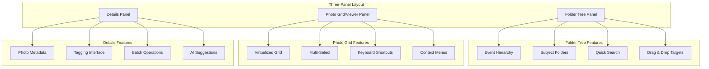
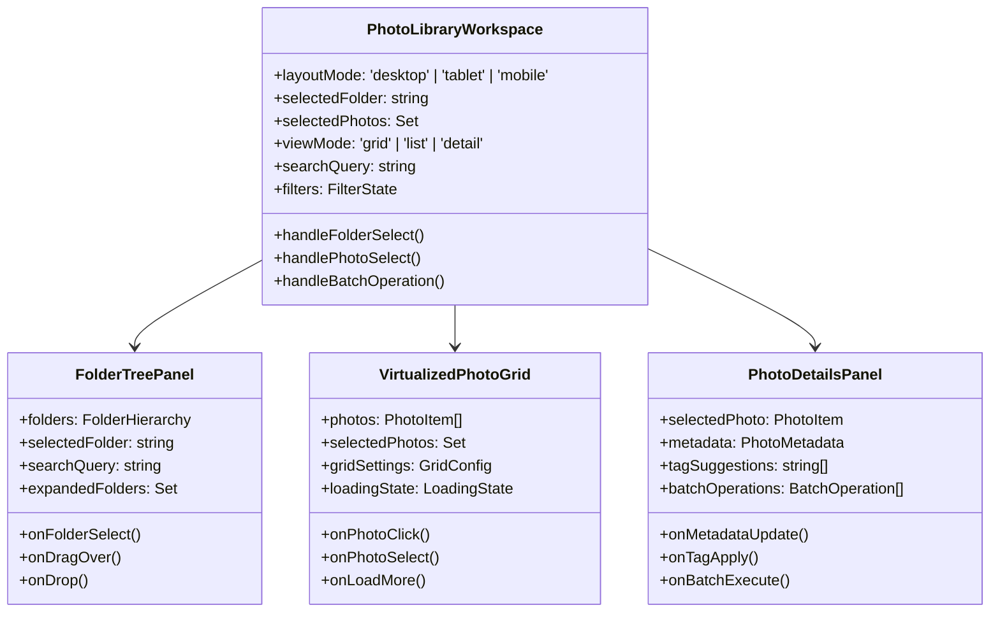

# Event Photo Library Optimization Design

## Overview

This design document outlines a comprehensive optimization strategy for the Event Photo Library system in LookEscolar. The current implementation provides basic photo management capabilities through various gallery components and admin interfaces. However, there is significant opportunity to enhance performance, user experience, and scalability through modern interface design, virtualization techniques, and advanced features.

The optimization focuses on transforming the existing single-column photo browser into a professional-grade photo management system that can efficiently handle large collections while providing an intuitive three-panel workspace design.

## Technology Stack & Dependencies

### Current Technology Foundation
- **Frontend**: Next.js 15 with App Router, React 19
- **State Management**: Zustand (existing implementation)
- **Database**: Supabase with Row Level Security
- **Storage**: Supabase Storage with signed URLs
- **Styling**: Tailwind CSS
- **Image Processing**: Sharp (server-side)
- **Existing Virtualization**: react-window (partially implemented)

### Additional Dependencies Required
- **Virtualization Enhancement**: react-virtual or react-window optimization
- **Image Processing**: WebP conversion support
- **Caching**: Enhanced service worker implementation
- **Gesture Support**: react-use-gesture for touch interactions
- **Computer Vision**: TensorFlow.js or similar for AI features

## Architecture

### Current State Analysis

The existing system implements several optimization techniques:
- Virtualized photo grids using react-window
- Lazy loading with Intersection Observer
- Signed URL caching for photo access
- Memory management through component memoization
- Basic performance monitoring

However, the current architecture has limitations:
- Single-column layout limits workspace efficiency
- Limited batch operations support
- Basic search and filtering capabilities
- No drag-and-drop functionality
- Minimal mobile optimization

### Target Architecture: Three-Panel Workspace



### Component Architecture



## Component Hierarchy

### Three-Panel Layout Implementation

#### Desktop Layout (1200px+)
```
┌─────────────┬─────────────────────────────┬──────────────┐
│ Folder Tree │ Photo Grid / Viewer         │ Details      │
│ (300px)     │ (flexible)                  │ (320px)      │
├─────────────┼─────────────────────────────┼──────────────┤
│ Events      │ [Photo Grid]                │ Photo Info   │
│ ├── Event1  │ ├── [Photo] [Photo] [Photo] │ ├── Name     │
│ │   ├── 01  │ ├── [Photo] [Photo] [Photo] │ ├── Size     │
│ │   ├── 02  │ ├── [Photo] [Photo] [Photo] │ ├── Date     │
│ │   └── 03  │ └── [Photo] [Photo] [Photo] │ ├── Actions  │
│ └── Event2  │                             │ └── Tags     │
│     ├── A   │                             │              │
│     ├── B   │                             │              │
│     └── C   │                             │              │
└─────────────┴─────────────────────────────┴──────────────┘
```

#### Tablet Layout (768px - 1199px)
```
┌─────────────┬─────────────────────────────┐
│ Folder Tree │ Photo Grid                  │
│ (280px)     │ (flexible)                  │
├─────────────┼─────────────────────────────┤
│ [Folders]   │ [Photo Grid with overlay]   │
│             │                             │
│             │ [Details slide-over panel]  │
│             │                             │
└─────────────┴─────────────────────────────┘
```

#### Mobile Layout (< 768px)
```
┌─────────────────────────────────────┐
│ [Tab Navigation]                    │
├─────────────────────────────────────┤
│ Folders | Photos | Details          │
├─────────────────────────────────────┤
│                                     │
│ [Active panel content]              │
│                                     │
│                                     │
└─────────────────────────────────────┘
```

### State Management Architecture

```typescript
interface PhotoLibraryState {
  // Layout and UI
  layout: {
    mode: 'desktop' | 'tablet' | 'mobile'
    panelSizes: { tree: number; grid: number; details: number }
    activePanel: 'folders' | 'photos' | 'details' // mobile only
  }
  
  // Folder Management
  folders: {
    byId: Record<string, FolderData>
    allIds: string[]
    tree: FolderHierarchy
    selected: string | null
    expanded: Set<string>
  }
  
  // Photo Management
  photos: {
    byId: Record<string, PhotoData>
    byFolder: Record<string, string[]>
    selected: Set<string>
    cache: Record<string, CachedPhotoData>
    loading: LoadingState
  }
  
  // Search and Filtering
  filters: {
    query: string
    dateRange: [Date, Date] | null
    tags: string[]
    approvalStatus: 'all' | 'approved' | 'pending'
    fileSize: [number, number] | null
  }
  
  // Grid Configuration
  grid: {
    viewMode: 'grid' | 'list' | 'detail'
    itemSize: number
    columns: number
    enableSelection: boolean
    showMetadata: boolean
  }
  
  // Performance
  performance: {
    cacheHitRate: number
    loadTime: number
    memoryUsage: number
  }
}
```

## State Management System

### Enhanced Zustand Store Implementation

```typescript
interface PhotoLibraryStore extends PhotoLibraryState {
  // Actions
  setLayout: (layout: Partial<PhotoLibraryState['layout']>) => void
  selectFolder: (folderId: string) => void
  toggleFolderExpansion: (folderId: string) => void
  selectPhotos: (photoIds: string[], mode: 'replace' | 'add' | 'toggle') => void
  clearSelection: () => void
  
  // Batch Operations
  movePhotos: (photoIds: string[], targetFolderId: string) => Promise<void>
  tagPhotos: (photoIds: string[], tags: string[]) => Promise<void>
  deletePhotos: (photoIds: string[]) => Promise<void>
  approvePhotos: (photoIds: string[]) => Promise<void>
  
  // Search and Filter
  setSearchQuery: (query: string) => void
  setFilters: (filters: Partial<PhotoLibraryState['filters']>) => void
  
  // Grid Management
  setGridConfig: (config: Partial<PhotoLibraryState['grid']>) => void
  loadMorePhotos: () => Promise<void>
  
  // Cache Management
  preloadPhotos: (photoIds: string[]) => Promise<void>
  clearCache: () => void
}
```

### Performance-Optimized Selectors

```typescript
// Memoized selectors for performance
const useFilteredPhotos = () => {
  return usePhotoLibraryStore(useCallback((state) => {
    const { photos, folders, filters } = state
    const selectedFolder = folders.selected
    
    if (!selectedFolder) return []
    
    let photoIds = photos.byFolder[selectedFolder] || []
    
    // Apply filters
    if (filters.query) {
      photoIds = photoIds.filter(id => 
        photos.byId[id]?.name.toLowerCase().includes(filters.query.toLowerCase())
      )
    }
    
    if (filters.tags.length > 0) {
      photoIds = photoIds.filter(id =>
        filters.tags.some(tag => photos.byId[id]?.tags.includes(tag))
      )
    }
    
    return photoIds.map(id => photos.byId[id])
  }, []))
}

const useGridConfiguration = () => {
  return usePhotoLibraryStore(useCallback((state) => {
    const { grid, layout } = state
    
    // Responsive column calculation
    const baseColumns = layout.mode === 'mobile' ? 2 : 
                       layout.mode === 'tablet' ? 3 : 4
    
    return {
      ...grid,
      columns: Math.max(2, Math.floor((window.innerWidth - 400) / grid.itemSize))
    }
  }, []))
}
```

## Routing and Navigation System

### Enhanced Navigation Structure

The optimized photo library maintains the existing Next.js App Router structure while adding new navigation patterns:

```
/admin/photos/library
├── [eventId]/                 # Event-specific photo library
│   ├── folders/[folderId]     # Folder-specific view
│   ├── search                 # Search results view
│   └── batch                  # Batch operations view
├── recent                     # Recently uploaded photos
├── untagged                   # Photos without tags
└── search                     # Global search
```

### Navigation State Management

```typescript
interface NavigationState {
  currentPath: string
  breadcrumbs: BreadcrumbItem[]
  history: string[]
  backEnabled: boolean
  forwardEnabled: boolean
}

const useDynamicNavigation = () => {
  const router = useRouter()
  const [navState, setNavState] = useState<NavigationState>()
  
  const navigateToFolder = useCallback((folderId: string) => {
    const newPath = `/admin/photos/library/${folderId}`
    router.push(newPath)
    updateNavigation(newPath)
  }, [router])
  
  const navigateBack = useCallback(() => {
    if (navState?.backEnabled) {
      router.back()
    }
  }, [router, navState])
  
  return { navState, navigateToFolder, navigateBack }
}
```

## UI Design System and Styling

### Responsive Three-Panel Layout

```typescript
// Responsive panel management hook
const usePanelLayout = () => {
  const [windowSize, setWindowSize] = useState({ width: 0, height: 0 })
  const [panelSizes, setPanelSizes] = useState({
    tree: 300,
    details: 320
  })
  
  const layout = useMemo(() => {
    if (windowSize.width < 768) return 'mobile'
    if (windowSize.width < 1200) return 'tablet'
    return 'desktop'
  }, [windowSize.width])
  
  const gridWidth = useMemo(() => {
    return windowSize.width - (layout === 'desktop' ? 
      panelSizes.tree + panelSizes.details : 
      layout === 'tablet' ? panelSizes.tree : 0)
  }, [windowSize.width, layout, panelSizes])
  
  return { layout, panelSizes, gridWidth, setPanelSizes }
}
```

### Theme System Integration

```typescript
interface PhotoLibraryTheme {
  panels: {
    tree: {
      background: string
      border: string
      selectedItem: string
    }
    grid: {
      background: string
      itemHover: string
      selectedItem: string
    }
    details: {
      background: string
      sectionBorder: string
    }
  }
  photos: {
    placeholder: string
    loadingShimmer: string
    selectionOverlay: string
  }
  interactions: {
    dragOver: string
    dropZone: string
    contextMenu: string
  }
}
```

## API Endpoints Reference

### Enhanced Photo Management API

#### Batch Operations API
```typescript
// GET /api/admin/photos/batch-info
interface BatchInfoResponse {
  selectedCount: number
  totalSize: number
  avgFileSize: number
  supportedOperations: string[]
  estimatedTime: number
}

// POST /api/admin/photos/batch-move
interface BatchMoveRequest {
  photoIds: string[]
  targetFolderId: string
  options: {
    preserveHierarchy: boolean
    createMissingFolders: boolean
  }
}

// POST /api/admin/photos/batch-tag
interface BatchTagRequest {
  photoIds: string[]
  tags: string[]
  operation: 'add' | 'remove' | 'replace'
  aiSuggestions?: boolean
}
```

#### Advanced Search API
```typescript
// POST /api/admin/photos/search
interface SearchRequest {
  query: string
  filters: {
    eventIds?: string[]
    dateRange?: [string, string]
    tags?: string[]
    fileSize?: [number, number]
    dimensions?: [number, number]
    approvalStatus?: 'all' | 'approved' | 'pending'
  }
  sort: {
    field: 'date' | 'name' | 'size' | 'tags'
    direction: 'asc' | 'desc'
  }
  pagination: {
    offset: number
    limit: number
  }
}

interface SearchResponse {
  photos: PhotoItem[]
  totalCount: number
  facets: {
    tags: { name: string; count: number }[]
    events: { id: string; name: string; count: number }[]
  }
  searchTime: number
}
```

#### Folder Management API
```typescript
// GET /api/admin/photos/folders/hierarchy
interface FolderHierarchyResponse {
  tree: FolderNode[]
  stats: {
    totalFolders: number
    totalPhotos: number
    avgPhotosPerFolder: number
  }
}

interface FolderNode {
  id: string
  name: string
  type: 'event' | 'subject' | 'custom'
  photoCount: number
  children: FolderNode[]
  metadata: {
    created: string
    lastModified: string
    totalSize: number
  }
}
```

## Data Models & ORM Mapping

### Enhanced Photo Entity
```typescript
interface EnhancedPhotoEntity {
  // Existing fields
  id: string
  filename: string
  url: string
  size: number
  created_at: string
  event_id: string
  code_id: string
  approved: boolean
  
  // New optimization fields
  preview_url?: string
  webp_url?: string
  dimensions: { width: number; height: number }
  metadata: {
    camera?: string
    iso?: number
    aperture?: string
    shutter_speed?: string
    focal_length?: string
  }
  tags: string[]
  ai_tags: string[]
  quality_score: number
  duplicate_group?: string
  last_accessed: string
  access_count: number
}
```

### Folder Hierarchy Model
```typescript
interface FolderEntity {
  id: string
  name: string
  parent_id?: string
  type: 'event' | 'subject' | 'custom' | 'ai_generated'
  path: string // Full hierarchical path
  level: number
  photo_count: number
  total_size: number
  created_at: string
  updated_at: string
  metadata: Record<string, any>
  permissions: {
    read: boolean
    write: boolean
    delete: boolean
  }
}
```

### Performance Metrics Model
```typescript
interface PhotoLibraryMetrics {
  session_id: string
  user_id: string
  timestamp: string
  metrics: {
    // Loading Performance
    initial_load_time: number
    grid_render_time: number
    average_photo_load_time: number
    
    // User Interaction
    photos_viewed: number
    folders_opened: number
    searches_performed: number
    batch_operations: number
    
    // System Performance
    cache_hit_rate: number
    memory_usage: number
    api_response_times: number[]
    
    // Error Tracking
    failed_loads: number
    timeout_errors: number
    network_errors: number
  }
}
```

## Business Logic Layer

### Advanced Photo Processing Service

```typescript
class EnhancedPhotoService {
  // Batch operations with progress tracking
  async batchMovePhotos(
    photoIds: string[], 
    targetFolderId: string,
    onProgress?: (progress: number) => void
  ): Promise<BatchOperationResult> {
    const batchSize = 50
    const results: OperationResult[] = []
    
    for (let i = 0; i < photoIds.length; i += batchSize) {
      const batch = photoIds.slice(i, i + batchSize)
      const batchResults = await this.processBatch(batch, targetFolderId)
      results.push(...batchResults)
      
      onProgress?.(Math.min(100, ((i + batchSize) / photoIds.length) * 100))
    }
    
    return this.aggregateResults(results)
  }
  
  // AI-powered photo organization
  async suggestOrganization(photoIds: string[]): Promise<OrganizationSuggestion[]> {
    const photos = await this.getPhotosWithMetadata(photoIds)
    
    // Group by visual similarity
    const visualGroups = await this.groupByVisualSimilarity(photos)
    
    // Group by metadata patterns
    const metadataGroups = this.groupByMetadata(photos)
    
    // Generate suggestions
    return this.generateSuggestions(visualGroups, metadataGroups)
  }
  
  // Smart caching with predictive preloading
  async preloadPredictivePhotos(currentPhotoId: string): Promise<void> {
    const neighbors = await this.findNeighboringPhotos(currentPhotoId)
    const userPatterns = await this.getUserNavigationPatterns()
    
    const priorityPhotos = this.calculatePreloadPriority(neighbors, userPatterns)
    await this.preloadPhotoUrls(priorityPhotos)
  }
}
```

### Folder Management Service

```typescript
class FolderManagementService {
  // Dynamic folder creation based on patterns
  async createSmartFolders(eventId: string): Promise<FolderCreationResult> {
    const photos = await this.getEventPhotos(eventId)
    const patterns = await this.analyzePhotoPatterns(photos)
    
    const suggestedFolders = []
    
    // Create folders based on date patterns
    if (patterns.dateDistribution.multiDay) {
      suggestedFolders.push(...this.createDateBasedFolders(patterns.dates))
    }
    
    // Create folders based on photo characteristics
    if (patterns.hasPortraits && patterns.hasGroups) {
      suggestedFolders.push(
        { name: 'Individual Photos', type: 'ai_generated' },
        { name: 'Group Photos', type: 'ai_generated' }
      )
    }
    
    return this.createFolders(suggestedFolders)
  }
  
  // Hierarchical folder operations
  async moveFolderWithChildren(
    folderId: string, 
    targetParentId: string
  ): Promise<FolderMoveResult> {
    const folder = await this.getFolder(folderId)
    const children = await this.getFolderChildren(folderId)
    
    // Validate move operation
    const validation = await this.validateFolderMove(folder, targetParentId)
    if (!validation.valid) {
      throw new Error(validation.reason)
    }
    
    // Move folder and update paths
    await this.updateFolderHierarchy(folder, targetParentId)
    
    // Update all children paths


