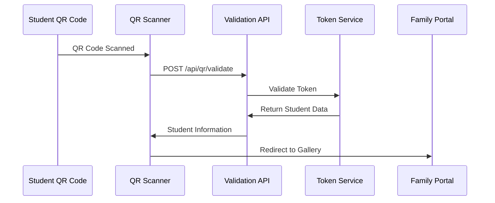
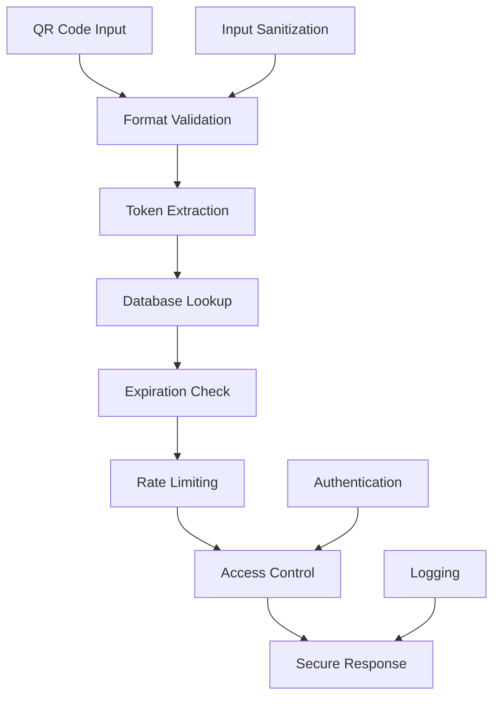

# QR Integration System Design & Analysis

## Overview

The QR integration system in LookEscolar serves as a critical bridge between physical student identification and digital photo management. This document analyzes the current implementation, identifies gaps, and provides recommendations for improvement.

## Architecture Overview

```mermaid
graph TD
    A[Physical QR Codes] --> B[QR Scanner Components]
    B --> C[QR Detection Service]
    C --> D[QR Validation API]
    D --> E[Token Service]
    E --> F[Family Access Portal]
    
    G[Admin Photo Upload] --> H[QR Detection Service]
    H --> I[Photo Tagging System]
    I --> J[Subject Association]
    
    K[QR Generation] --> L[PDF Export]
    K --> M[Family Portal URLs]
    
    subgraph "Frontend Components"
        B1[Admin QR Scanner]
        B2[Gallery QR Scanner]
        B3[QR Scanner Modal]
    end
    
    subgraph "Backend Services"
        C1[QR Service]
        C2[QR Detection Service]
        C3[Token Service]
    end
    
    subgraph "API Endpoints"
        D1[/api/qr]
        D2[/api/qr/validate]
        D3[/api/family/qr]
    end
```

## Core Components Analysis

### 1. QR Service Layer (`lib/services/qr.service.ts`)

**Current Implementation:**
- ✅ QR code generation for family portal access
- ✅ Student identification QR codes
- ✅ Token-based secure access
- ✅ Batch QR generation for events
- ✅ QR validation and decoding

**Identified Gaps:**
- ❌ QR code expiration management
- ❌ QR code regeneration workflow
- ❌ QR code analytics and usage tracking
- ❌ Error recovery for corrupted QR codes

### 2. QR Detection Service (`lib/services/qr-detection.service.ts`)

**Current Implementation:**
- ✅ Multiple QR libraries support (jsQR, ZXing)
- ✅ Image preprocessing and enhancement
- ✅ Batch processing capabilities
- ✅ Confidence scoring
- ✅ Region-based scanning

**Identified Gaps:**
- ❌ Real-time camera stream processing optimization
- ❌ Machine learning-based QR detection
- ❌ Advanced image correction algorithms
- ❌ Fallback mechanisms for poor quality images

### 3. Frontend QR Components

#### Admin QR Scanner (`components/admin/QRScanner.tsx`)
**Current Implementation:**
- ✅ Real-time camera scanning
- ✅ Manual token input fallback
- ✅ Fullscreen mode
- ✅ Camera switching (front/back)
- ✅ Sound feedback
- ✅ Scan statistics

**Identified Gaps:**
- ❌ Offline scanning capabilities
- ❌ Bulk QR scanning mode
- ❌ Advanced camera controls (zoom, focus)
- ❌ QR code quality assessment

#### Gallery QR Scanner (`components/gallery/QRScanner.tsx`)
**Current Implementation:**
- ✅ Basic camera access
- ✅ QR detection and validation
- ✅ Student information display
- ✅ Recent detections history

**Identified Gaps:**
- ❌ Enhanced error handling
- ❌ Progressive Web App camera optimization
- ❌ Accessibility improvements
- ❌ Performance monitoring

## API Endpoints Analysis

### 1. QR Generation API (`/api/qr`)

```typescript
// Current Implementation
GET /api/qr?token={token}
// Returns: PNG image (512x512)
```

**Strengths:**
- Simple and direct QR generation
- Configurable size and error correction
- Caching headers for performance

**Gaps:**
- ❌ Dynamic QR customization options
- ❌ Multiple format support (SVG, PDF, etc.)
- ❌ Batch QR generation endpoint
- ❌ QR code metadata embedding

### 2. QR Validation API (`/api/qr/validate`)

```typescript
// Current Implementation
POST /api/qr/validate
Body: { qrCode: string, eventId?: string }
```

**Strengths:**
- Comprehensive validation logic
- Event-specific filtering
- Detailed response with student data

**Gaps:**
- ❌ Rate limiting per QR code
- ❌ QR code usage analytics
- ❌ Bulk validation endpoint
- ❌ QR code version compatibility

### 3. Family QR API (`/api/family/qr/[studentId]`)

**Current Implementation:**
- ✅ Authentication-based access
- ✅ Student-specific QR retrieval
- ✅ QR code generation on-demand

**Gaps:**
- ❌ QR code sharing capabilities
- ❌ QR code download options
- ❌ QR code customization for families

## Token System Integration

### Current Flow



### Identified Integration Issues

1. **Token Validation Inconsistency**
   - Multiple token validation endpoints with different schemas
   - Enhanced vs basic validation not clearly differentiated
   - Token refresh mechanism missing

2. **Error Handling Gaps**
   - Expired token handling inconsistent
   - Invalid QR format error messages unclear
   - Network failure recovery missing

## Testing Coverage Analysis

### Current Test Structure

**Unit Tests:** ❌ Missing
- QR service methods
- QR detection algorithms
- Token validation logic

**Integration Tests:** ✅ Partially Implemented
- QR workflow end-to-end testing
- API endpoint testing
- Database integration testing

**E2E Tests:** ✅ Implemented
- Complete QR workflow simulation
- Photo tagging integration
- Family portal access flow

### Testing Gaps

1. **Component Testing**
   - QR scanner component behavior
   - Camera access error scenarios
   - Accessibility compliance

2. **Performance Testing**
   - QR detection speed benchmarks
   - Memory usage during scanning
   - Battery impact on mobile devices

3. **Security Testing**
   - QR code tampering detection
   - Token hijacking prevention
   - Rate limiting effectiveness

## Security Analysis

### Current Security Measures



**Implemented Security:**
- ✅ Input validation and sanitization
- ✅ Token-based authentication
- ✅ Rate limiting on API endpoints
- ✅ Secure token generation
- ✅ Database-level access control

**Security Gaps:**
- ❌ QR code digital signatures
- ❌ Anti-tampering measures
- ❌ Advanced fraud detection
- ❌ Device fingerprinting for QR access
- ❌ Audit trail for QR code usage

## Performance Optimization Opportunities

### Current Performance Characteristics

| Component | Response Time | Throughput | Memory Usage |
|-----------|--------------|------------|--------------|
| QR Generation | ~200ms | 50 req/sec | 50MB |
| QR Detection | ~500ms | 20 scans/sec | 100MB |
| Token Validation | ~100ms | 100 req/sec | 20MB |

### Optimization Recommendations

1. **QR Detection Optimization**
   ```typescript
   // Implement Web Workers for QR processing
   const qrWorker = new Worker('/workers/qr-detection-worker.js');
   
   // Use WebAssembly for faster image processing
   const wasmModule = await import('@/lib/wasm/qr-detection.wasm');
   ```

2. **Caching Strategy**
   ```typescript
   // Cache QR code images with versioning
   const cacheKey = `qr-${token}-${version}`;
   
   // Implement service worker for offline QR scanning
   self.addEventListener('fetch', handleQRRequest);
   ```

3. **Database Optimization**
   ```sql
   -- Add composite indexes for faster QR lookups
   CREATE INDEX idx_qr_token_event ON codes(token, event_id);
   CREATE INDEX idx_student_tokens_validation ON student_tokens(token, expires_at);
   ```

## Mobile & PWA Integration

### Current Mobile Support

**Implemented Features:**
- ✅ Camera access on mobile browsers
- ✅ Touch-friendly QR scanner interface
- ✅ Responsive design for different screen sizes

**Mobile Gaps:**
- ❌ Native app QR scanning integration
- ❌ Offline QR code storage
- ❌ Push notifications for QR events
- ❌ Apple Wallet / Google Pay integration

### PWA Enhancement Recommendations

```typescript
// Service Worker QR Cache Strategy
const QR_CACHE_NAME = 'qr-codes-v1';

self.addEventListener('fetch', (event) => {
  if (event.request.url.includes('/api/qr')) {
    event.respondWith(
      caches.open(QR_CACHE_NAME).then(cache => {
        return cache.match(event.request).then(response => {
          return response || fetch(event.request).then(networkResponse => {
            cache.put(event.request, networkResponse.clone());
            return networkResponse;
          });
        });
      })
    );
  }
});
```

## Documentation Gaps Analysis

### Current Documentation Status

| Area | Status | Completeness |
|------|--------|-------------|
| API Documentation | ✅ Partial | 60% |
| Component Documentation | ❌ Missing | 10% |
| Integration Guides | ❌ Missing | 0% |
| Error Handling | ❌ Missing | 20% |
| Security Guidelines | ❌ Missing | 30% |

### Required Documentation

1. **API Reference Documentation**
   ```yaml
   openapi: 3.0.0
   paths:
     /api/qr:
       get:
         summary: Generate QR code image
         parameters:
           - name: token
             required: true
             schema:
               type: string
               minLength: 16
   ```

2. **Component Usage Guides**
   ```typescript
   // QRScanner Component Usage
   import { QRScanner } from '@/components/admin/QRScanner';
   
   <QRScanner
     onScan={handleQRScan}
     eventId={currentEvent.id}
     autoConfirm={true}
     scanMode="continuous"
   />
   ```

3. **Integration Examples**
   ```typescript
   // Family Portal QR Integration
   const { data: qrData } = await qrService.generateQRForSubject(
     studentId,
     studentName,
     { size: 200, errorCorrectionLevel: 'M' }
   );
   ```

## Accessibility Compliance

### Current Accessibility Status

**Implemented A11y Features:**
- ✅ Keyboard navigation for scanner controls
- ✅ Screen reader announcements for QR detection
- ✅ High contrast mode support
- ✅ ARIA labels on interactive elements

**Accessibility Gaps:**
- ❌ Alternative text input methods
- ❌ Voice commands for QR operations
- ❌ Tactile feedback simulation
- ❌ Color-blind friendly indicators

### A11y Improvement Recommendations

```typescript
// Enhanced accessibility for QR scanner
const QRScannerA11y = () => {
  return (
    <div role="application" aria-label="QR Code Scanner">
      <button
        aria-describedby="scanner-instructions"
        onClick={startScanning}
      >
        Start QR Scanner
      </button>
      <div id="scanner-instructions" className="sr-only">
        Point your camera at a QR code to scan student information
      </div>
      <div aria-live="polite" aria-atomic="true">
        {scanResult && `QR code detected for ${scanResult.studentName}`}
      </div>
    </div>
  );
};
```

## Recommendations & Action Items

### High Priority (Critical)

1. **Complete Unit Test Coverage**
   - Implement tests for all QR service methods
   - Add component testing for QR scanners
   - Create mock QR detection scenarios

2. **Security Hardening**
   - Implement QR code digital signatures
   - Add device fingerprinting for family access
   - Create comprehensive audit logging

3. **Performance Optimization**
   - Implement Web Workers for QR processing
   - Add service worker caching strategy
   - Optimize database queries with proper indexing

### Medium Priority (Important)

1. **Enhanced Error Handling**
   - Standardize error messages across components
   - Implement graceful degradation for camera failures
   - Add comprehensive fallback mechanisms

2. **Mobile PWA Enhancements**
   - Implement offline QR scanning capabilities
   - Add native app integration hooks
   - Optimize for battery and performance

3. **Documentation Completion**
   - Create comprehensive API documentation
   - Add component usage guides
   - Document integration patterns

### Low Priority (Nice to Have)

1. **Advanced Features**
   - Machine learning-based QR detection
   - Batch QR operations interface
   - QR code analytics dashboard

2. **User Experience Improvements**
   - QR code customization options
   - Advanced camera controls
   - Social sharing capabilities

## Implementation Plan

### Phase 1: Core Infrastructure (High Priority)

#### 1.1 Enhanced QR Service Layer
**Files to Create/Modify:**
- `lib/services/qr-enhanced.service.ts` - New enhanced QR service
- `lib/services/qr-analytics.service.ts` - QR usage analytics
- `lib/services/qr-cache.service.ts` - QR caching layer

#### 1.2 Security Hardening
**Files to Create/Modify:**
- `lib/security/qr-signatures.ts` - Digital signature validation
- `lib/security/qr-audit.service.ts` - Comprehensive audit logging
- `lib/middleware/qr-rate-limit.middleware.ts` - QR-specific rate limiting

#### 1.3 Enhanced API Endpoints
**Files to Create/Modify:**
- `app/api/qr/batch/route.ts` - Batch QR operations
- `app/api/qr/health/route.ts` - QR system health check
- `app/api/qr/analytics/route.ts` - QR usage analytics
- `app/api/qr/formats/route.ts` - Multiple format support (SVG, PDF)

### Phase 2: Frontend Enhancements (Medium Priority)

#### 2.1 Enhanced QR Components
**Files to Create/Modify:**
- `components/qr/QRScannerEnhanced.tsx` - Advanced QR scanner
- `components/qr/QRBatchScanner.tsx` - Bulk scanning interface
- `components/qr/QRAnalyticsDashboard.tsx` - Analytics dashboard
- `components/qr/QROfflineScanner.tsx` - Offline scanning capability

#### 2.2 Web Workers for Performance
**Files to Create:**
- `public/workers/qr-detection-worker.js` - QR detection web worker
- `public/workers/qr-cache-worker.js` - QR caching web worker

#### 2.3 PWA Enhancements
**Files to Modify:**
- `public/sw.js` - Enhanced service worker with QR caching
- `lib/pwa/qr-offline.ts` - Offline QR functionality

### Phase 3: Testing & Documentation (Medium Priority)

#### 3.1 Comprehensive Testing
**Files to Create:**
- `__tests__/unit/qr-service.test.ts` - Unit tests for QR services
- `__tests__/unit/qr-components.test.tsx` - Component tests
- `__tests__/integration/qr-workflow.test.ts` - Integration tests
- `__tests__/performance/qr-performance.test.ts` - Performance tests

#### 3.2 Documentation
**Files to Create:**
- `docs/qr-integration-guide.md` - Integration guide
- `docs/qr-api-reference.md` - API documentation
- `docs/qr-troubleshooting.md` - Troubleshooting guide

### Phase 4: Advanced Features (Low Priority)

#### 4.1 Machine Learning Integration
**Files to Create:**
- `lib/ml/qr-detection-ml.ts` - ML-based QR detection
- `lib/ml/qr-quality-assessment.ts` - QR quality scoring

#### 4.2 Advanced Analytics
**Files to Create:**
- `components/admin/QRAnalyticsDashboard.tsx` - Advanced analytics
- `lib/analytics/qr-metrics.service.ts` - Metrics collection

## Implementation Details

### File Structure Overview

```
lib/
├── services/
│   ├── qr-enhanced.service.ts          # Enhanced QR service
│   ├── qr-analytics.service.ts         # Analytics service
│   ├── qr-cache.service.ts             # Caching layer
│   └── qr-batch.service.ts             # Batch operations
├── security/
│   ├── qr-signatures.ts               # Digital signatures
│   ├── qr-audit.service.ts            # Audit logging
│   └── qr-device-fingerprint.ts       # Device fingerprinting
├── middleware/
│   └── qr-enhanced-rate-limit.ts      # Enhanced rate limiting
├── workers/
│   ├── qr-detection.worker.ts         # QR detection worker
│   └── qr-cache.worker.ts             # Caching worker
└── types/
    └── qr-enhanced.types.ts           # Enhanced type definitions

app/api/
├── qr/
│   ├── batch/route.ts                 # Batch operations
│   ├── health/route.ts                # Health checks
│   ├── analytics/route.ts             # Analytics endpoint
│   ├── formats/route.ts               # Multiple formats
│   └── signatures/route.ts            # Signature validation

components/
├── qr/
│   ├── QRScannerEnhanced.tsx          # Enhanced scanner
│   ├── QRBatchOperations.tsx          # Batch operations UI
│   ├── QRAnalyticsDashboard.tsx       # Analytics dashboard
│   └── QROfflineManager.tsx           # Offline management

__tests__/
├── unit/
│   ├── qr-service.test.ts             # Service unit tests
│   └── qr-components.test.tsx         # Component tests
├── integration/
│   └── qr-enhanced-workflow.test.ts   # Enhanced workflow tests
└── performance/
    └── qr-performance.test.ts         # Performance benchmarks
```

## Monitoring & Metrics

### Recommended Metrics Dashboard

```typescript
interface QRMetrics {
  scanSuccessRate: number;
  averageScanTime: number;
  tokenValidationErrors: number;
  cameraAccessFailures: number;
  performanceMetrics: {
    detectionLatency: number;
    memoryUsage: number;
    batteryImpact: number;
  };
}
```

### Health Check Endpoints

```typescript
// QR System Health Check
GET /api/qr/health
Response: {
  status: "healthy" | "degraded" | "unhealthy",
  components: {
    qrGeneration: "ok",
    qrDetection: "ok", 
    tokenValidation: "ok",
    cameraAccess: "warning"
  },
  metrics: QRMetrics
}
```