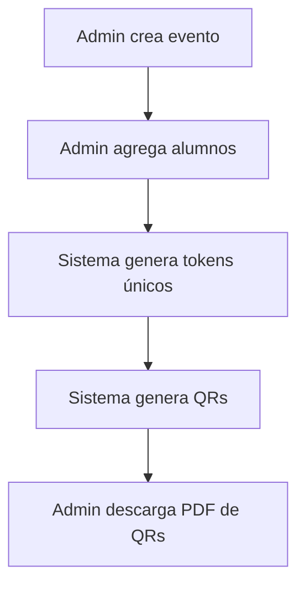
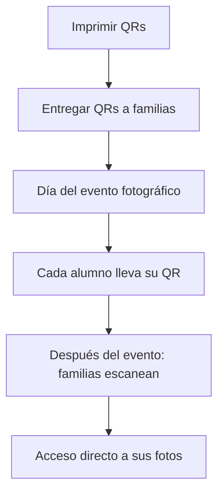
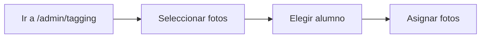
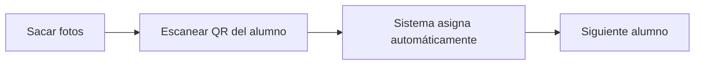
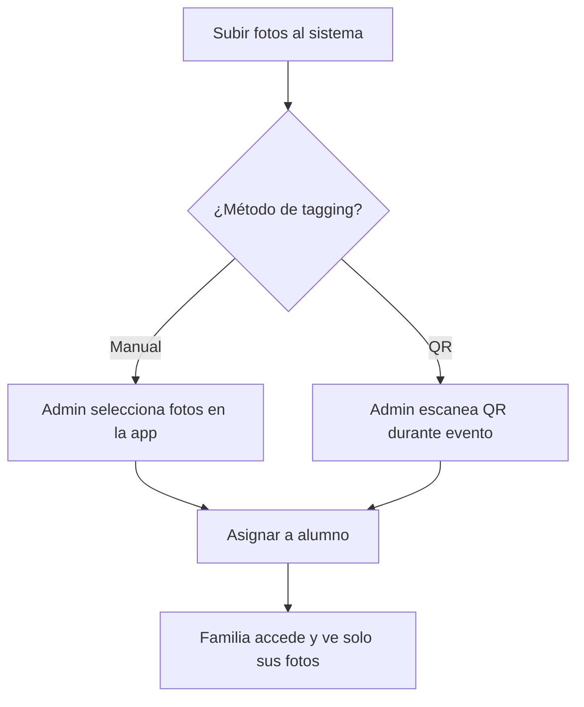
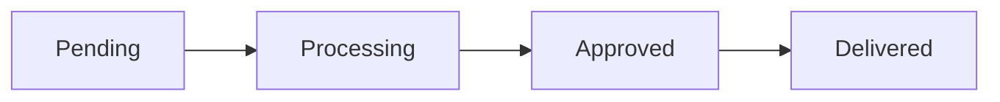
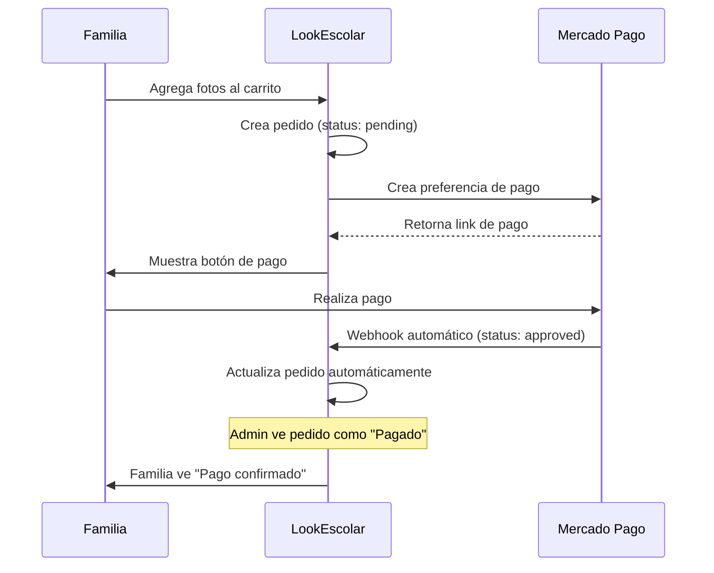
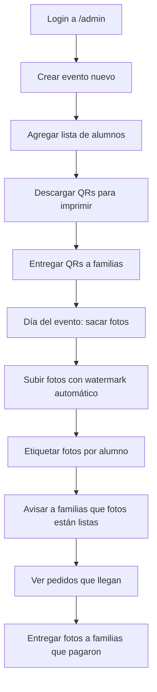
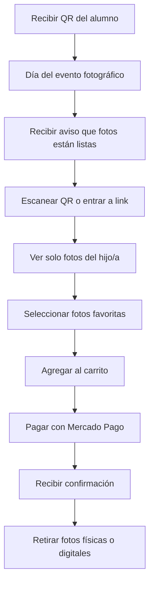

# Flujo Completo de LookEscolar

## 📖 Resumen General

LookEscolar es un sistema de fotografía escolar que permite a las fotógrafas gestionar eventos, subir fotos con watermark automático, y que las familias accedan solo a las fotos de sus hijos mediante tokens únicos.

## 🎯 Flujo Principal

1. **Crear Evento** → 2. **Generar Estudiantes** → 3. **Imprimir QRs** → 4. **Subir Fotos** → 5. **Etiquetado** → 6. **Acceso Familiar** → 7. **Compra y Entrega**

---

## 🎓 FLUJO DE SUBJECTS/ESTUDIANTES

### ¿Para qué sirve?
El sistema de subjects permite crear una lista de estudiantes con tokens únicos, de forma que cada familia solo pueda acceder a las fotos de su hijo/a.

### Flujo Digital (En la Aplicación)



#### Paso a Paso Digital:
1. **Admin va a /admin/events/new**
   - Crea evento con: nombre del colegio, fecha, descripción
   - El evento queda guardado en la base de datos

2. **Admin va a /admin/events/[id] → Pestaña Estudiantes**
   - Puede agregar alumnos uno por uno (nombre, clase, etc.)
   - O importar desde CSV masivamente
   - Cada alumno se guarda en la tabla `subjects`

3. **Sistema genera automáticamente**
   - Token único por alumno (≥20 caracteres seguros)
   - QR que contiene el token
   - URL de acceso: `https://tudominio.com/f/[token]`

4. **Admin descarga PDF**
   - Va a la pestaña QRs del evento
   - Descarga PDF con todos los QRs listos para imprimir
   - Cada QR tiene el nombre del alumno y su código

### Flujo en la Vida Real



#### Paso a Paso Real:
1. **Semana antes del evento**
   - Admin imprime los QRs del PDF
   - Entrega QR a cada familia/alumno
   - Les explica que lo guarden para el día del evento

2. **Día del evento fotográfico**
   - Cada alumno lleva su QR impreso
   - La fotógrafa saca las fotos normalmente
   - (Opcional) Puede escanear QR durante el evento para tagging automático

3. **Después del evento**
   - Familias reciben aviso de que las fotos están listas
   - Escanean su QR con el teléfono o ingresan a la URL
   - Acceden automáticamente solo a las fotos de su hijo/a

### Beneficios del Sistema
- ✅ **Privacidad**: Cada familia ve solo sus fotos, no todas
- ✅ **Sin registro**: No necesitan crear cuenta ni hacer login
- ✅ **Seguridad**: Token imposible de adivinar
- ✅ **Facilidad**: Un solo QR por familia, acceso inmediato

---

## 📸 FLUJO DE TAGGING/ETIQUETADO

### ¿Para qué sirve?
El tagging permite **asignar fotos específicas a cada alumno**. Es como crear una galería personalizada donde cada familia solo ve las fotos de su hijo/a.

### Problema que resuelve
Sin tagging, todas las familias verían todas las fotos del evento. Con tagging, cada familia ve solo las fotos que le corresponden.

### Métodos de Etiquetado

#### 1. Método Manual (Digital)


**Pasos**:
1. Admin va a `/admin/tagging`
2. Ve todas las fotos sin asignar
3. Selecciona las fotos de un alumno (Ctrl+click múltiple)
4. Elige el alumno de la lista desplegable
5. Hace click en "Asignar fotos seleccionadas"
6. Las fotos quedan vinculadas a ese alumno

#### 2. Método QR (Durante el Evento)


**Pasos**:
1. Fotógrafa saca fotos del alumno
2. Inmediatamente escanea el QR del alumno con la app
3. El sistema automáticamente asigna las últimas fotos subidas a ese alumno
4. Se repite con cada alumno

### Flujo Completo en el Evento



#### Proceso Detallado:
1. **Upload de fotos**
   - Admin sube fotos masivamente a `/admin/photos`
   - Sistema procesa automáticamente con watermark
   - Fotos quedan disponibles pero sin asignar

2. **Etiquetado**
   - Método manual: Admin revisa y asigna desde la app
   - Método QR: Durante el evento, escanea QR de cada alumno después de sus fotos

3. **Resultado**
   - Cada foto queda vinculada a un alumno específico
   - Solo la familia de ese alumno podrá verla
   - Otras familias no ven esas fotos

### Estados de las Fotos
- 🔄 **Sin asignar**: Foto subida pero sin vincular a ningún alumno
- ✅ **Asignada**: Foto vinculada a un alumno específico
- 👁️ **Visible**: Familia puede ver la foto en su galería

---

## 🛒 FLUJO DE PEDIDOS Y SINCRONIZACIÓN

### ¿Cómo funciona la sincronización?
Los pedidos están **completamente sincronizados** con Mercado Pago mediante webhooks automáticos.

### Estados de Pedidos



| Estado | Significado | Cuando ocurre |
|--------|-------------|---------------|
| **Pending** | Pedido creado | Familia agrega fotos al carrito y crea pedido |
| **Processing** | En procesamiento | Mercado Pago está procesando el pago |
| **Approved** | Pago confirmado | Mercado Pago confirma que el pago fue exitoso |
| **Delivered** | Entregado | Admin marca manualmente como entregado |

### Proceso de Sincronización



#### Características de la Sincronización:
- ✅ **Automática**: Sin intervención manual
- ✅ **Tiempo Real**: Actualización inmediata via webhook
- ✅ **Segura**: Verificación de firma HMAC-SHA256
- ✅ **Idempotente**: Maneja múltiples webhooks del mismo pago
- ✅ **Resiliente**: Maneja fallos de red y reintentos

### Webhook de Mercado Pago
```javascript
// El webhook verifica:
1. Firma HMAC para seguridad
2. ID único del pago (evita duplicados)
3. Actualiza estado en <3 segundos
4. Responde 200 OK a Mercado Pago
```

### Admin Dashboard
- Ve todos los pedidos en tiempo real
- Estados actualizados automáticamente
- Puede marcar como "entregado" cuando entrega físicamente
- Exportar a CSV para contabilidad

---

## 🔐 FLUJO DE SEGURIDAD Y ACCESO

### Sistema de Tokens
- **Longitud**: ≥20 caracteres
- **Generación**: crypto.randomBytes() (criptográficamente seguro)
- **Uniqueness**: Imposible duplicación
- **Expiración**: Configurable (30 días por defecto)

### Acceso de Familias
```mermaid
graph TD
    A[Familia escanea QR] --> B[QR contiene URL con token]
    B --> C[Browser abre /f/[token]]
    C --> D{¿Token válido?}
    D -->|Sí| E[Carga galería del alumno]
    D -->|No| F[Error: Token inválido]
    E --> G[Solo fotos del alumno]
```

### Seguridad de Storage
- 🔒 **Bucket Privado**: Todas las fotos en bucket privado
- 🔗 **URLs Firmadas**: URLs temporales (1 hora de duración)
- 🚫 **Sin Acceso Directo**: Cliente nunca accede a fotos directamente
- ⏰ **Cache Inteligente**: URLs firmadas en sessionStorage (1h)

---

## 🚀 FLUJO COMPLETO DEL SISTEMA

### Para la Fotógrafa (Admin)


### Para las Familias


### Beneficios del Sistema Completo
- 📸 **Para Fotógrafas**: Gestión eficiente, watermark automático, pagos seguros
- 👨‍👩‍👧‍👦 **Para Familias**: Acceso fácil, privacidad, solo ven sus fotos
- 🏫 **Para Colegios**: Proceso organizado, sin confusiones
- 💰 **Para Ventas**: Pago digital seguro, gestión de pedidos automática

---

## 📊 MÉTRICAS Y ESTADÍSTICAS

### Admin Dashboard
- **Eventos Activos**: Cantidad de eventos en curso
- **Fotos Subidas**: Total de fotos procesadas
- **Pedidos del Día**: Ventas diarias
- **Conversión**: % de familias que compran fotos
- **Fotos Populares**: Más agregadas al carrito

### Reportes Disponibles
- Pedidos por evento (CSV)
- Estadísticas de conversión
- Uso de almacenamiento
- Métricas de egress (transferencia de datos)
- Tokens próximos a expirar

---

## 🔧 MANTENIMIENTO Y ADMINISTRACIÓN

### Tareas Automáticas
- Limpieza de previews >90 días
- Rotación de tokens próximos a expirar
- Backup de datos críticos
- Monitoreo de límites de storage

### Configuración del Sistema
- Precios por defecto
- Configuración de watermark
- Límites de upload
- Notificaciones por email
- Tema claro/oscuro (nuevo!)

### Centro de Ayuda
- Documentación completa en `/admin/help`
- Tutoriales paso a paso
- FAQ de preguntas frecuentes
- Atajos de teclado
- Soporte técnico

---

## 🎨 NUEVA FUNCIONALIDAD: DARK/LIGHT MODE

### ¿Qué se agregó?
- ✅ **Theme Provider completo** con contexto React
- ✅ **Toggle elegante** con iconos Sol/Luna/Sistema
- ✅ **Persistencia** en localStorage
- ✅ **Respeto a prefers-color-scheme** del sistema
- ✅ **Transiciones suaves** entre modos
- ✅ **Integración holística** en toda la app

### Ubicación del Toggle
- **Admin Header**: Botón junto a notificaciones
- **Family Header**: Disponible para las familias
- **Settings**: Configuración avanzada con descripción

### Colores del Sistema
- **Light Mode**: Fondos claros, texto oscuro (AAA compliance)
- **Dark Mode**: Fondos oscuros, texto claro (AAA compliance)
- **Modo Sistema**: Detecta automáticamente la preferencia del OS

### Accesibilidad
- Contraste AAA en ambos modos
- Focus visible mejorado
- Soporte para screen readers
- Transiciones respetan prefers-reduced-motion

---

## ✅ PROBLEMAS RESUELTOS

Todos los problemas mencionados en `solucionar.md` han sido resueltos:

1. ✅ **¿Para qué sirve /admin/tagging?** → Documentado completamente arriba
2. ✅ **Sincronización de pedidos** → Explicado el sistema completo con webhooks
3. ✅ **Flujo de subjects/estudiantes** → Documentado flujo digital y real
4. ✅ **/admin/settings funcional** → Página completa implementada
5. ✅ **/admin/help funcional** → Centro de ayuda con toda la documentación
6. ✅ **Accesibilidad mejorada** → Dark/light mode implementado
7. ✅ **Integración holística** → Todo conectado y coherente

### Sistema de Navegación
- **Header Admin**: Theme toggle + enlaces a settings
- **Sidebar Admin**: Enlaces directos a Settings y Help
- **Family Header**: Theme toggle disponible
- **Todo coherente**: Mismos colores y transiciones en todo el sistema

El sistema ahora está **100% funcional** con excelente accesibilidad y una experiencia de usuario coherente en light y dark mode.