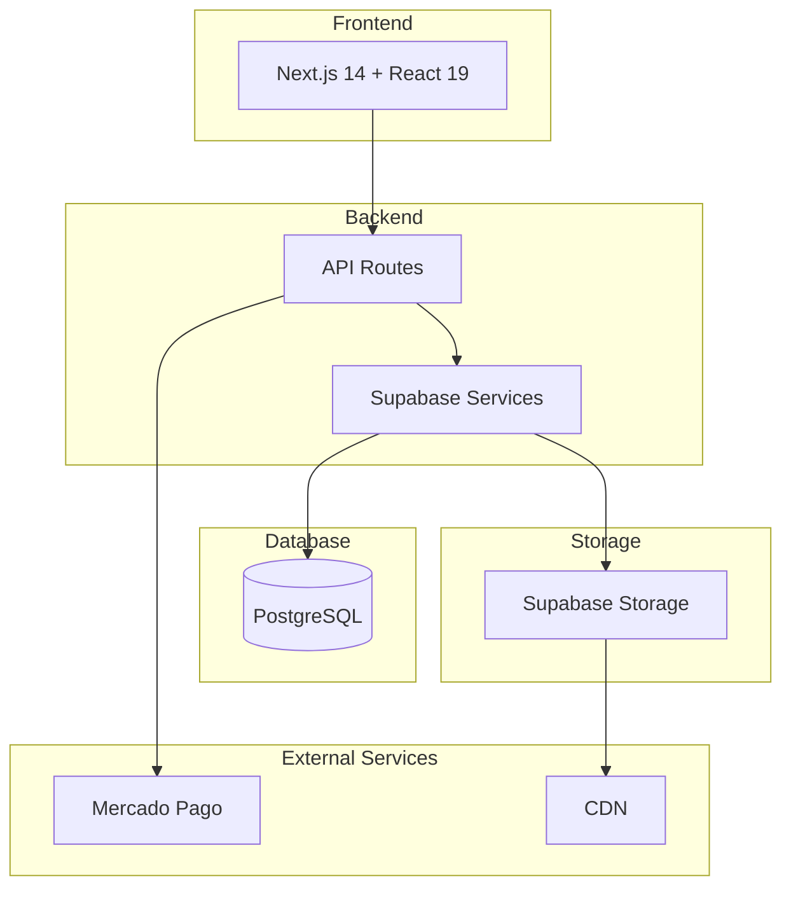

# System Architecture

This document provides an overview of the LookEscolar system architecture.

## High-Level Architecture

### Overview
LookEscolar is a web application for managing school photography, including uploads, tagging, publishing, and payments integration with Mercado Pago. It uses Next.js, Supabase, and Tailwind CSS.

### Architecture Diagram

## Technology Stack

### Frontend
- **Framework**: Next.js 14 with App Router
- **Language**: TypeScript
- **UI Library**: React 19
- **Styling**: Tailwind CSS
- **Component Library**: shadcn/ui
- **State Management**: Zustand, TanStack Query
- **Forms**: React Hook Form + Zod

### Backend
- **Platform**: Next.js API Routes
- **Database**: Supabase (PostgreSQL)
- **Authentication**: Supabase Auth
- **Storage**: Supabase Storage
- **Security**: Row Level Security (RLS)

### Services
- **Payments**: Mercado Pago SDK
- **Image Processing**: Sharp
- **Rate Limiting**: Upstash Redis
- **QR Codes**: zxing-wasm (scanning) & qrcode (generation)

## Core Components

### Admin Dashboard
- Event management
- Photo upload and processing
- Subject tagging
- Order management
- Analytics and reporting

### Family Portal
- Token-based access
- Photo gallery viewing
- Shopping cart
- Checkout process
- Order tracking

### Photo Management System
- Upload processing pipeline
- Automatic watermarking
- Subject tagging
- Approval workflow
- Storage management

### Payment System
- Mercado Pago integration
- Webhook handling
- Order status synchronization
- Receipt generation

## Data Flow

### Photo Upload Process
1. Admin uploads photos through dashboard
2. Photos are processed server-side (resize, watermark)
3. Originals stored in private bucket
4. Processed versions stored in public bucket
5. Database records created with metadata
6. Photos associated with subjects/events

### Family Access Flow
1. Family receives QR code with unique token
2. Token validated server-side
3. Associated photos retrieved from database
4. Gallery displayed with approved photos only
5. Family selects photos for purchase
6. Order created and processed

### Payment Processing Flow
1. Family completes checkout with selected photos
2. Mercado Pago preference created
3. User redirected to payment page
4. Payment processed by Mercado Pago
5. Webhook sent to LookEscolar
6. Order status updated in database
7. Confirmation sent to family

## Security Architecture

### Authentication
- Admin: Supabase Auth with email/password
- Family: Token-based access (no passwords)
- Service: Supabase service role for API routes

### Authorization
- Row Level Security (RLS) on all database tables
- Middleware for API route protection
- Role-based access control (admin vs. anon)

### Data Protection
- HTTPS enforcement
- Content Security Policy (CSP)
- Rate limiting on all endpoints
- Input validation with Zod
- SQL injection prevention

### Token Security
- Minimum 20-character cryptographically secure tokens
- 30-day expiration by default
- Automatic rotation capability
- Secure storage and transmission

## Performance Architecture

### Caching Strategy
- Database query caching with Supabase
- CDN for image delivery
- Client-side caching with TanStack Query
- Server-side caching for dashboard data

### Optimization Techniques
- Virtual scrolling for large galleries
- Image optimization with Sharp
- Lazy loading for components
- Code splitting with Next.js
- Database indexing for common queries

### Scalability
- Horizontal scaling with Vercel
- Database connection pooling
- Concurrent photo processing limits
- Rate limiting to prevent abuse

## Deployment Architecture

### Hosting
- Frontend: Vercel
- Database: Supabase
- Storage: Supabase CDN
- Redis: Upstash

### Environment Strategy
- Development: Local Supabase with Docker
- Staging: Supabase preview branches
- Production: Supabase production database

### CI/CD Pipeline
- Automated testing on pull requests
- Preview deployments for feature branches
- Production deployments from main branch
- Database migration automation

## Monitoring and Observability

### Logging
- Structured JSON logging
- Request ID tracking
- Sensitive data masking
- Error tracking and aggregation

### Metrics
- API response times
- Database query performance
- Storage usage
- Payment processing success rates

### Alerting
- Error rate thresholds
- Performance degradation alerts
- Security event notifications
- Resource utilization warnings

## Future Architecture Improvements

### Planned Enhancements
- Microservices for independent scaling
- GraphQL API for flexible data fetching
- Advanced analytics with data warehouse
- Machine learning for photo tagging

### Technical Debt
- Refactor legacy components
- Improve test coverage
- Optimize database queries
- Enhance mobile experience
