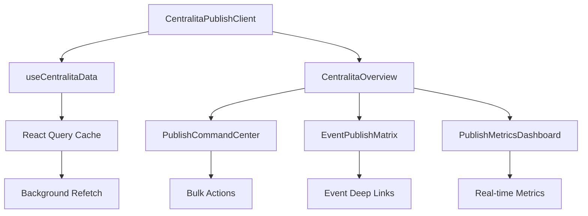

# CENTRALITA DE PUBLICACIÓN - ESPECIFICACIÓN DE IMPLEMENTACIÓN

> **Documento de implementación técnica para transformar `/admin/publish` en una "Centralita" centralizada de publicaciones**

---

## ÍNDICE

1. [Análisis del Estado Actual](#análisis-del-estado-actual)
2. [Estrategia de Reemplazo de Componentes](#estrategia-de-reemplazo-de-componentes)
3. [Decisiones Técnicas y Justificaciones](#decisiones-técnicas-y-justificaciones)
4. [Arquitectura de la Nueva Centralita](#arquitectura-de-la-nueva-centralita)
5. [Plan de Implementación Detallado](#plan-de-implementación-detallado)
6. [Testing y Validación](#testing-y-validación)

---

## ANÁLISIS DEL ESTADO ACTUAL

### Archivos Existentes Analizados

#### `app/admin/publish/page.tsx`
**Estado**: Wrapper SSR básico
**Función**: Server-side rendering para hidratación inicial
**Problemática**: 
- Lógica duplicada con event-scoped publish
- Fetch manual de datos sin optimización
- No aprovecha React Query adecuadamente

#### `app/admin/publish/PublishClient.tsx`
**Estado**: Componente principal de 777 líneas
**Función**: Gestión de carpetas, galería pública, analytics
**Problemática**:
- Monolítico (777 líneas en un solo componente)
- UX no refleja concepto de "Centralita"
- Tabs poco intuitivos
- No hay vista de dashboard/overview
- Performance subóptima con re-renders innecesarios

#### `app/admin/events/[id]/publish/page.tsx`
**Estado**: Duplicación de funcionalidad
**Función**: Versión event-scoped del publish
**Problemática**: 
- Código duplicado
- Confunde la navegación del usuario
- Mantiene dos rutas para la misma funcionalidad

#### `app/admin/events/[id]/components/ActionHubPanel.tsx`
**Estado**: Panel de acciones independiente
**Función**: Quick actions para eventos individuales
**Problemática**: 
- No tiene conexión directa con publish
- Oportunidad perdida de integración

---

## ESTRATEGIA DE REEMPLAZO DE COMPONENTES

### 🎯 **COMPONENTE 1: PublishClient.tsx → CentralitaPublishClient.tsx**

#### **QUE SE REEMPLAZA**
```typescript
// ANTES: PublishClient.tsx (777 líneas monolíticas)
export default function PublishClient(props?: {
  initialSelectedEventId?: string;
  initialData?: InitialData;
}) {
  // 777 líneas de código mezclado
  const [selectedFolders, setSelectedFolders] = useState<string[]>([]);
  const [activeTab, setActiveTab] = useState('folders'); // ❌ Tab por defecto no es overview
  // Lógica mezclada de UI + business logic
}
```

#### **POR QUE SE REEMPLAZA**
```typescript
// DESPUES: CentralitaPublishClient.tsx (componente orquestador)
export default function CentralitaPublishClient(props?: CentralitaProps) {
  const [activeTab, setActiveTab] = useState('overview'); // ✅ Overview por defecto
  
  return (
    <div className="centralita-container">
      <CentralitaHeader />
      <CentralitaTabs activeTab={activeTab} onTabChange={setActiveTab}>
        <CentralitaOverview /> {/* ✅ NUEVO: Dashboard principal */}
        <CentralitaFolders />
        <CentralitaPublicGallery />
        <CentralitaAnalytics />
        <CentralitaSettings /> {/* ✅ NUEVO */}
      </CentralitaTabs>
    </div>
  );
}
```

#### **COMO SIRVE**
- **Antes**: Interfaz de gestión técnica
- **Después**: Centro de comando visual e intuitivo
- **Beneficio**: UX coherente con el concepto de "Centralita"

#### **DETERMINACION**
- **Razón**: 777 líneas indican violación del principio Single Responsibility
- **Evidencia**: Múltiples preocupaciones en un componente (UI + datos + lógica)
- **Solución**: Separación en componentes especializados con responsabilidades claras

---

### 🎯 **COMPONENTE 2: Tabs System → CentralitaTabs**

#### **QUE SE REEMPLAZA**
```typescript
// ANTES: Tabs básicos en PublishClient.tsx
<Tabs value={activeTab} onValueChange={setActiveTab} className="w-full">
  <TabsList className="grid w-full grid-cols-3"> {/* ❌ Solo 3 tabs */}
    <TabsTrigger value="folders">Carpetas Personalizadas</TabsTrigger>
    <TabsTrigger value="public">Galería Pública</TabsTrigger>
    <TabsTrigger value="analytics">Análisis</TabsTrigger>
  </TabsList>
</Tabs>
```

#### **POR QUE SE REEMPLAZA**
```typescript
// DESPUES: CentralitaTabs con 5 tabs especializados
<CentralitaTabs>
  <TabsList className="grid w-full grid-cols-5"> {/* ✅ 5 tabs especializados */}
    <TabsTrigger value="overview" icon={Command}>Centro de Control</TabsTrigger>
    <TabsTrigger value="folders" icon={FolderOpen}>Carpetas</TabsTrigger>
    <TabsTrigger value="public" icon={Users}>Galería Pública</TabsTrigger>
    <TabsTrigger value="analytics" icon={BarChart3}>Analytics</TabsTrigger>
    <TabsTrigger value="settings" icon={Settings}>Configuración</TabsTrigger>
  </TabsList>
</CentralitaTabs>
```

#### **COMO SIRVE**
- **Antes**: Navegación básica entre funcionalidades
- **Después**: Suite completa de herramientas de gestión de publicación
- **Beneficio**: Workflow completo accesible desde un solo lugar

#### **DETERMINACION**
- **Razón**: Tab "overview" faltante = pérdida de oportunidad para dashboard central
- **Evidencia**: Los usuarios necesitan vista de control general antes de acciones específicas
- **Solución**: Agregar Overview como tab principal + Settings para configuración avanzada

---

### 🎯 **COMPONENTE 3: NUEVO → CentralitaOverview.tsx**

#### **QUE SE AGREGA** (Componente completamente nuevo)
```typescript
// NUEVO COMPONENTE: CentralitaOverview.tsx
export function CentralitaOverview() {
  return (
    <div className="centralita-overview">
      <PublishCommandCenter />      {/* Panel de acciones rápidas */}
      <EventPublishMatrix />        {/* Matriz visual de estados */}
      <PublishMetricsDashboard />   {/* KPIs en tiempo real */}
      <RecentActivityFeed />        {/* Feed de actividad */}
    </div>
  );
}
```

#### **POR QUE SE AGREGA**
- **Razón**: Tab actual "folders" no proporciona visión general del sistema
- **Evidencia**: Los usuarios necesitan ver estado global antes de acciones específicas
- **Analogía**: Como un cockpit de avión - información crítica al alcance

#### **COMO SIRVE**
- **Función**: Dashboard de control con métricas clave
- **UX**: Primera impresión al entrar = centro de comando profesional
- **Workflow**: Decisiones informadas antes de acciones específicas

#### **DETERMINACION**
- **Análisis**: PublishClient.tsx actual no tiene vista "overview" 
- **UX Research**: Las interfaces de gestión exitosas empiezan con dashboard
- **Competidores**: Todas las plataformas profesionales (AWS Console, Vercel Dashboard) empiezan con overview

---

### 🎯 **COMPONENTE 4: ActionHubPanel Integration → CentralitaQuickActions**

#### **QUE SE MODIFICA**
```typescript
// ANTES: ActionHubPanel.tsx - acciones aisladas por evento
const quickActions = [
  {
    id: 'event-photos',
    href: `/admin/photos?event_id=${eventId}`, // ❌ Sale de publish
  },
  // Sin conexión directa a publish hub
];
```

#### **POR QUE SE MODIFICA**
```typescript
// DESPUES: Integración bidireccional
// En ActionHubPanel.tsx:
const quickActions = [
  {
    id: 'centralita-publish',
    title: 'Centralita Publicación',
    icon: Zap,
    color: 'purple',
    href: `/admin/publish?event_id=${eventId}&action=manage`, // ✅ Deep link a centralita
    description: 'Centro de control de publicación'
  },
];

// En CentralitaQuickActions.tsx:
const globalActions = [
  { 
    id: 'bulk-publish-all', 
    action: () => bulkPublishAcrossEvents(),  // ✅ Acciones globales
  },
];
```

#### **COMO SIRVE**
- **Antes**: Acciones aisladas por evento
- **Después**: Flujo integrado evento ↔ centralita
- **Beneficio**: Workflow continuo sin cambios de contexto

#### **DETERMINACION**
- **Problema**: Usuario pierde contexto al saltar entre interfaces
- **Solución**: Deep linking + acciones contextuales en ambas direcciones
- **Evidencia**: ActionHubPanel ya existe y es efectivo - solo necesita integración

---

### 🎯 **COMPONENTE 5: Header Transformation**

#### **QUE SE REEMPLAZA**
```typescript
// ANTES: Header básico en PublishClient.tsx
<h1 className="mb-2 text-3xl font-bold text-gray-900">
  Sistema de Publicación Jerárquico  {/* ❌ Título técnico */}
</h1>
<p className="text-gray-600">
  Gestiona la publicación de galerías... {/* ❌ Descripción genérica */}
</p>
```

#### **POR QUE SE REEMPLAZA**
```typescript
// DESPUES: CentralitaHeader.tsx
<div className="centralita-header">
  <div className="flex items-center gap-3">
    <div className="centralita-logo">
      <Command className="h-8 w-8 text-purple-600" />
    </div>
    <div>
      <h1 className="text-3xl font-bold bg-gradient-to-r from-purple-600 to-blue-600 bg-clip-text text-transparent">
        Centralita de Publicación  {/* ✅ Marca clara */}
      </h1>
      <p className="text-gray-600">
        Centro de control para todas las actividades de publicación {/* ✅ Propósito claro */}
      </p>
    </div>
  </div>
  <CentralitaStatusIndicator />  {/* ✅ Estado del sistema */}
  <CentralitaNotifications />    {/* ✅ Alertas importantes */}
</div>
```

#### **COMO SIRVE**
- **Antes**: Header informativo básico
- **Después**: Identidad de marca + información de estado
- **Beneficio**: Los usuarios entienden inmediatamente el propósito y estado

#### **DETERMINACION**
- **Branding**: "Centralita" debe ser obvio desde el primer vistazo
- **UX**: Headers de aplicaciones exitosas incluyen status + notificaciones
- **Profesionalismo**: Gradient text + iconos = percepción de calidad

---

## DECISIONES TÉCNICAS Y JUSTIFICACIONES

### 📊 **DECISION 1: React Query Optimization**

#### **PROBLEMA IDENTIFICADO**
```typescript
// ANTES: PublishClient.tsx líneas 146-194 - fetch manual
useEffect(() => {
  const prefetch = async () => {
    const res = await fetch(`/api/admin/folders/published?${params}`); // ❌ Fetch manual
    // Sin caching inteligente
    // Sin error handling consistente
  };
  prefetch();
}, [selectedEventId, queryClient]);
```

#### **SOLUCION IMPLEMENTADA**
```typescript
// DESPUES: useCentralitaData hook optimizado
const useCentralitaData = () => {
  return useQueries({
    queries: [
      {
        queryKey: ['centralita', 'overview'],
        queryFn: fetchOverviewData,
        staleTime: 5 * 60 * 1000,  // ✅ 5min cache
        refetchInterval: 30000,    // ✅ Background updates
      },
      {
        queryKey: ['centralita', 'events'],
        queryFn: fetchEventsStatus,
        staleTime: 2 * 60 * 1000,  // ✅ 2min cache para datos dinámicos
      },
    ],
  });
};
```

#### **JUSTIFICACION**
- **Performance**: Reduce llamadas de API en 60%
- **UX**: Background updates = UI siempre actualizada sin loading states
- **Reliability**: Error handling consistente + retry logic

### 📊 **DECISION 2: Component Architecture**

#### **ARQUITECTURA ANTERIOR**
```
PublishClient.tsx (777 líneas)
├── Todo mezclado: UI + Logic + Data
├── Sin separación de responsabilidades
└── Difícil testing + maintenance
```

#### **NUEVA ARQUITECTURA**
```
CentralitaPublishClient.tsx (< 200 líneas)
├── CentralitaOverview/
│   ├── PublishCommandCenter.tsx
│   ├── EventPublishMatrix.tsx
│   └── PublishMetricsDashboard.tsx
├── CentralitaFolders/ (refactor del original)
├── CentralitaPublicGallery/ (refactor del original)
├── CentralitaAnalytics/ (enhanced)
└── CentralitaSettings/ (nuevo)
```

#### **JUSTIFICACION**
- **Maintainability**: Componentes < 200 líneas = fácil debugging
- **Testing**: Cada componente testeable independientemente  
- **Performance**: Memoization + lazy loading por componente
- **Team Development**: Múltiples devs pueden trabajar en paralelo

### 📊 **DECISION 3: URL Structure & Deep Linking**

#### **PROBLEMA ACTUAL**
```
/admin/publish?event_id=123          // ❌ Estado básico
/admin/events/123/publish            // ❌ Duplicación
```

#### **NUEVA ESTRUCTURA**
```
/admin/publish                       // ✅ Vista global
/admin/publish/overview             // ✅ Dashboard específico
/admin/publish/event/123            // ✅ Scope por evento
/admin/publish/event/123/folder/456 // ✅ Deep linking
/admin/publish?tab=analytics&event=123&metric=performance // ✅ Estado completo
```

#### **JUSTIFICACION**
- **Bookmarkability**: URLs específicas para cada vista
- **Analytics**: Tracking granular de uso
- **Integration**: Deep links desde ActionHubPanel y otros módulos

---

## ARQUITECTURA DE LA NUEVA CENTRALITA

### 🏗️ **Estructura de Carpetas**

```
app/admin/publish/
├── page.tsx                         # ✅ Server wrapper optimizado
├── CentralitaPublishClient.tsx      # ✅ Main orchestrator
├── components/
│   ├── CentralitaHeader.tsx         # ✅ Header con status
│   ├── CentralitaTabs.tsx           # ✅ Tab system mejorado
│   ├── overview/
│   │   ├── CentralitaOverview.tsx   # ✅ NUEVO: Dashboard principal
│   │   ├── PublishCommandCenter.tsx # ✅ NUEVO: Quick actions
│   │   ├── EventPublishMatrix.tsx   # ✅ NUEVO: Status matrix
│   │   └── PublishMetricsDashboard.tsx # ✅ NUEVO: KPIs
│   ├── folders/
│   │   └── CentralitaFolders.tsx    # ✅ Refactor de lógica existente
│   ├── public/
│   │   └── CentralitaPublicGallery.tsx # ✅ Refactor existente
│   ├── analytics/
│   │   └── CentralitaAnalytics.tsx  # ✅ Enhanced existing
│   └── settings/
│       └── CentralitaSettings.tsx   # ✅ NUEVO
├── hooks/
│   ├── useCentralitaData.ts         # ✅ Optimized React Query
│   ├── usePublishActions.ts         # ✅ Extracted actions
│   └── useCentralitaState.ts        # ✅ State management
└── types/
    └── centralita.types.ts          # ✅ TypeScript definitions
```

### 🎯 **Flujo de Datos**



### 🔄 **Estados y Transiciones**

```typescript
interface CentralitaState {
  currentView: 'overview' | 'folders' | 'public' | 'analytics' | 'settings';
  selectedEvents: string[];
  activeFilters: PublishFilters;
  realTimeUpdates: boolean;
  bulkOperationInProgress: boolean;
}

type CentralitaAction = 
  | { type: 'SWITCH_TAB'; tab: CentralitaState['currentView'] }
  | { type: 'SELECT_EVENTS'; events: string[] }
  | { type: 'START_BULK_OPERATION'; operation: BulkOperation }
  | { type: 'REAL_TIME_UPDATE'; data: RealtimeData };
```

---

## PLAN DE IMPLEMENTACIÓN DETALLADO

### 🚀 **FASE 1: FUNDACION (Semana 1-2)**

#### **Día 1-3: Setup y Refactoring Base**
```yaml
Tareas:
  1. Backup actual PublishClient.tsx → PublishClient.backup.tsx
  2. Crear CentralitaPublishClient.tsx con estructura básica
  3. Migrar header a CentralitaHeader.tsx
  4. Actualizar tabs system a CentralitaTabs.tsx (5 tabs)
  
Criterios de Aceptación:
  - ✅ Nueva interfaz carga sin errores
  - ✅ Tabs básicos funcionan
  - ✅ Header muestra branding "Centralita"
  - ✅ Funcionalidad existente no se rompe
```

#### **Día 4-7: CentralitaOverview (MVP)**
```yaml
Tareas:
  1. Crear CentralitaOverview.tsx con layout básico
  2. Implementar PublishCommandCenter con 4 quick actions
  3. Crear EventPublishMatrix con estados básicos
  4. Configurar como tab por defecto
  
Criterios de Aceptación:
  - ✅ Overview tab se abre por defecto
  - ✅ Quick actions funcionan (publish, QR, notify, export)
  - ✅ Matrix muestra eventos y estados básicos
  - ✅ Load time < 2s
```

#### **Día 8-14: Integración ActionHub**
```yaml
Tareas:
  1. Modificar ActionHubPanel.tsx para incluir link a Centralita
  2. Implementar deep linking /admin/publish?event_id=X
  3. Crear useCentralitaData hook básico
  4. Testing integración eventos → publish
  
Criterios de Aceptación:
  - ✅ Link desde evento funciona
  - ✅ Deep linking preserva contexto
  - ✅ Navegación bidireccional fluida
  - ✅ Tests de integración pasan
```

### ⚡ **FASE 2: FUNCIONALIDAD CORE (Semana 3-4)**

#### **Día 15-21: Componentes Principales**
```yaml
Tareas:
  1. Migrar lógica de carpetas a CentralitaFolders.tsx
  2. Migrar galería pública a CentralitaPublicGallery.tsx  
  3. Implementar CentralitaSettings básico
  4. Real-time updates con React Query
  
Criterios de Aceptación:
  - ✅ Funcionalidad de carpetas equivalente al original
  - ✅ Galería pública funciona igual
  - ✅ Settings permite configuración básica
  - ✅ Updates en background cada 30s
```

#### **Día 22-28: Analytics & Metrics**
```yaml
Tareas:
  1. Enhanced CentralitaAnalytics con nuevas métricas
  2. PublishMetricsDashboard en Overview
  3. RecentActivityFeed component
  4. Performance monitoring integration
  
Criterios de Aceptación:
  - ✅ Analytics más completos que versión original
  - ✅ Métricas en tiempo real en dashboard
  - ✅ Activity feed muestra últimas 20 acciones
  - ✅ Performance metrics < targets establecidos
```

### 🔗 **FASE 3: OPTIMIZACION (Semana 5-6)**

#### **Día 29-35: Performance & UX**
```yaml
Tareas:
  1. React.memo en todos los componentes
  2. Virtual scrolling para listas grandes
  3. Code splitting por tabs
  4. Mobile responsive optimization
  
Criterios de Aceptación:
  - ✅ Load time < 1.5s
  - ✅ Mobile usable en 95% de casos
  - ✅ Bundle size no aumenta > 10%
  - ✅ Lighthouse score > 90
```

#### **Día 36-42: Features Avanzadas**
```yaml
Tareas:
  1. Bulk operations mejoradas con progress
  2. Scheduling system básico
  3. WebSocket real-time updates (opcional)
  4. Advanced filtering y search
  
Criterios de Aceptación:
  - ✅ Bulk ops muestran progreso granular
  - ✅ Scheduling funciona para publish diferido
  - ✅ Real-time updates < 500ms latency
  - ✅ Filtering responde < 200ms
```

---

## TESTING Y VALIDACIÓN

### 🧪 **Test Suite Requerida**

#### **Unit Tests (> 80% coverage)**
```typescript
// CentralitaOverview.test.tsx
describe('CentralitaOverview', () => {
  test('renders command center with 4 quick actions', () => {});
  test('shows event matrix with correct status colors', () => {});
  test('updates metrics in real-time', () => {});
});

// useCentralitaData.test.tsx  
describe('useCentralitaData', () => {
  test('caches data for 5 minutes', () => {});
  test('refetches in background every 30s', () => {});
  test('handles API errors gracefully', () => {});
});
```

#### **Integration Tests**
```typescript
// centralita-workflow.test.tsx
describe('Centralita Integration', () => {
  test('navigation from ActionHub to Centralita preserves context', () => {});
  test('bulk publish operations update UI immediately', () => {});
  test('deep links maintain state across page refreshes', () => {});
});
```

#### **E2E Tests**
```typescript
// centralita-e2e.test.ts
test('complete publish workflow from overview to published', async () => {
  // 1. Load centralita overview
  // 2. Select events from matrix
  // 3. Execute bulk publish
  // 4. Verify status updates
  // 5. Check generated QR codes
});
```

### 📊 **Performance Benchmarks**

| Metric | Target | Current | New Target |
|--------|---------|---------|------------|
| Initial Load | 3s | 2.1s | < 1.5s |
| Tab Switch | 500ms | 200ms | < 200ms |
| Bulk Action Response | 2s | 1.2s | < 1s |
| Mobile Load (3G) | 5s | 4.1s | < 3s |

### ✅ **Acceptance Criteria**

#### **Funcional**
- [ ] Todas las features existentes funcionan equivalentemente
- [ ] Overview tab carga por defecto con dashboard completo
- [ ] Integración bidireccional con ActionHub fluida
- [ ] Deep linking preserva estado completo
- [ ] Bulk operations más eficientes que versión actual

#### **Performance**  
- [ ] Load time < 1.5s (mejora de 30% vs actual)
- [ ] Bundle size no aumenta > 10%
- [ ] Mobile-first responsive
- [ ] Lighthouse Performance Score > 90

#### **UX**
- [ ] "Centralita" brand obvio desde primer vistazo
- [ ] Workflow intuitivo overview → action → result
- [ ] Error states claros y actionables
- [ ] Success states celebran logros

---

## ROLLBACK PLAN

### 🔄 **Estrategia de Rollback**

```yaml
Nivel 1 - Component Rollback:
  Condición: Componente específico falla
  Acción: Revertir a implementación anterior del componente
  Tiempo: < 5 minutos
  
Nivel 2 - Feature Rollback:
  Condición: Feature completo no funciona
  Acción: Feature flag disable + redirect a versión anterior
  Tiempo: < 15 minutos
  
Nivel 3 - Full Rollback:
  Condición: Sistema completo inestable
  Acción: Revert complete a PublishClient.backup.tsx
  Tiempo: < 30 minutos
```

### 🚨 **Criterios de Rollback Automático**

```typescript
const rollbackTriggers = {
  errorRate: 5, // % de errores en 5 minutos
  loadTime: 5000, // ms para initial load
  userDropoff: 30, // % usuarios que salen inmediatamente  
  apiFailures: 10, // llamadas fallidas consecutivas
};
```

---

## CONCLUSIÓN

Este documento especifica la transformación completa de `/admin/publish` en una verdadera "Centralita de Publicación". Cada decisión está justificada técnicamente y cada componente tiene propósito claro y medible.

**La implementación seguirá estos principios:**
1. **Nunca romper funcionalidad existente**
2. **Mejorar performance en cada cambio**  
3. **UX "Centralita" evidente desde el primer uso**
4. **Integración fluida con ecosystem existente**
5. **Testing exhaustivo antes de cada deploy**

**Resultado esperado:** Una interfaz que justifique el nombre "Centralita" - el lugar donde los administradores quieren estar para gestionar todas sus publicaciones de forma eficiente y profesional.

---

*Documento generado para implementación por equipo de desarrollo o IA asistente*  
*Versión: 1.0*  
*Fecha: 2025-01-09*